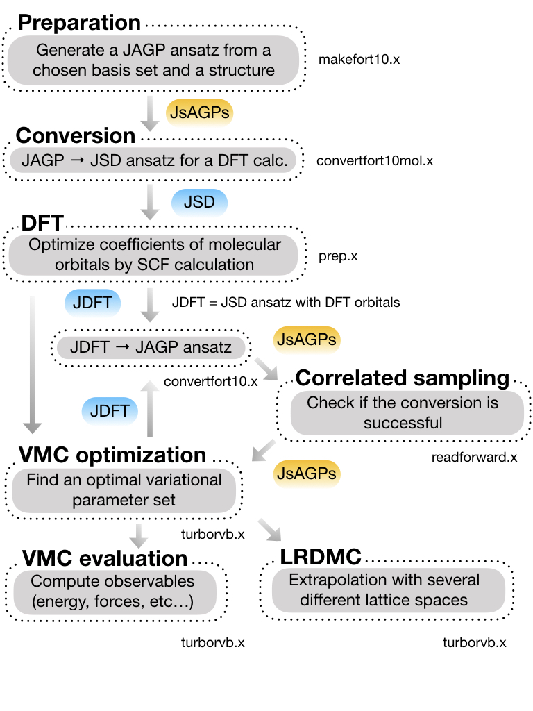
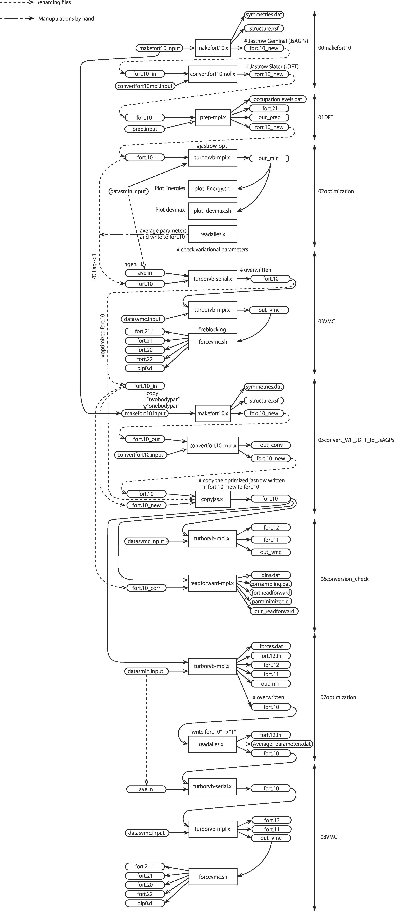
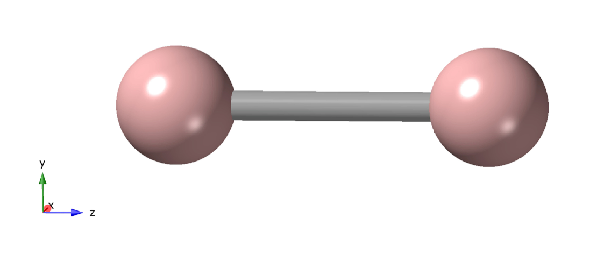
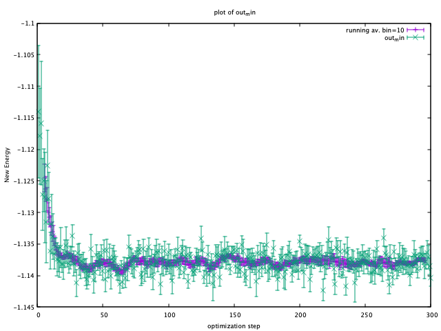
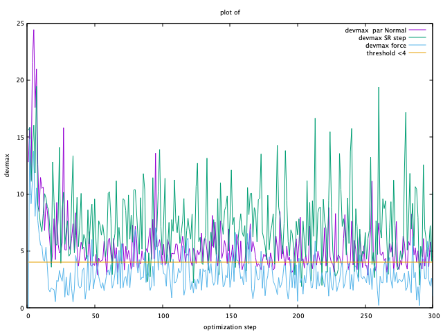

.. TurboRVB_manual documentation master file, created by
   sphinx-quickstart on Thu Jan 24 00:11:17 2019.
   You can adapt this file completely to your liking, but it should at least
   contain the root `toctree` directive.

.. _turborvbtutorial_0101:

01_01Hydrogen_dimer
======================================================

.. contents:: Table of Contents
   :depth: 2

.. _turborvbtutorial_0101_00:

00 Introduction
--------------------------------------------------------------------

From this tutorial, you can learn how to calculate all-electron Variational Monte Carlo (VMC) and lattice regularized diffusion Monte Carlo (LRDMC) energies of the H\ :sub:`2` dimer. You can download all the input and output files from :download:`here  <./file.tar.gz>`.

.. _review: https://doi.org/10.1063/5.0005037

This is a workflow of this tutorial:

This is the detailed workflow of this tutorial:

.. _turborvbtutorial_0101_01:

01 Preparing a JDFT trial wavefunction
--------------------------------------------------------------------

.. _turborvbtutorial_0101_01_01:

01-01 Preparing a makefort10.input file
^^^^^^^^^^^^^^^^^^^^^^^^^^^^^^^^^^^^^^^^^^^^^

Move to a working directory:

.. code-block:: bash

    cd 01trial_wavefunction/00makefort10

The first step of this tutorial is to generate a Jastrow antisymmetrized Geminal Power (JsAGPs) ansatz,
which will be convert to a Jastrow Slater determinant (JSD) ansatz later. First, one should prepare "makefort10.input" to generate an AGP ansatz. This is a *minimun* makefort10.input.

.. code-block:: bash

    # makefort10.input

    &system
     posunits='bohr'
     natoms=2
     ntyp=1
     pbcfort10=.false.
    /

    &electrons
     twobody=-15
     twobodypar=0.50
     onebodypar=0.50
     no_4body_jas=.false.
     neldiff=0
    /
    
    &symmetries
     eqatoms=.true.
     rot_det=.true.
     symmagp=.true.
    /

    ATOMIC_POSITIONS
    1.0   1.0   0.0   0.0  -1.0000000000
    1.0   1.0   0.0   0.0  1.0000000000
    /
    
    ATOM_1
    &shells
     nshelldet=7
     nshelljas=6
    /
      1   1   16
      1   5.095000000000
      1   1   16
      1   1.159000000000
      1   1   16
      1   0.325800000000
      1   1   16
      1   0.102700000000
      3   1   36
      1   1.407000000000
      3   1   36
      1   0.388000000000
      5   1   68
      1   1.057000000000
    #  Parameters atomic Jastrow wf
      1   1   16
      1   0.83560000000    
      1   1   16
      1   0.18530000000     
      1   1   16
      1   0.09555000000
      3   1   36
      1   1.26134000000     
      3   1   36
      1   0.18114000000     
      5   1   68
      1   0.36285000000  

Here are brief explanations of the input variables. 
Please refer to the user manual and README in details:

**&system namelist**

``posunits`` Unit used in the calculation (STRING). bohr and crystal are implemented.

``natoms`` The number of atoms contained in the system (INTEGER).

``ntyp`` The number of atomic species (INTEGER).

``pbcfort10`` periodic boundary condition (BOOLEN).

**&electrons namelist**

``twobody`` Switch of Jastrow factor (INTEGER). For all electron calculation, we recommend -15 (spin-independent) or -22 (spin-dependent). In this tutorial, we employ -15.

``twobodypar`` Variational parameter of two-body Jastrow factor (Float). :math:`b_{ee}` in Eq.33 of the review_ paper. we recommend 1.00 as the initial value.

``onebodypar`` Variational Parameter of one-body Jastrow factor (Float). :math:`b_{ea}` in Eq.31 of the review_ paper. The suitable initial value depends on the largest exponent of an employed basis set. See later.

``no_4body_jas`` No four-body Jastrow factor (BOOLEAN). Indeed, if this is true, :math:`M` in Eq.34 of the review_ paper is set zero for :math:`a \neq b`.

``neldiff`` Difference between the number of spin-up electrons and the number of spin-down electrons (INTEGER).

**&symmetries namelist**

``eqatoms`` Treating the same atoms equally  (BOOLEAN).

``rot_det`` Taking the rotational symmetries into account (BOOLEAN).

``symmagp`` If true, taking into account of only singlet pairings, if false, considering also triplet pairings (BOOLEAN).

**ATOMIC_POSITIONS namelist**
 
.. code-block:: bash

    ATOMIC_POSITIONS
    1.0   1.0   0.0   0.0  -1.0000000000
    1.0   1.0   0.0   0.0  1.0000000000

They represent:

.. code-block:: bash

    ATOMIC_POSITIONS
    Electrons, Atomic number, Position x, Position y, Position z
    Electrons, Atomic number, Position x, Position y, Position z
    ...

wherein The unit of the coordinations are set by "posunits" in &system namelist.

.. note::

    Electrons = Atomic number in an all-electron calculation. 
    On the other hand,  Electrons != Atomic number in a pseudo-potential calculation.

**ATOM_1**

This section describes basis sets used for the determinant and Jastrow parts for ATOM_1.

As in quantum chemistry, the choice of a basis set strongly affects the results.
One can employ an well-optimized basis set for an open system, from the Basis Set Exchange (https://www.basissetexchange.org/). In this tutorial, we choose the cc-pVTZ basis set.  
You can see optimized exponents and contraction coefficients as follows:

.. code-block:: bash

    #Gaussian format
    
    H     0
    S   5   1.00
          3.387000D+01           6.068000D-03
          5.095000D+00           4.530800D-02
          1.159000D+00           2.028220D-01
          3.258000D-01           5.039030D-01
          1.027000D-01           3.834210D-01
    S   1   1.00
          3.258000D-01           1.000000D+00
    S   1   1.00
          1.027000D-01           1.000000D+00
    P   1   1.00
          1.407000D+00           1.000000D+00
    P   1   1.00
          3.880000D-01           1.000000D+00
    D   1   1.00
          1.057000D+00           1.0000000
    ****

In Gaussian format, exponents are listed a the left column (:math:`33.87`, :math:`5.095`...), and contraction coefficients appears at the right (:math:`0.006068`, :math:`0.04530800`...).
Only the optimized exponents are needed in general.

In all-electron calculations, we recommend that you cut several s orbitals having large exponents. 
The cut s orbitals are implicitly compensated by the one body Jastrow term  (see. `J. Chem. Theory Comput. 2019, 15, 7, 4044-4055 <https://doi.org/10.1021/acs.jctc.9b00295>`_ ).
An empirical criteria is :math:`\eta \ge 8 \times \rm{atomic number}`. For example, we can discard the topmost :math:`\eta = 33.87 \ge 8 \time 1.0`.

Also, when there exist duplicated coefficients, you can choose only one of them. 
For example, :math:`0.1027` appears twice, and you can remove one of them. 
Finally, you should take 7 Gaussian primitive basis in total:

.. code-block:: bash

    S   4
          5.095000
          1.159000
          0.325800
          0.102700
    P   2
          1.407000
          0.388000
    D   1
          1.057000

put the Gaussian basis set into makefort10.input file as follows:

.. code-block:: bash

    ATOM_1
    &shells
    nshelldet=7
    nshelljas=6
    /
      1   1   16
      1   5.095000000000
      1   1   16
      1   1.159000000000
      1   1   16
      1   0.325800000000
      1   1   16
      1   0.102700000000
      3   1   36
      1   1.407000000000
      3   1   36
      1   0.388000000000
      5   1   68
      1   1.057000000000
    #  Parameters atomic Jastrow wf
      1   1   16
      1   0.83560000000    
      1   1   16
      1   0.18530000000     
      1   1   16
      1   0.09555000000
      3   1   36
      1   1.26134000000     
      3   1   36
      1   0.18114000000     
      5   1   68
      1   0.36285000000  

wherein,

.. code-block:: bash

      1   1   16
      1   5.095000000000
      
represents,

.. code-block:: bash

    Number of orbitals, Number of exponents (and/or coefficients), Type of orbital
    Label,  Exponents

``Type of orbital`` specifies an angular momentum of orbital, i.e., s, p, d, f, g, h, which correspond to 16, 36, 68, 48, xx, and xx, respectively. In detail, please refer to makefun.f90 in src directory.

``Number of orbitals`` should be consistenti with the type of orbital, i.e., 1, 3, 5, 7, 9, 11 for s, p, d, f, g, h, respectively.

``Label`` is a dummy variable in makefort10.input as long as ``eqatoms`` is set .true., so one can usually set it unity.

You should also set the following two variables:

``nshelldet`` The number of gaussian basis for use in the determinant part (INTEGER).

``nshelljas`` The number of gaussian basis for use in Jastrow factor (INTEGER).

We are ready for generating a JAGP ansatz.

.. _turborvbtutorial_0101_01_02:

01-02 Generating a JsAGPs ansatz
^^^^^^^^^^^^^^^^^^^^^^^^^^^^^^^^^^^^^^^^^^^^^

One can generate a JsAGPs ansatz using the prepared makefort10.input by typing:

.. code-block:: bash

    makefort10.x < makefort10.input > out_make

``makefort10.x`` outputs ``fort.10_new``. All information of a many body wavefunction is written in ``fort.10_XXX`` file in TurboRVB.

At the same time, ``structure.xsf`` is generated. One can check if the input structure is what you have expected, e.g., by xcrysden.

.. _turborvbtutorial_0101_01_03:

01-03 Convert the JsAGPs ansatz to a JSD one
^^^^^^^^^^^^^^^^^^^^^^^^^^^^^^^^^^^^^^^^^^^^^

One should convert the generated JAGP ansatz to Jastrow Slater Determinant (JSD) one to prepare a trial wavefunction using DFT. In this tutorial, the nodal surface of the JSD ansatz is fixed to DFT one, so the trial wave function is called JDFT (i.e., JSD with DFT orbitals).
First, rename `fort.10_new`:

.. code-block:: bash

     mv fort.10_new fort.10_in

Then, prepare ``convertfort10mol.input``:

.. code-block:: bash
    
    # convertfort10mol.input
    
    &control
    epsdgm=-1d-14
    /
    &mesh_info
    ax=0.20
    nx=64
    ny=68
    nz=128
    /
    &molec_info
    nmol=1
    nmolmax=1
    nmolmin=1
    /

Here are brief explanations of the variables:

**&mesh_info namelist**

``ax`` Mesh width in x direction. The unit is Bohr

``ay`` Mesh width in y direction. If it is not specified, ``ay`` = ``ax``.

``az`` Mesh width in y direction. If it is not specified, ``az`` = ``ax``.

``nx`` The number of mesh in x direction.

``ny`` The number of mesh in y direction.  If it is not specified, ``ny`` = ``nx``

``nz`` The number of mesh in z direction.  If it is not specified, ``nz`` = ``nx``

.. note::

    These variables should be set so that the rectangular of (ax × nx)(ay × ny)(az × nz) encloses the molecule, and ax, ay, and az are small enough to be consistent with an electronic scale, typically 0.01 Bohr and 0.10 Bohr for all-electron and pseudo-potential calculations.

.. warning::

    However, the size of grids are not necessarily small here because convertfort10mol.x generetes random coefficients of molecular orbitals, just for initialization of the coefficients.

**&molec_info namelist**

``nmol`` ``nmolmin`` ``nmolmax``  The numbers of molecular orbitals. When they equals to N/2, where N is the total number of electrons in the system, JAGP = JDFT.

After preparing "convertfort10mol.input", covert ``fort.10_in`` (JAGP) to ``fort.10_new`` (JSD) by:

.. code-block:: bash

    convertfort10mol.x < convertfort10mol.input > out_mol

Confirm that the ``fort.10_new`` is generated. If you find ``100000`` (molecular orbital) in fort.10_new and it counts N/2, you have successfully converted the JAGP to a JSD ansatz.

.. code-block:: bash

    # fort.10_new
    
    1 60 1000000
    1 1 2 3 4 5 6 7 8 9 10 11 12 13 14 15 16 17 18 19 20 21 22 23 24 25 26 27 28 29 30  2.692246437072754E-002  -0.490652024745941  0.157296895980835  0.340546727180481  0.224633455276489  0.208685338497162  -0.312226712703705  -0.185131192207336  0.174039185047150  -0.284971058368683  0.335320353507996  0.242606043815613  -0.442098379135132  -0.289426684379578  -0.410119652748108  0.449322640895844  0.266223728656769  -0.189827919006348  -0.223830282688141  0.267185926437378  0.268258810043335  0.370114803314209  0.462309062480927  0.226067721843719  0.272605717182159  -0.395478725433350  -0.320022642612457   0.356949687004089  0.159764945507050  -0.193772673606873

Finally, rename ``fort.10_new``:

.. code-block:: bash

    mv fort.10_new fort.10

.. _turborvbtutorial_0101_01_04:

01-04 Run DFT calculation
^^^^^^^^^^^^^^^^^^^^^^^^^^^^^^^^^^^^^^^^^^^^^

As written above, the coefficients of the molecular orbitals generated by “convertfort10mol.x” are random. Therefore, the next step is to optimize coefficients using a build-in DFT code, called `prep.x`.

First, make a working directory:

.. code-block:: bash

    cd ../01DFT

Next, copy the prepared ``fort.10`` to 01DFT directory:

.. code-block:: bash

    cp ../00makefort10/fort.10 ./

This is a minimum input for a DFT calculation:

.. code-block:: bash

    #prep.input
    
    &simulation
    itestr4=-4
    iopt=1
    /
    &pseudo
    /
    &vmc
    /
    &optimization
    molopt=1
    /
    &readio
    /
    &parameters
    /
    &molecul
    ax=0.20
    nx=32
    ny=32
    nz=64
    /
    &dft
    maxit=50
    epsdft=1d-5
    mixing=0.5d0
    typedft=1
    optocc=0
    nelocc=1
    /
    2 

Here are brief explanations of the variables:

**&simulation section**

``itestr4`` Always set -4 in a DFT calculation (INTEGER).

``iopt=1``  From scratch 1, Restart 0 (INTEGER).

**&optimization section**

``molopt`` Always set 1 in a DFT calculation (INTEGER).

**&dft section**

``maxit`` Maximun number of SCF iterations (INTEGER).

``epsdft`` Tollerance in convergence in total energy (DOUBLE).

``mixing`` Mixing in the density (DOUBLE).

``typedft`` Type of exchange-correlation functional (INTEGER). typedft=0 Hartree, typedft=1 LDA (PZ 1981), typefit=2 LDA (OB 1994). We recommend 1 (PZ-LDA).

``optocc`` Flag, smearing (Integer). 0: no use (i.e, fixed), 1: use.

``neloc`` The number of occupied spatial orbitals (INTEGER). You should specify this variable and put the occupations explicitly below when you use ``optocc`` = 0.

**&mesh_info namelist**

``ax`` Mesh width in x direction. The unit is Bohr

``ay`` Mesh width in y direction. If it is not specified, ``ay`` = ``ax``.

``az`` Mesh width in y direction. If it is not specified, ``az`` = ``ax``.

``nx`` The number of mesh in x direction.

``ny`` The number of mesh in y direction.  If it is not specified, ``ny`` = ``nx``

``nz`` The number of mesh in z direction.  If it is not specified, ``nz`` = ``nx``

.. warning::

    One should carefully choose the size and the number of grids in DFT calculation. Grid sizes and the numbers should be set so that the rectangular of (ax × nx)(ay × ny)(az × nz) encloses the molecule, and ax, ay, and az are small enough to be consistent with an electronic scale, typically 0.01 Bohr and 0.10 Bohr for all-electron and pseudo-potential calculations. The so-called double-grid scheme avoids us from using the small size of grid for all-electron calculation. Please refer to the Li-tutorial.

**occupation**

``2`` in the last line. This indicates the number of electrons occupying each electron orbital.

After preparing ``prep.input``, one can start DFT:

.. code-block:: bash

    prep-serial.x < prep.input > out_prep

Note that ``prep-serial.x`` generates an output file ``fort.10_new``, to which optimized molecular orbitals are written. This obtained trial wavefunction is denoted ``JDFT`` (i.e., JSD ansatz with DFT orbitals).

DFT-LDA total energy, the occupations, etc... are written in ``out_prep``:

.. code-block:: bash

    # Iterations =     7
    Final variational DFT  energy (Ha) =            -1.108056839095119

The generated ``fort.10_new`` is used for the following VMC and DMC calculations as its **trial wave function** / **guiding wave function**.

.. _turborvbtutorial_0101_01_05:

01-05 One-body Jastrow factor optimization
^^^^^^^^^^^^^^^^^^^^^^^^^^^^^^^^^^^^^^^^^^^^^

In TurboRVB, inner s orbitals are implicitly compensated by the one body Jastrow term  (See. `J. Chem. Theory Comput. 2019, 15, 7, 4044-4055 <https://doi.org/10.1021/acs.jctc.9b00295>`_ ). Indeed, the quality of a trial wavefunction depends on onebody Jastrow factor :math:`b` in Eq.31 of the review_ paper. Therefore, we should optimize the one-body parameter :math:`b` at the DFT level.

.. code-block:: bash

    cd ../02onebody_jastrow_opt

Run DFT calculations by changing parameter :math:`b` in fort.10

.. code-block:: bash

    # in fort.10
    
    # Parameters Jastrow two body
      2  0.500000000000000       0.600000000000000 <- this is b

Then, you get:

.. code-block:: bash

    %kosukenoMBP% grep "variat" b_*/out_prep 
    
    b_0.50/out_prep: Final variational DFT  energy (Ha) =            -1.108442236649934
    b_0.60/out_prep: Final variational DFT  energy (Ha) =            -1.109010338029238
    b_0.70/out_prep: Final variational DFT  energy (Ha) =            -1.109205292027722
    b_0.80/out_prep: Final variational DFT  energy (Ha) =            -1.109229424614839
    b_0.90/out_prep: Final variational DFT  energy (Ha) =            -1.109156340624355
    b_1.00/out_prep: Final variational DFT  energy (Ha) =            -1.109032022526679
    b_1.20/out_prep: Final variational DFT  energy (Ha) =            -1.108750694390122
    b_1.30/out_prep: Final variational DFT  energy (Ha) =            -1.108626544919879
    b_1.50/out_prep: Final variational DFT  energy (Ha) =            -1.108434821311452

we can choose the lowest one, i.e., :math:`b = 0.80`.

.. code-block:: bash

    #onebody-script for csh
    set b_onebody_list="0.5 0.6 0.7 0.8 0.9 1.0 1.1 1.2 1.3 1.4 1.5"
    
    set root_dir=`pwd`
    foreach b_onebody ($b_onebody_list)
        mkdir onebody_$b_onebody
        cd onebody_$b_onebody
        cp $root_dir/temp/fort.10 ./
        cp $root_dir/temp/prep.input ./
        cp $root_dir/temp/submit.sh ./
        sed -i -e "s/b_onebody/$b_onebody/g" fort.10
        qsub submit.sh
        cd $root_dir
    end
    
    echo "b_onebody dft energy" > result.out
    
    foreach b_onebody ($b_onebody_list)
        cd onebody_$b_onebody
        set energy=`grep "Final self consistent energy" ./out_prep | awk '{print $7}'`
        echo "${b_onebody}  ${energy}" >> ../result.out
        cd $root_dir
    end

.. _turborvbtutorial_0101_02:

02 Jastrow factor optimization (WF=JDFT)
--------------------------------------------------------------------

In this step, Jastrow factors are optimized at the VMC level
First, create a working directory.

.. code-block:: bash

    cd ../../02optimization

Next, copy the trial wavefunction ``fort.10_new`` generated by the DFT calculation to ``02optimization`` directory and rename it to ``fort.10``:

.. code-block:: bash

    cp ../01trial_wavefunction/01DFT/fort.10_new fort.10

Then, prepare ``datasmin.input``, which is a minimal input file for a VMC-optimization:

.. code-block:: bash

    # datasmin.input

    &simulation
      itestr4=-4
      ngen=50000
      iopt=1
      maxtime=10800

    /
    &pseudo
    /
    &vmc
      epscut=1.0d-10
    /
    &optimization
      nweight=1000
      nbinr=10
      iboot=0
      tpar=3.5d-1
      parr=5.0d-3
    /
    &readio
    /
    &parameters
      iesd=1
      iesfree=1
    /

Here are brief explanations of the variables:

**&simulation section**

``itestr4`` Optimization method (INTEGER). -4 (-8) the modified linear method (LR) [`the original linear method <https://journals.aps.org/prl/abstract/10.1103/PhysRevLett.98.110201>`_], -9 (-5) the stochastic reconfiguration (SR) [See. `ref <https://aip.scitation.org/doi/abs/10.1063/1.2746035>`_]. See also the review_ paper.

``ngen`` Total number of Monte Carlo sampling (INTEGER). Number of optimization steps is ``ngen``/``nweight``.

``iopt 1`` 1:From scratch, 0:Restart.

``maxtime`` Maximun CPU time (INTEGER).

**&vmc section**

``epscut`` Regularization parameter. Small positive value (DOUBLE).

**&optimization section**

``nweight`` Number of Monte Carlo sampling per a optimization step (INTEGER).  Be careful to choose ``nweight``.  If it is too small, the outcome is biased, also error bars during optimization steps become too large. Again, the total number of optimization steps is ``ngen``/``nweight``.

``nbinr`` Bin (reblocking) length per a optimization step (INTEGER).

``iboot`` Number of equilibrium step per a optimization step (INTEGER).

``ncg`` The number of the natural gradients calculated the present and the previous optimization steps (ncg) to span global line parameter directions in eq. 135 of the review_ paper. See the ``VII B. Linear method`` section of the review_ paper.
Choose 1 for the SR method (not used), 2-4 is fine for the linear method.

``tpar`` a hyper parameter :math:`\Delta` for the acceleration (DOUBLE).  See the eq. 128 and eq. 139 of the review_ paper, for the SR and LR method, respectively.
~ 0.30 is preferable for LR method. On the other hand, ~1.0d-4 can be an initial value of ``tpar`` for the SR method, and you can use ``adjust_tpar`` option to find an optimal ``tpar`` automatically, as discussed later.

``parr`` a hyper parameter  :math:`\varepsilon` for the regularization of the preconditioning matrix (i.e., ill-conditioned).  See the equation (130) of the review_ paper.

**&parameters section**

``iesd`` Optimizing one-body and two-body Jastrow parameters (INTEGER).  0: fixed, 1: optimized.

``iesfree`` Optimizing three/four-body Jastrow parameters (INTEGER).  0: fixed, 1: optimized.

``iessw`` Optimizing coefficients of the antisymmetric (determinant of pfaffian) part (INTEGER).  0: fixed, 1: optimized.

``iesup`` Optimizing exponents of the atomic orbitals (the antisymmetric part) and coefficients of hybrid orbitals (INTEGER).  0: fixed, 1: optimized.

``iesm`` Optimizing exponents of the atomic orbitals (Jastrow part) (INTEGER).  0: fixed, 1: optimized.

After preparing ``datasmin.input``, you can start a VMC optimization:

.. code-block:: bash

    turborvb-serial.x < datasmin.input > out_min &

.. warning::

    For a real run (i.e., for a peer-reviewed paper), one should optimize variational parameters much more carefully. We recommend that one consult to an expert or a developer of TurboRVB, or carefully read the :ref:`turborvbtutorial_98` part.
    
After finishing the calculation, you can delete temporary files:

.. code-block:: bash

    rm -r turborvb.scratch/

.. Note::

    Files in turborvb.scratch is needed for continuing the calculation (i.e., ``iopt`` = 0).

Next, confirm energy convergence by typing:

.. code-block:: bash

    plot_Energy.sh out_min

Then, you can see the following window.

When the energy (plotted in violet) is converged, energy minimization is successfully completed.
As can be seen from this window, 200 steps are performed to minimize the total energy.

Alternatively, you may check the convergence using row data:

.. code-block:: bash

    grep New out_min

Next, check the convergence of devmax by typing:

.. code-block:: bash

    plot_devmax.sh out_min

Then, you can see following window.

When the devmax (plotted in violet) is below the threshold, convergence is achieved.

Alternatively, you may check the convergence using row data:

.. code-block:: bash

    KosukenoMacBook-Pro-2% grep New out_min
    New Energy =   -1.11404046317607       1.050065489593612E-002
    New Energy =   -1.11787627130192       7.600965145837732E-003
    New Energy =   -1.11586670351862       9.751652956980546E-003
    New Energy =   -1.12715052371262       5.705645767390606E-003
    New Energy =   -1.12493358677406       4.972731686123029E-003
    ...

Next step is to average optimized variational parameters. first of all, you can check variational parameters v.s. optimization step:

.. code-block:: bash

    kosukenoMBP% readalles.x 
    bin length, ibinit, write fort.10 (0/1), draw (0/1) ? 
    1 1 0 1
    number of generations from standard input? (1  yes, 0 no) 
    0
    max number of ind par  for each part of the wf  
    1000 

Here:

``bin length`` is the number of steps per bin.   

``ibinit`` is the number of disregarded steps for averaging, i.e, , 1 to (``ibinit`` - 1) steps are discarded, and remaining steps starting from ``ibinit`` are averaged. This is used at the next step.

``write fort.10 (0/1)`` indicates whether the averaged variational parameters is written to fort.10.  

``draw (0/1)`` plot optimized parameters using gnuplot.

``max number of ind par`` is the number of the parameters plotted using gnuplot.

Then, you can see following figures:

.. image:: J2.PNG
   :scale: 60%
   :align: center

.. image:: J1.PNG
   :scale: 60%
   :align: center

.. image:: J3.PNG
   :scale: 60%
   :align: center

The figures show the changes in variational parameters. In our experience, it is very difficult all the variational parameters are converged. However, at least, we should keep optimizing WF until the first two variational parameters (i.e., the two-body and the one-body Jastrow parameters) are converged well, as shown here.

You may know the number of steps that required to obtain converged the Jastrow factors (e.g, 201- in this example).  Since QMC calculations always suffers from statistical noises, the variational parameters also fluctuate. Therefore, one should average the optimized variational parameters in the converged region (e.g, 201-300 in this example). The average can be also done by `readalles.x` module.

.. code-block:: bash

    kosukenoMBP% readalles.x 
    bin length, ibinit, write fort.10 (0/1), draw (0/1) ? 
    1 201 1 0
    number of generations from standard input? (1  yes, 0 no) 
    0
    max number of ind par  for each part of the wf  
    1000
    
    ...
    
    record read =         290
    record read =         291
    record read =         292
    record read =         293
    record read =         294
    record read =         295
    record read =         296
    record read =         297
    record read =         298
    record read =         299
    record read =         300
    number of measures done =         100  <- the number of averaged steps

Thus, variational parameters will be averaged over the remaining last 60 steps.
``readalles.x`` writes the averaged variational parameters in the end of ``fort.10``.

.. code-block:: bash

    # fort.10
    
    ...
    # new parameters
    0.290626442260694E+00   0.108521356525542E+01  -0.301131622319121E+00  -0.102380295055131E+01   0.229700639835700E+01  -0.220409737565913E-02  -0.609584028614942E-02   0.272306548035257E-01   0.734700209267177E-01  -0.182065664321832E-01   0.453293541473009E+00   0.164648614827512E+00   0.173486608007203E-02   0.583308470999047E-02  -0.188429085081367E-01   0.248889135790375E-01  -0.138300779564990E+00   0.440777377680407E+00  -0.134604374717883E+01  -0.707524794465785E-03   0.780729515612661E-03  -0.151361566539925E-01  -0.522035153211261E-01   0.366708625842555E-01  -0.175477073796467E+00   0.211200067156240E+00   0.925206078797516E-03   0.334330184442289E-02  -0.556589712590827E-02   0.324861920952639E-01   0.941094689163063E-01  -0.387403732714091E+01  -0.872987341975953E+01  -0.489666531788676E-01   0.509954432475785E-01  -0.151442414

.. _turborvbtutorial_0101_03:

03 VMC (WF=JDFT)
--------------------------------------------------------------------

As written above, averaged (i.e., optimized) variational parameters are just written in the end of ``fort.10``.  The next step is to write the optimized parameters. Run a dummy VMC.

First, create a working directory by typing:

.. code-block:: bash

    cd ../03vmc

and copy ``fort.10`` from ``02optimization`` to ``03VMC``:

.. code-block:: bash

    cp ../02optimization/fort.10 ./

Then, copy ``datasmin.input`` from ``02optimization`` and rename it as ``ave.in``:

.. code-block:: bash

    cp ../02optimization/datasmin.input ave.in

You must also rewrite value of ``ngen`` in ``ave.in`` as ``ngen = 1``:

.. code-block:: bash

    ngen=1

Next, replace the following line of ``fort.10``:

.. code-block:: bash

    # unconstrained iesfree,iessw,ieskinr,I/O flag 
         435         466           6           0

with

.. code-block:: bash

    # unconstrained iesfree,iessw,ieskinr,I/O flag 
         435         466           6           1

Note that ``I/O flag`` is changed to ``1``, which allows us to write the optimized variational parameters.

Run the dummy VMC by typing:

.. code-block:: bash

    turborvb-serial.x < ave.in > out_ave

Next step is to run VMC for calculating the total energy. 
Prepare datasvmc.input:

.. code-block:: bash

    &simulation 
    itestr4=2 
    ngen=15000
    maxtime=86000
    iopt=1
    /
    &pseudo  
    /
    &vmc
    /
    &optimization 
    /
    &readio
    /
    &parameters  
    /

**&simulation section**

``itestr4`` indicates run type. Choose 2 for VMC.

``ngen`` Total number of Monte Carlo sampling.

``iopt 1`` 1:From scratch, 0:Restart.

Run a VMC calculation by typing:

.. code-block:: bash

    turborvb-serial.x < datasvmc.input > out_vmc;

Remove unnecessary files when you finish the calculation:

.. code-block:: bash

    rm -r turborvb.scratch/

.. Note::

    Files in turborvb.scratch is needed for continuing the calculation (i.e., ``iopt`` = 0).
    
After the VMC run finishes, check the total energy by running the script:

.. code-block:: bash

    kosukenoMBP% forcevmc.sh 10 5 1
    ...
    max k corrections, bin lenght, ibinit,iskip  ?
    number of measures done =        1496
    max k corrections, bin lenght, ibinit,iskip  ?
    number of measures done =        1496
    -------------------------------------------------
    The elapse time of forcevmc.sh is 0 [sec]
    -------------------------------------------------

``forcevmc.sh`` performs reblocking, wherein 10, 5, and 1 are ``bin length``, ``the number of the discarded bins`` (i.e., warm-up steps), and ``the ratio of Pulay force`` (1 is ok), respectively. A reblocked total energy  and its variance is written in ``pip0.d``.
 
.. code-block:: bash

    #cat pip0.d 
    
    number of bins read =        1496
    Energy =  -1.1379192772188327        1.7589095174214898E-004
    Variance square =   1.7369139136828382E-003   2.7618833870090571E-005
    Est. energy error bar =   1.7510470092362484E-004   3.9800256121536918E-006
    Est. corr. time  =   2.6420266523220208       0.10738159557488412    

.. _turborvbtutorial_0101_04:

04 LRDMC (WF=JDFT)
--------------------------------------------------------------------
Lattice regularized diffusion Monte Carlo (LRDMC) is a projection technique that
can improve a trial wavefunction obtained by a DFT calculation or a VMC optimization systematically. Indeed, this method filters out the ground state wavefunction 
fro a given trial wavefunction. See `the original Casula's paper <https://journals.aps.org/prl/abstract/10.1103/PhysRevLett.95.100201>`_, or the review_ paper in detail.

In LRDMC, the Suzuki-Trotter decomposition is no longer necessary, 
the so-called time step error does not exist unlike the conventional DMC technique.
Instead, there is the so-called lattice-space error in LRDMC,
because the Hamiltonian is regularized by allowing electrons hopping with finite step size ``alat`` (Bohr).
Therefore, one should extrapolate energies calculated by several 
lattice spaces (``alat``) to obtain an unbiased energy (:math`alat \to 0`).

Move to a working directory.

.. code-block:: bash

    cd ../04lrdmc
    
You should copy an optimized fort.10 to the current directory, 

.. code-block:: bash

    cp ../03vmc/fort.10 .

and prepare the following input files, ``datasvmc.input`` and ``datasfn.input``.

.. code-block:: bash

    # datasvmc.input
    &simulation 
    itestr4=2 
    ngen=100
    iopt=1
    /
    &pseudo  
    /
    &vmc
    epscut=1.0d-10
    /
    &optimization 
    /
    &readio
    /
    &parameters  
    /

and

.. code-block:: bash

    # datasfn.input 
    &simulation
    itestr4=-6
    ngen=200000
    iopt=2
    /
    &pseudo
    /
    &dmclrdmc
    tbra=0.1d0
    etry=-1.14d0
    alat=-0.20
    alat2=0.0d0
    !iesrandoma=.true.
    /
    &readio
    /
    &parameters
    /

Here, the VMC run is needed for generating initial electron configurations.

Here are brief explanations of the variables for a LRDMC calculation:

**&simulation section**

``itestr4`` Run type.  Choose -6 for LRDMC.

``ngen`` Total number of projections (i.e, :math:`\exp(-\tau \cdot \hat{\mathcal{H}})`).

``iopt 1`` 1:From scratch, 2:Restart. Since initial configurations are generated by a VMC calculation, choose 2.

**&dmclrdmc section**

``tbra`` projection time (i.e, :math:`\exp(-\tau \cdot \hat{\mathcal{H}})`). Set 0.1 in general. However, for a heavy element, it is better to choose a smaller value. Please check Average number of survived walkers in ``out_fn``

.. code-block:: bash

    Av. num. of survived walkers/ # walkers in the branching
    0.9939

if the number is too small, try smaller ``tbra``.

``etry`` Put a DFT of VMC energy. :math:`\Gamma` in eq.6 of the review_ paper is set 2 :math:`\times` ``etry``

``alat`` The lattice space for discretizing the Hamitonian. If you do a single grid calculation (i.e., alat2=0.0d0), please put a negative value. If you do a double-grid calculation (See. Nakano's paper), put a positive value and set ``iesrandoma=.true.``. This trick is needed for satisfying the detailed-valance condition.

``alat2`` The corser lattice space used in the double-grid calculation. If you put 0.0d0, Turbo does a single grid calculation. If you want to do a double-grid calculation for a compound include Z > 2 element, please comment out alat2 because alat2 is automatically set (See Nakano's paper).

Prepare different working directories, copy ``fort.10`` to each directory, and set the corresponding ``alat``.

.. code-block:: bash

    alat_0.10  <- copy fort.10, datasvmc.input, and datasfn.input. Set alat = -0.10 in datasfn.input.
    alat_0.20  <- copy fort.10, datasvmc.input, and datasfn.input. Set alat = -0.20 in datasfn.input.
    alat_0.40  <- copy fort.10, datasvmc.input, and datasfn.input. Set alat = -0.40 in datasfn.input.
    alat_0.60  <- copy fort.10, datasvmc.input, and datasfn.input. Set alat = -0.60 in datasfn.input.

And then, run each LRDMC calculation after generating initial electron configurations at the VMC level.

.. code-block:: bash
    
    # in alat_0.XX directory
    turborvb-serial.x < datasvmc.input > out_vmc;
    turborvb-serial.x < datasfn.input > out_fn;

You can average the local energies with considering weights:

.. code-block:: bash
    
    # in alat_0.XX directory
    kosukenoMBP% readf.x
    max k corrections, bin lenght, ibinit,iskip  ?
    5 10 5 1
    number of measures done =        9996

.. code-block:: bash

    5 10 5 1
    collecting factor, bin length, initial bin, pulay force

.. code-block:: bash

    kosukenoMBP% cat fort.20 
    Independent bins        19996 of lenght           10
 
    Energy , error, # of bias correcting factor 
    -1.13793066055242       9.375884167918795E-005           0 <-- corr. factor = 0
    -1.13796319111127       9.318769592623732E-005           1 <-- corr. factor = 1
    -1.13797737445143       9.295013704706716E-005           2 <-- corr. factor = 2
    -1.13798570959436       9.282337020238336E-005           3 <-- corr. factor = 3
    -1.13799119297896       9.274814895227470E-005           4 <-- corr. factor = 4
    -1.13799487628498       9.270631872370276E-005           5 <-- corr. factor = 5

The effect of correcting factor is typically very small.
One can also try different reblocking lengths (bin length) and check the convergence.

Please collect all LRDMC energies into ``evsa.in``, # at 04lrdmc directory

.. code-block:: bash

    2  4  4  1
    0.10 -1.13810148463746       1.081107885639917E-004
    0.20 -1.13799520203238       9.985034545291718E-005
    0.40 -1.13811591303364       1.092139729594029E-004
    0.60 -1.13785055959330       1.244613258193110E-004

wherein 

.. code-block:: bash
    
    # See. Readme of funvsa.x in detail.
    # 2  number of data 4 1
      2  4  4  1

for a quadratic fitting i.e., :math:`E(a)=E(0) + k_{1} \cdots a^2 + k_{2} \cdots a^4` and 

.. code-block:: bash
    
    # alat    LRDMC energy            Its error bar
      0.10    -1.13810148463746       1.081107885639917E-004

``funvsa.x`` is a tool for a quadratic fitting:

.. code-block:: bash

    funvsa.x < evsa.in > evsa.out

You can see

.. code-block:: bash

      Reduced chi^2  =   0.876592055494152     
      Coefficient found 
       1  -1.13803097957683       1.045060026486010E-004  <- E_0
       2 -1.039867020790643E-003  1.780475364652620E-003  <- k_1
       3  4.237124912102820E-003  4.688879337831868E-003  <- k_2

If you want to do a linear fitting, i.e, i.e., :math:`E(a)=E(0) + k_{1} \cdots a^2`, put evsa.in 

.. code-block:: bash

    1  4  4  1
    0.10 -1.13810148463746       1.081107885639917E-004
    0.20 -1.13799520203238       9.985034545291718E-005
    0.40 -1.13811591303364       1.092139729594029E-004
    0.60 -1.13785055959330       1.244613258193110E-004

``funvsa.x`` can also do a linear fitting:

.. code-block:: bash

    funvsa.x < evsa.in > evsa.out

Check evsa.out

.. code-block:: bash

      Reduced chi^2  =  0.873603895738953     
      Coefficient found 
       1  -1.13808947524004       8.025420272361147E-005  <- E_0
       2  5.210500236482952E-004  4.472096760481409E-004  <- k_1

Thus, we get :math:`E(a \to 0)` = -1.13808(8) Ha.

.. warning::

    For this hydrogen dimer, the linear fit is better than the quadratic one, because the energies are almost constant in the region. Try to plot evsa.in.

.. _turborvbtutorial_0101_05:

05 Convert JDFT WF to JsAGPs one
--------------------------------------------------------------------
We have finished all JDFT calculation.
Next step is to convert the optimized JDFT ansatz to a JsAGPs one.

Create the following working directory:

.. code-block:: bash

    cd ../05convert_WF_JDFT_to_JsAGPs

Then, copy ``fort.10`` in ``03VMC`` to ``05convert_WF_JDFT_to_JsAGPs`` and rename it as ``fort.10_in``, and copy makefort10.input in 01trial_wavefunction/00makefort10 directory.

.. code-block:: bash

    cp ../03vmc/fort.10 fort.10_in
    cp ../01trial_wavefunction/00makefort10/makefort10.input ./

Open ``fort.10_in`` by an editor (e.g., emacs) and check the values of ``twobodypar`` and ``onebodypar``:

.. code-block:: bash

    # Parameters Jastrow two body
      2  0.290626442260694        1.08521356525542

Here, ``twobodypar`` is 0.290626442260694, and ``onebodypar`` is 1.08521356525542.
Put these values into ``makefort10.input``:

.. code-block:: bash

    twobodypar=0.290626442260694         ! two body parameter
    onebodypar=1.08521356525542          ! one body parameter

Please generate a **templete** of a JsAGPs ansatz and rename it as ``fort.10_out``:

.. code-block:: bash

    makefort10.x < makefort10.input > out_make
    mv fort.10_new fort.10_out

Next step is to convert the optimized JDFT ansatz to a JsAGPs one.
Prepare ``convertfort10.input``:

.. code-block:: bash
    
    # convertfort10.input
    &option
    /
    &control
    /
    &mesh_info
    nx=128
    ny=128
    nz=256
    ax=0.05
    ay=0.05
    az=0.05
    /

.. note::

    You can use the same grid as in the previous DFT calculation.
    
Run a conversion:

.. code-block:: bash

    convertfort10.x < convertfort10.input > out_conv

Please check the overlap square in out_conv:

.. code-block:: bash

    kosukenoMBP% cat out_conv 
    ....
    Overlap square with no zero  0.99999999999999800   

``Overlap square`` should be close to unity, i.e., if a conversion is perfect, this becomes unity.

The converted WF ``fort.10_new``. This is an JAGP wavefunction.
Next step is to copy the optimized Jastrow factors. Please rename ``fort.10_new`` as ``fort.10`` and ``fort.10_in`` as ``fort.10_new``:

.. code-block:: bash

   cp fort.10_new fort.10
   cp fort.10_in fort.10_new

A tool ``copyjas.x`` copies Jastrow factors written in fort.10_new to fort.10.

.. code-block:: bash

    copyjas.x > out_copyjas

The conversion has finished. The obtained JAGP wavefunction is fort.10

.. _turborvbtutorial_0101_06:

06 Conversion check
--------------------------------------------------------------------

We recommend one should check if the above conversion was successful.
This can be checked using the so-called correlated sampling method.
Indeed, one can check the difference in energies of WFs using a VMC calculation.

Create a working directory:

.. code-block:: bash

    cd ../06conversion_check

Copy the obtained JsAGPs wavefunction ``fort.10``, and the optimized JDFT wavefunction ``fort.10_in`` as ``fort.10_corr``:

.. code-block:: bash

    cp ../05convert_WF_JDFT_to_JsAGPs/fort.10 ./fort.10
    cp ../05convert_WF_JDFT_to_JsAGPs/fort.10_in ./fort.10_corr

Prepare the following two input files for a correlated sampling calculation:

.. code-block:: bash

    #datasvmc.input
    &simulation 
    itestr4=2 
    ngen=15000
    maxtime=86000
    iopt=1
    /
    &pseudo  
    /
    &vmc
    epscut=1.0d-10
    /
    &optimization 
    /
    &readio
    iread=3
    /
    &parameters
    /

.. code-block:: bash

    # readforward.input
    &simulation
    / 
    &system
    /
    &corrfun
    bin_length=100
    initial_bin=5
    correlated_samp=.true.
    /

Run a correlated sampling

.. code-block:: bash

    turborvb-serial.x < datasvmc.input > out_vmc
    readforward-serial.x < datasvmc.input > out_read
    
``corrsampling.dat`` contains the output.

.. code-block:: bash

    cat corrsampling.dat 
                                       Number of bins                146
                          reference energy: E(fort.10)  -0.113791540E+01     0.169207044E-03
                    reweighted energy: E(fort.10_corr)  -0.113791540E+01     0.169207054E-03
    reweighted difference: E(fort.10)-E(fort.10_corr)    0.315309090E-08     0.316227766E-07
              Overlap square : (fort.10,fort.10_corr)    0.999999992E+00     0.316227766E-07

``reweighted difference`` indicates the difference in energies of the WFs, ``fort.10`` and ``fort.10_corr``. This should be close to zero. ``Overlap square`` should be close to unity, i.e., if a conversion is perfect, this becomes unity.  

.. _turborvbtutorial_0101_07:

07 Optimization (WF=JsAGPs)
--------------------------------------------------------------------

Now that you have obtained a good trial JsAGPs wavefunction, 
you can optimize its nodal surface at the VMC level.

Create a working directory:

.. code-block:: bash

    cd ../07optimization

Then, copy the converted WF.

.. code-block:: bash

    cp ../05convert_WF_JDFT_to_JsAGPs/fort.10 ./

Prepare ``datasmin.input``:

.. code-block:: bash

    &simulation
      itestr4=-4
      ngen=200000
      iopt=1
      maxtime=10800
      !nscra=1
    /
    &pseudo
    /
    &vmc
    /
    &optimization
      ncg=2
      nweight=1000
      nbinr=10
      iboot=0
      tpar=1.5d-1
      parr=5.0d-3
    /
    &readio
      !iread=3
      !nowrite12=.true.
    /
    &parameters
      iesd=1
      iesfree=1
      iessw=1
    /

The difference from datasmin.input in ``03optimization`` is ``iessw``, because we optimize the determinant part (nodal surface) at this step.

Run a VMC run.

.. code-block:: bash

    turborvb-serial.x < datasmin.input > out_min

The rest of procesure is the same as in :ref:`turborvbtutorial_0101_02` part.

.. warning::

    For a real run (i.e., for a peer-reviewed paper), one should optimize variational parameters much more carefully. We recommend that one consult to an expert or a developer of TurboRVB, or carefully read the :ref:`turborvbtutorial_98` part.

.. _turborvbtutorial_0101_08:

08 VMC (WF=JsAGPs)
--------------------------------------------------------------------

All procedure is the same as in 03VMC (WF=JDFT). You may get:

.. code-block:: bash

    #cat pip0.d 

    kosukenoMBP% cat pip0.d 
    number of bins read =        2996
    Energy =  -1.13824397697212       2.031478212992182E-004
    Variance square =  6.011315428358828E-004  3.723234430114773E-005
    Est. energy error bar =  2.043035139805420E-004  7.792161532953647E-006
    Est. corr. time  =   2.08300367700792       8.581166733308811E-002

When fort.10 is ``JsAGPs``, the obtained energy is usually lower than that of ``JDFT``.
For the hydrogen dimer at this bond distance, the resonance effect is not important, so the energies are distinguishable. See the Li-dimer tutorial, where JsAGPs energy is much lower than JDFT one.

.. _turborvbtutorial_0101_09:

09 LRDMC (WF=JsAGPs)
--------------------------------------------------------------------

All procedure is the same as in 04LRDMC (WF=JDFT). You may get:

Thus, we get :math:`E(a \to 0)` = -1.13808(7)

_turborvbtutorial_0101_10:

10 Summary
--------------------------------------------------------------------

.. code-block:: bash

    # WF energies
    VMC   (JDFT)  = -1.1379(2)  Ha
    VMC   (JsAGPs) = -1.1382(2)  Ha
    LRDMC (JDFT)  = -1.13809(8) Ha
    LRDMC (JsAGPs) = -1.13808(7) Ha

All energies are indistinguishable within the error bars for the hydrogen dimer at 2.0 Bohr. Try a longer bond distance where the static correlation plays an important role (i.e., JsAGPs is better than JDFT).