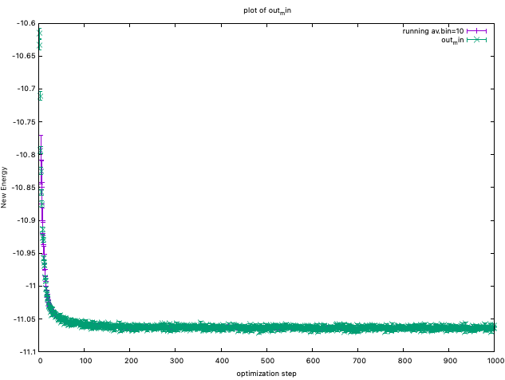

.. TurboRVB_manual documentation master file, created by
   sphinx-quickstart on Thu Jan 24 00:11:17 2019.
   You can adapt this file completely to your liking, but it should at least
   contain the root `toctree` directive.

.. _turborvbtutorial_98:

98 Wavefuntion optimization
======================================================

.. contents:: Table of Contents
   :depth: 2
   
.. _turborvbtutorial_98_00:

00 What the VMC optimization does?
--------------------------------------------------------------------
.. _review: https://doi.org/10.1063/5.0005037

From this document, you can learn how to optimize a wavefunction at the VMC level in practice. The most difficult operation in quantum Monte Carlo simulations is to optimize a many-body wavefunction at the VMC level. Here, we describe how to do it in practice. You can also refer to the optimization part (VII. Optimization of WFs) of the review_ article.

In Variational Monte Carlo, we evaluate the following integral using the Markov-chain monte Carlo method.

.. math::

    E = \cfrac{\int d \vec{R} \cdot \Psi^{*} \left( \vec{R} \right) \cdot \hat{\cal{H}} \Psi \left( \vec{R} \right)}{\int d \vec{R} \cdot \Psi^{*} \left( \vec{R} \right) \Psi \left( \vec{R} \right)}

From the variational principle, the closer to the exact the WF is, the lower the energy becomes.
There once we can evaluate the above integral with some variational parameters :math:`\vec{\alpha}`, we can seek exact solution by minimizing the parameters.

.. math::

    E\left(\vec{\alpha}\right) = \cfrac{\int d \vec{R} \cdot \Psi^{*} \left( \vec{R}, \vec{\alpha} \right) \cdot \hat{\cal{H}} \Psi \left( \vec{R}, \vec{\alpha} \right)}{\int d \vec{R} \cdot \Psi^{*} \left( \vec{R}, \vec{\alpha} \right) \Psi \left( \vec{R}, \vec{\alpha} \right)} \ge E_0

.. _turborvbtutorial_98_01:

01 Optimization method
--------------------------------------------------------------------
There are two major optimization methods are implemented in TurboRVB.
One is the so-called stochastic reconfiguration (SR) method (``itestr4`` = -9,-5),
and the other one is the so-called linear method (LR) with conjugate gradient (``itestr4`` = -4,-8). Notice that -9 and -4 do not optimize exponents of the determinant part, while -5 and -8 optimize them.

In general, the LR method works very efficiently and properly when the number of variational parmeters is not so large. For example, less than 1000? If you optimize more than 1000 variational parameters, we recommend the SR method.

02 important hyperparameters
--------------------------------------------------------------------

The most important parameters in practice are

 - tpar: Acceleration parameter (i.e., learning rate.)
 - parr: Regularization (c.f., LASSO)

tpar
^^^^^^^^^^^^

For example, in the stochastic reconfiguration (SR) method, the variational parameters 
are updated as:

.. math::

    {\alpha _k} \to {\alpha _k} + \Delta  \cdot {\left( {{{{\boldsymbol{\mathcal{S'}}}}^{ - 1}}{\mathbf{f}}} \right)_k},
    
    
where :math:`\Delta` is ``tpar``, :math:`{\mathbf{f}}` is the general force vector, and :math:`{\boldsymbol{\mathcal{S'}}}` is
the variance-covariance matrix which is stochastically evaluated by means of :math:`M` configuration samples :math:`{\mathbf{x}} = \left\{ {{{\mathbf{x}}_1},{{\mathbf{x}}_2}, \ldots {{\mathbf{x}}_M}} \right\}`:

.. math::

    {{\mathcal{S}}_{k,k'}} = \left[ {\frac{1}{M}\sum\limits_{i = 1}^M {\left( {{O_k}\left( {{{\mathbf{x}}_i}} \right) - {{\bar O}_k}} \right) ^ * \left( {{O_{k'}}\left( {{{\mathbf{x}}_i}} \right) - {{\bar O}_{k'}}} \right)} } \right],

where :math:`{O_k}\left( {{{\mathbf{x}}_i}} \right) = \frac{{\partial \ln \Psi \left( {{{\mathbf{x}}_i}} \right)}}{{\partial {\alpha _k}}}` and :math:`{{\bar O}_k} = \frac{1}{M}\sum\limits_{i = 1}^M {{O_k}\left( {{{\mathbf{x}}_i}} \right)}`.
    

parr
^^^^^^^^^^^^

The straightforward implementation of the SR method is not stable mainly because the statistical noise sometimes makes the matrix :math:`{\boldsymbol{\mathcal{S}}}` ill-conditioned,
which deteriorates the efficiency of the optimization method. Therefore, in practice, the diagonal elements of the  preconditioning matrix :math:`{\mathcal{S}}` are shifted by a small positive parameter (:math:`\varepsilon`) as:

.. math::
    
    {s'_{i,i}} = {s_{i.i}}(1 + \varepsilon ),

where :math:`\varepsilon` = ``parr`` in TurboRVB.

This modification improves the efficiency of the optimization by  several orders of magnitude.

.. _turborvbtutorial_98_03:

03 Order of optimizing variational parameters
--------------------------------------------------------------------

The so-called Andrea-Zen's method empirically works very well for the LR method.
Indeed, to avoid local minima in the Jastrow, the developers have experienced that it is important at the beginning to optimize only the one-body Jastrow part.
According to this procedure, one should optimize variational parameters in the following order.

1. Put a reasonable two-body Jastrow parameter (typically ~ 1.0 for -6, -15, -22),
2. Optimize homogenous and inhomogeneous one-body Jastrows (two-body and three-body are fixed),
3. Optimize three-body Jastrows (two-body fixed), and
4. Optimize two-body Jastrow(s) and the determinant part,

wherein

2. One should set ``iesfree=1`` and ``iesd=1``, and put ``twobodyoff=.true.`` and ``iesdtwobodyoff=.true.`` in the ``&parameters`` section, 
3. One should remove ``iesdtwobodyoff=.true.`` option, and
4. One should remove ``twobodyoff=.true.`` and ``iesdtwobodyoff=.true.``, and set ``iessw=1`` (determinant optimization).

.. _turborvbtutorial_98_04:

04 Criterium of optimization convergence
--------------------------------------------------------------------

In practice, during an optimization, the code monitors the variational energy (:math:`E\left( \boldsymbol{\alpha} \right)`) and the maximum value of the signal to noise ratio among all  the force components, which is denoted as ``devmax``  in the code:

.. math::

    devmax \equiv \max_k \left( {\left| {\frac{{{f_k}}}{{{\sigma _{{f_k}}}}}} \right|} \right)

where :math:`{\sigma _{{f_k}}}` represents the estimated error bar of a general force :math:`{f_k} =- \frac{{\partial E\left( \alpha  \right)}}{{\partial {\alpha _k}}} =  - \frac{\partial }{{\partial {\alpha _k}}}\frac{{\braket{{\Psi _\alpha }|\hat {\mathcal{H}}|{\Psi _\alpha }}}}{{\braket{{\Psi _\alpha }|{\Psi _\alpha }}}}`. 

You can plot ``energies`` by ``plot_Energy.sh``

You can also plot ``devmaxs`` by ``plot_devmax.sh``

.. image:: devmax.png
   :scale: 50%
   :align: center
   
The devepoler has experience that, at least, ``devmax`` should be smaller 
than 4.0 after optimization. However, the developers also have experienced 
that this simple criteria is not sufficient to obtain a converged result.

Instead, the developers recently checked if the ``two-body Jastrow`` and the ``inhomogeneous one-body Jastrows`` are also converged.
This seems an empirically good criterium of optimization convergence,
though it is still under debate.

.. _turborvbtutorial_98_05:

05 Hyperparameters in the optimization methods
--------------------------------------------------------------------
There are several hyperparameters in the optimization method.
Although a proper choice for some hyperparameters are still under debate,
we show a tentative guidline.

.. _turborvbtutorial_98_05_01:

05-01 nweight
^^^^^^^^^^^^^^^^^^^^^^^^^^^^^^^^^^^^
``nweight`` is the number of Monte Carlo sampling per optimization step.
For the LR method, the number of samplings in VMC should be much larger than the number of variational parameters, i.e., ``nweight`` :math:`\times` ``Number of (mpi) tasks`` :math:`>` 5 :math:`\sim` 10 :math:`\times` :math:`p`, where :math:`p` is the number of variational parameters.

For the SR method, ``nweight`` :math:`\times` ``Number of (mpi) tasks`` can be set even or smaller than :math:`p` as long as ``parr`` is set sufficiently large.

.. _turborvbtutorial_98_05_02:

05-02 tpar
^^^^^^^^^^^^^^^^^^^^^^^^^^^^^^^^^^^^
``tpar`` is an acceleration hyperparameter in optimization, corresponding to :math:`Delta` in Eq.131 and that in Eq.139 of the review_ paper for the LR and SR methods, respectively. In the machine learning community, ``tpar`` is also called ``learning rate``.
For the LR method, ``tpar`` = 0.35 usually works well.
For the SR method, one should set ``tpar`` much smaller, typically 1.0d-4.

``adjust_tpar`` is a useful option recently introduced by Andrea Tirelli, to find an optimal ``tpar``. Indeed, if ``adjust_tpar`` is set true, ``tpar`` gradually increases as optimization iteration goes on after 100 equilibrium iterations.

``beta_learning`` is also a useful option to realize a stable optimization. ``beta_learning = 0.90`` is a good starting point?

.. _turborvbtutorial_98_05_03:

05-03 parr
^^^^^^^^^^^^^^^^^^^^^^^^^^^^^^^^^^^^
``parr`` is a regularization parameter which is added to the diagonal elements of a preconditioning matrix S, in Eq.128 of the review_ paper.
In the LR method, XXX

:red:`KN is now working...`

.. _turborvbtutorial_98_05_04:

05-04 ncg
^^^^^^^^^^^^^^^^^^^^^^^^^^^^^^^^^^^^
This works only for the LR method. 

:red:`KN is now working...`

.. _turborvbtutorial_98_05_05:

05-05 npbra and parcurpar
^^^^^^^^^^^^^^^^^^^^^^^^^^^^^^^^^^^^
This works only for the LR method.

:red:`KN is now working...`