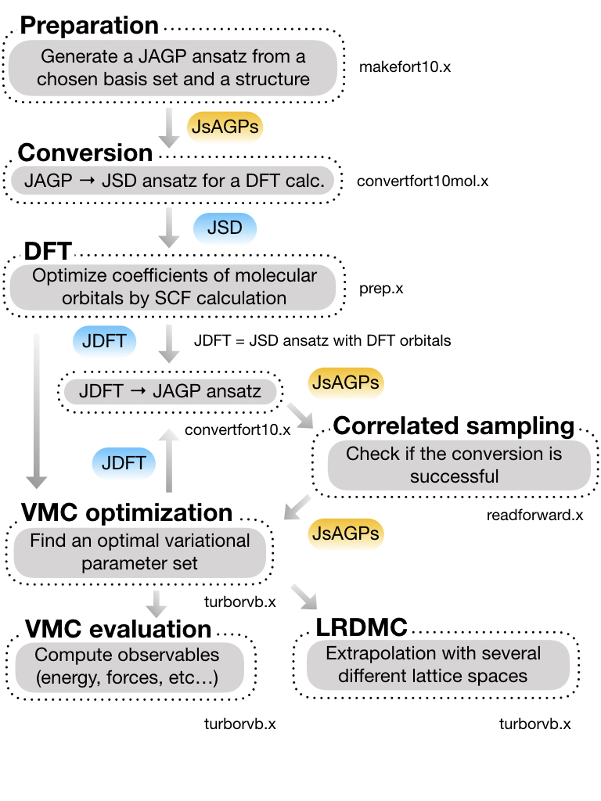
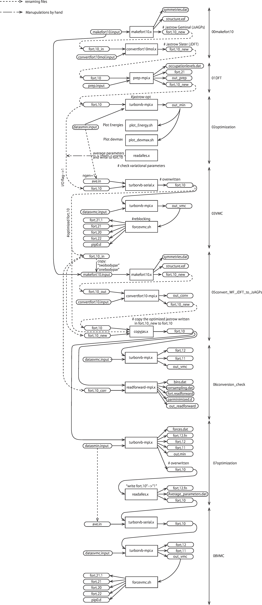

Basic workflow
======================================================

This is a basic workflow:

This is the detailed workflow of this tutorial in this section :ref:`turborvbtutorial_0101`:

------------------------------------------------------
Reference link
------------------------------------------------------
* make ``fort.10``

   - :ref:`turborvbtutorial_command_makefort10.x`
   - :ref:`turborvbtutorial_command_convertfort10mol.x`
* DFT

   - :ref:`turborvbtutorial_command_prep.x`
* optimization

   - :ref:`turborvbtutorial_command_plots`
   - :ref:`turborvbtutorial_command_readalles.x`
* VMC

   - :ref:`turborvbtutorial_command_turborvb.x`
   - :ref:`turborvbtutorial_command_forcevmc.sh`

* convert JDFT wavefunction to JsAGPs one

   - :ref:`turborvbtutorial_command_convertfort10.x`
   - :ref:`turborvbtutorial_command_copyjas_copydet.x`
* conversion check

   - :ref:`turborvbtutorial_command_readforward.x`
