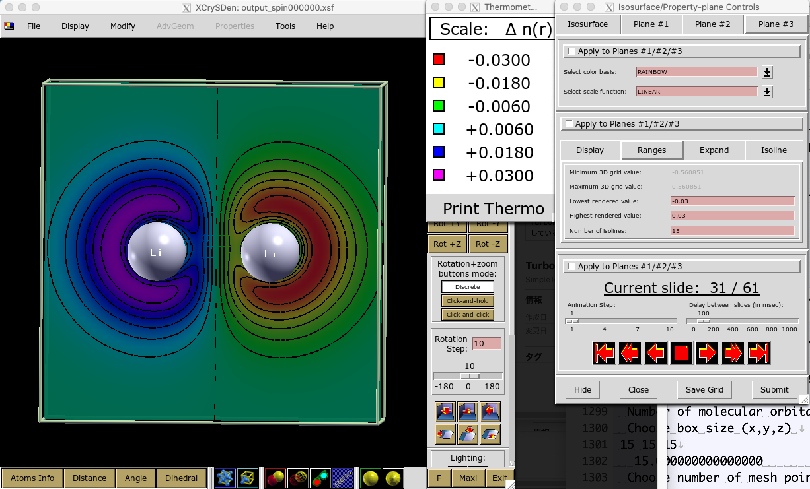

.. TurboRVB_manual documentation master file, created by
   sphinx-quickstart on Thu Jan 24 00:11:17 2019.
   You can adapt this file completely to your liking, but it should at least
   contain the root `toctree` directive.

.. _turborvbtutorial_0201:

02_01Lithium_dimer
======================================================

.. _turborvbtutorial_0201_00:

00 Introduction
--------------------------------------------------------------------

.. contents:: Table of Contents
   :depth: 3
   
From this tutorial, you can learn how to calculate all-electron Variational Monte Carlo (VMC) and lattice regularized diffusion Monte Carlo (LRDMC) energies of the Li\ :sub:`2` dimer with various ansatz. JDFT, JSD, JsAGPs, JAGPu, and JAGP(JPf). 

Reference values (https://aip.scitation.org/doi/suppl/10.1063/1.3288054)

Li atom
 - HF = -7.4327 Ha
 - Exact = -7.4781 Ha

Li\ :sub:`2` dimer
 - d\ :sub:`bond` = 2.67330 angstrom (J. Chem. Phys. 129 204105)
 - HF = -14.8715 Ha
 - Exact = -14.9951 Ha
 - E\ :sub:`bond` = 24.4 kcal/mol = 38.9 mHa
 
.. You can download all the input and output files from :download:`here  <./file.tar.gz>`.

.. _review: https://doi.org/10.1063/5.0005037

.. _turborvbtutorial_0201_01:

01 Li\ :sub:`2` dimer and Li atom - JDFT ansatz
--------------------------------------------------------------------

.. _turborvbtutorial_0201_01_01:

01-01 Li\ :sub:`2` dimer: Preparing a wave function
^^^^^^^^^^^^^^^^^^^^^^^^^^^^^^^^^^^^^^^^^^^^^^^^^^^^^^^^^^^^^^^^^^^^

Prepare Li\ :sub:`2` dimer structure, :download:`Li2.xyz <./Li2.xyz>` ::

      2
      comment line
	  Li 0.0000 0.0000 -2.52589975576638451762
	  Li 0.0000 0.0000 2.52589975576638451762

and prepare ``makefort10.input`` and ``convertfort10mol.input`` and 

.. code-block:: bash

    # makefort10.input
    
    &system
    posunits='bohr'
    natoms=2
    ntyp=1
    pbcfort10=.false.
    /
    
    &electrons
    twobody=-15
    twobodypar=1.00
    onebodypar=1.00
    no_4body_jas=.false.
    neldiff=0
    /
    
    &symmetries
    eqatoms=.true.
    rot_det=.true.
    symmagp=.true.
    /
    
    ATOMIC_POSITIONS 
    3.0000000000000000  3.0000000000000000  0.0000000000000000  0.0000000000000000  -2.5259024244810400
    3.0000000000000000  3.0000000000000000  0.0000000000000000  0.0000000000000000  2.5259024244810400
    /
    
    ATOM_3
    &shells
    nshelldet=11
    nshelljas=5
    /
    1   1   16
    1   14.24
    1   1   16
    1   4.581
    1   1   16
    1   1.58
    1   1   16
    1   0.564
    1   1   16
    1   0.07345
    1   1   16
    1   0.02805
    1   1   36
    1   1.534
    1   1   36
    1   0.2749
    1   1   36
    1   0.07362
    1   1   36
    1   0.02403
    1   1   68
    1   0.1144
    #  Parameters atomic Jastrow wf 
    1   1   16
    1   4.581
    1   1   16
    1   1.58
    1   1   16
    1   0.564
    1   1   36
    1   0.2749
    1   1   36
    1   0.07362

.. code-block:: bash

    # convertfort10mol.input

    &control
    epsdgm=-1d-14
    /
    &mesh_info
    ax=0.20
    nx=64
    ny=68
    nz=128
    /
    &molec_info
    nmol=3
    nmolmax=3
    nmolmin=3
    /

You may obtain makefort10.input. Next, you can run ``makefort10.sh``:

.. code-block:: bash
  
    kosukenoMBP% ./makefort10.sh

where,

.. code-block:: bash

    # makefort10.sh
    kosukenoMBP% cat makefort10.sh
    makefort10.x < makefort10.input > out_make
    mv fort.10_new fort.10
    mv fort.10 fort.10_in
    convertfort10mol.x < convertfort10mol.input > out_mol
    mv fort.10_new fort.10

The generated wave function ``fort.10`` is a symmetric Jastrow Antisymmetrized Geminal Power (JsAGPs).

.. _turborvbtutorial_0201_01_02:

01-02 Li\ :sub:`2` dimer: generate a trial wave function using DFT.
^^^^^^^^^^^^^^^^^^^^^^^^^^^^^^^^^^^^^^^^^^^^^^^^^^^^^^^^^^^^^^^^^^^^
The next step is to generate a trial wave function using the built-in DFT code.
This is the minimal input file:

.. code-block:: bash
    
    # prep.input
    &simulation
    itestr4=-4
    iopt=1
    double_mesh=.true
    /
    &pseudo
    /
    &vmc
    /
    &optimization
    molopt=1
    /
    &readio
    /
    &parameters
    /
    &molecul
    ax=0.2
    ay=0.2
    az=0.2
    nx=64
    ny=64
    nz=128
    /
    &dft
    maxit=50
    epsdft=1d-5
    mixing=1.0d0
    typedft=1
    optocc=0
    nelocc=3
    l0_at=0.8320335292207617
    scale_z=5
    scale_hartree=-1.00
    corr_hartree=.true.
    linear=.false.
    /
    2 2 2

Then, you can run DFT by typing:

.. code-block:: bash

    prep-serial.x < prep.input > out_prep

You can optimize one-body Jastrow.

.. code-block:: bash

    #onebody-script for bash on mac
    b_onebody_list="0.5 0.6 0.7 0.8 0.9 1.0 1.1 1.2 1.3 1.4 1.5"
    
    root_dir=`pwd`
    for b_onebody in $b_onebody_list
    do
        mkdir onebody_$b_onebody
        cd onebody_$b_onebody
        cp $root_dir/temp/fort.10 ./
        cp $root_dir/temp/prep.input ./
        gsed -i -e "s/b_onebody/$b_onebody/g" fort.10
        prep-serial.x < prep.input > out_prep
        cd $root_dir
    done
    
    echo "b_onebody dft energy" > result.out
    
    for b_onebody in $b_onebody_list
    do
        cd onebody_$b_onebody
        energy=`grep "Final self consistent energy" ./out_prep | awk '{print $7}'`
        echo "${b_onebody}  ${energy}" >> ../result.out
        cd $root_dir
    done
    
You may get

.. code-block:: bash
    
    kosukenoMBP% cat result.out 
    b_onebody dft energy
    0.5  -14.740030455469444
    0.6  -14.746632760686529
    0.7  -14.749842736580408
    0.8  -14.750834382315727
    0.9  -14.750935229881659  <- the lowest one
    1.0  -14.750763468915963
    1.1  -14.750537472297879
    1.2  -14.750319868767475
    1.3  -14.750124626530374
    1.4  -14.749953844050875
    1.5  -14.749807044323163

Here, the DFT double-grid integration scheme is employed.

``l0_at`` The radius where the double-grid is used (Bohr)
``scale_z`` The number of grids used for the double grid. Indeed, the grid sizes in the double-grid region are ``ax/scale_z``, ``ay/scale_z``, and ``ax/scale_z``
``scale_hartree``, ``corr_hartree``, and ``linear`` can be default values.

.. _turborvbtutorial_0201_01_03:

01-03 Li\ :sub:`2` dimer: Jastrow factor optimization (WF=JDFT)
^^^^^^^^^^^^^^^^^^^^^^^^^^^^^^^^^^^^^^^^^^^^^^^^^^^^^^^^^^^^^^^^^^^^
One should refer to the :ref:`Hydrogen tutorial <turborvbtutorial_0101_02>` for the details.
Here, only needed commands are shown.

.. code-block:: bash

    cd 02optimization/
    cp ../01trial_wavefunction/02onebody_jastrow_opt/onebody_0.9/fort.10_new fort.10
    cp fort.10 fort.10_dft
    mpirun -np 4 turborvb-mpi.x < datasmin.input > out_min &
    rm -r turborvb.scratch/
    plot_Energy.sh out_min
    plot_devmax.sh out_min
    readalles.x << ____EOS
    1 41 10 
    0 
    1000 
    ____EOS

.. _turborvbtutorial_0201_01_04:

01-04 Li\ :sub:`2` dimer: VMC (WF=JDFT)
^^^^^^^^^^^^^^^^^^^^^^^^^^^^^^^^^^^^^^^^^^^^^^^^^^^^^^^^^^^^^^^^^^^^

Please refer to the :ref:`Hydrogen tutorial <turborvbtutorial_0101_03>` for the details.
Here, only needed commands are shown.

.. code-block:: bash

    cd 03vmc/
    cp ../02optimization/fort.10 ./
    cp ../02optimization/datasmin.input ave.in
    gsed -i -e 's/ngen=.*/ngen=1/g' ave.in
    gsed -i -e 's/iopt=.*/iopt=1/g' ave.in
    line_num_key=`grep "unconstrained" -n fort.10 | cut -d ":" -f 1`
    line_num=`expr $line_num_key + 1`
    line=`gsed -n ${line_num}p fort.10`
    mod_line=`echo $line | gsed -e 's/0$/ 1/'`
    gsed -i "${line_num}d" fort.10
    gsed -i "${line_num_key}a $mod_line" fort.10
    turborvb-serial.x < ave.in > out_ave
    mpirun -np 4 turborvb-mpi.x < datasvmc.input > out_vmc;
    forcevmc.sh 20 5 1
    cat pip0.d | grep "Energy"
    ...
    number of bins read =       14996
    Energy =  -14.9757876300445       4.853630781726438E-004
    Variance square =  7.979609547808308E-002  2.379635260709342E-004
    Est. energy error bar =  4.748991835467470E-004  2.848268581908139E-006
    Est. corr. time  =   3.39078657629560       3.817021016290687E-002

VMC (JDFT) = -14.9759(9)  Ha

.. _turborvbtutorial_0201_01_05:

01-05 Li\ :sub:`2` dimer: LRDMC (WF=JDFT)
^^^^^^^^^^^^^^^^^^^^^^^^^^^^^^^^^^^^^^^^^^^^^^^^^^^^^^^^^^^^^^^^^^^^

One should refer to the :ref:`Hydrogen tutorial <turborvbtutorial_0101_04>` for the details.
Here, only needed explanations and commands are shown.

.. code-block:: bash

    # datasfn.input 
    &simulation
    itestr4=-6
    ngen=200000
    iopt=2
    /
    &pseudo
    /
    &dmclrdmc
    tbra=0.1d0
    etry=-15.00d0
    alat=-0.20
    !alat2=0.0d0
    iesrandoma=.true.
    /
    &readio
    /
    &parameters
    /

Here are brief explanations of the variables for a LRDMC calculation:

**&dmclrdmc section**

``tbra`` projection time (i.e, :math:`\exp(-\tau \cdot \hat{\mathcal{H}})`). Set 0.1 in general. However, for a heavy element, it is better to choose a smaller value. Please check Average number of survived walkers in ``out_fn``

.. code-block:: bash

    Av. num. of survived walkers/ # walkers in the branching
    0.9939

if the number is too small, try smaller ``tbra``.

``etry`` Put a DFT of VMC energy. :math:`\Gamma` in eq.6 of the review_ paper is set 2 :math:`\times` ``etry``

``alat`` The lattice space for discretizing the Hamitonian. If you do a single grid calculation (i.e., alat2=0.0d0), please put a negative value. If you do a double-grid calculation (See. Nakano's paper), put a positive value and set ``iesrandoma=.true.``. This trick is needed for satisfying the detailed-valance condition.

``alat2`` The corser lattice space used in the double-grid calculation. If you put 0.0d0, TurboRVB does a single grid calculation. If you want to do a double-grid calculation for a compound include Z > 2 element, please comment out alat2 because alat2 is automatically set (See Nakano's paper).

Prepare different working directories, copy ``fort.10`` to each directory, and set the corresponding ``alat``.

.. code-block:: bash

    alat_0.8Z
    alat_1.0Z
    alat_1.2Z
    alat_1.5Z

And then, run each LRDMC calculation after generating initial 
electron configurations at the VMC level.

.. code-block:: bash

    cd ../03lrdmc/
    cp ../02vmc/fort.10 .
    alat_list="0.8Z 1.0Z 1.2Z 1.5Z"
    lrdmc_root_dir=`pwd`
    for alat in $alat_list
    do
        cd alat_${alat}
        cp ${lrdmc_root_dir}/fort.10 ./fort.10
        mpirun -np 4 turborvb-mpi.x < datasvmc.input > out_vmc;
        mpirun -np 4 turborvb-mpi.x < datasfn.input > out_fn;
        cd ${lrdmc_root_dir}
    done
    
    num=0
    echo -n > ${lrdmc_root_dir}/evsa.gnu
    for alat in $alat_list
    do  
        cd alat_${alat}
        num=`expr ${num} + 1`
        echo "10 20 5 1" | readf.x
        alat_d=`grep alat= datasfn.input | cut -f 2 -d '='`
        echo -n "${alat_d} " >> ${lrdmc_root_dir}/evsa.gnu
        tail -n 1 fort.20 | awk '{print $1, $2}' >> ${lrdmc_root_dir}/evsa.gnu
        cd ${lrdmc_root_dir}
    done
    
    gsed "1i 2  ${num}  4  1" evsa.gnu > evsa.in

One has collected all LRDMC energis into evsa.in 

.. code-block:: bash
    
    # Z=3 (Li)
    2  4  4  1
    0.22222 -14.9907899448815       3.101461151525789E-004  <- 1/(1.5*Z)
    0.27778 -14.9920193657668       3.175522770991489E-004  <- 1/(1.2*Z)
    0.33333 -14.9933364338623       3.387085675247969E-004  <- 1/(1.0*Z)
    0.41667 -14.9969823559963       3.650299072111256E-004  <- 1/(0.8*Z)

``funvsa.x`` is a tool for a quadratic fitting:

.. code-block:: bash

    funvsa.x < evsa.in > evsa.out

You can see

.. code-block:: bash

  Reduced chi^2  =  0.258290367368527     
  Coefficient found 
           1  -14.9894036676827       1.126607950073031E-003  <- E_0
           2 -2.333404434142712E-002  2.310746587271902E-002  <- k_1
           3 -0.116381701497219       0.102032433967512       <- k_2

Li\ :sub:`2` dimer
 - HF = -14.8715 Ha
 - :blue:`VMC(JDFT)   = -14.9759(9) Ha`
 - :blue:`LRDMC(JDFT) = -14.9894(11) Ha`
 - Exact = -14.9951 Ha

.. _turborvbtutorial_0201_01_06:

01-06 Li atom: preparation of a wave function
^^^^^^^^^^^^^^^^^^^^^^^^^^^^^^^^^^^^^^^^^^^^^^^^^^^^^^^^^^^^^^^^^^^^

and prepare ``makefort10.input`` and ``convertfort10mol.input`` and 

.. code-block:: bash

    # makefort10.input
    
    &system
    posunits='bohr'
    natoms=1
    ntyp=1
    pbcfort10=.false.
    /
    
    &electrons
    twobody=-15
    twobodypar=1.00
    onebodypar=0.90
    no_4body_jas=.false.
    neldiff=1  !! unpaired electrons
    /
    
    &symmetries
    eqatoms=.true.
    rot_det=.true.
    symmagp=.true.
    /
    
    ATOMIC_POSITIONS 
    3.0000000000000000  3.0000000000000000  0.0000000000000000  0.0000000000000000  0.0000000000000000
    /
    
    ATOM_3
    &shells
    nshelldet=11
    nshelljas=5
    /
    1   1   16
    1   14.24
    1   1   16
    1   4.581
    1   1   16
    1   1.58
    1   1   16
    1   0.564
    1   1   16
    1   0.07345
    1   1   16
    1   0.02805
    1   1   36
    1   1.534
    1   1   36
    1   0.2749
    1   1   36
    1   0.07362
    1   1   36
    1   0.02403
    1   1   68
    1   0.1144
    #  Parameters atomic Jastrow wf 
    1   1   16
    1   4.581
    1   1   16
    1   1.58
    1   1   16
    1   0.564
    1   1   36
    1   0.2749
    1   1   36
    1   0.07362

.. code-block:: bash

    # convertfort10mol.input

    &control
    epsdgm=-1d-14
    /
    &mesh_info
    ax=0.20
    nx=64
    ny=64
    nz=64
    /
    &molec_info
    nmol=1
    nmolmax=1
    nmolmin=1
    /

You may obtain makefort10.input. Next, you can run ``makefort10.sh``:

.. code-block:: bash
  
    kosukenoMBP% ./makefort10.sh

where,

.. code-block:: bash

    # makefort10.sh
    kosukenoMBP% cat makefort10.sh
    makefort10.x < makefort10.input > out_make
    mv fort.10_new fort.10
    mv fort.10 fort.10_in
    convertfort10mol.x < convertfort10mol.input > out_mol
    mv fort.10_new fort.10

The generated wave function ``fort.10`` is a symmetric Jastrow Antisymmetrized Geminal Power (JsAGPs).

.. _turborvbtutorial_0201_01_07:

01-07 Li atom: generate a trial wave function using DFT.
^^^^^^^^^^^^^^^^^^^^^^^^^^^^^^^^^^^^^^^^^^^^^^^^^^^^^^^^^^^^^^^^^^^^
One should refer to the :ref:`Hydrogen tutorial <turborvbtutorial_0101_01>` for the details.
Here, only needed commands are shown.

.. code-block:: bash

    mpirun -np 4 prep-mpi.x < prep.input > out_prep

.. _turborvbtutorial_0201_01_08:

01-08 Li atom: Jastrow factor optimization (WF=JDFT)
^^^^^^^^^^^^^^^^^^^^^^^^^^^^^^^^^^^^^^^^^^^^^^^^^^^^^^^^^^^^^^^^^^^^

One should refer to the :ref:`Hydrogen tutorial <turborvbtutorial_0101_02>` for the details.
Here, only needed commands are shown.

.. code-block:: bash

    cd 02optimization/
    cp ../01trial_wavefunction/01DFT/fort.10_new fort.10 
    cp fort.10 fort.10_dft
    mpirun -np 4 turborvb-mpi.x < datasmin.input > out_min &
    rm -r turborvb.scratch/
    plot_Energy.sh out_min
    plot_devmax.sh out_min
    readalles.x << ____EOS
    1 41 10 
    0 
    1000 
    ____EOS

.. _turborvbtutorial_0201_01_09:

01-09 Li atom: VMC (WF=JDFT)
^^^^^^^^^^^^^^^^^^^^^^^^^^^^^^^^^^^^^^^^^^^^^^^^^^^^^^^^^^^^^^^^^^^^

Please refer to the :ref:`Hydrogen tutorial <turborvbtutorial_0101_03>` for the details.
Here, only needed commands are shown.

.. code-block:: bash

    cd 03vmc/
    cp ../02optimization/fort.10 ./
    cp ../02optimization/datasmin.input ave.in
    gsed -i -e 's/ngen=.*/ngen=1/g' ave.in
    gsed -i -e 's/iopt=.*/iopt=1/g' ave.in
    line_num_key=`grep "unconstrained" -n fort.10 | cut -d ":" -f 1`
    line_num=`expr $line_num_key + 1`
    line=`gsed -n ${line_num}p fort.10`
    mod_line=`echo $line | gsed -e 's/0$/ 1/'`
    gsed -i "${line_num}d" fort.10
    gsed -i "${line_num_key}a $mod_line" fort.10
    turborvb-serial.x < ave.in > out_ave
    mpirun -np 4 turborvb-mpi.x < datasvmc.input > out_vmc;
    forcevmc.sh 20 5 1
    cat pip0.d 
    ...
    number of bins read =       14996
    Energy =  -7.47539042703452       2.682804200575495E-004
    Variance square =  2.847683107759093E-002  1.295272783812896E-004
    Est. energy error bar =  2.683664075931440E-004  1.733280980510503E-006
    Est. corr. time  =   3.03421296313493       3.544802996972372E-002

VMC (JDFT) = -14.9759(9)  Ha  (Li\ :sub:`2` dimer)
VMC (JDFT) =  -7.4754(3)  Ha  (Li atom)

Li\ :sub:`2` dimer
 - E\ :sub:`bond` = 38.9 mHa (experiment)
 - E\ :sub:`bond` = 25.1 mHa (VMC-JDFT)

.. _turborvbtutorial_0201_01_10:

01-10 Li atom: LRDMC (WF=JDFT)
^^^^^^^^^^^^^^^^^^^^^^^^^^^^^^^^^^^^^^^^^^^^^^^^^^^^^^^^^^^^^^^^^^^^

One should refer to the :ref:`Hydrogen tutorial <turborvbtutorial_0101_04>` for the details.
Here, only needed commands are shown.

.. code-block:: bash

    cd ../03lrdmc/
    cp ../02vmc/fort.10 .
    alat_list="0.8Z 1.0Z 1.2Z 1.5Z"
    lrdmc_root_dir=`pwd`
    for alat in $alat_list
    do
        cd alat_${alat}
        cp ${lrdmc_root_dir}/fort.10 ./fort.10
        mpirun -np 4 turborvb-mpi.x < datasvmc.input > out_vmc;
        mpirun -np 4 turborvb-mpi.x < datasfn.input > out_fn;
        cd ${lrdmc_root_dir}
    done
    
    num=0
    echo -n > ${lrdmc_root_dir}/evsa.gnu
    for alat in $alat_list
    do  
        cd alat_${alat}
        num=`expr ${num} + 1`
        echo "10 20 5 1" | readf.x
        alat_d=`grep alat= datasfn.input | cut -f 2 -d '='`
        echo -n "${alat_d} " >> ${lrdmc_root_dir}/evsa.gnu
        tail -n 1 fort.20 | awk '{print $1, $2}' >> ${lrdmc_root_dir}/evsa.gnu
        cd ${lrdmc_root_dir}
    done
    
    gsed "1i 2  ${num}  4  1" evsa.gnu > evsa.in

One has collected all LRDMC energis into evsa.in 

.. code-block:: bash
    
    # Z=3 (Li)
    2  4  4  1
    0.22222 -7.47824129633644       1.450042242028465E-004  <- 1/(1.5*Z)
    0.27778 -7.47833093539214       1.562945930953174E-004  <- 1/(1.2*Z)
    0.33333 -7.47909688312053       1.628394384627272E-004  <- 1/(1.0*Z)
    0.41667 -7.48032309244573       1.866069140147947E-004  <- 1/(0.8*Z)

``funvsa.x`` is a tool for a quadratic fitting:

.. code-block:: bash

    funvsa.x < evsa.in > evsa.out

You can see

.. code-block:: bash

  Reduced chi^2  =   1.52438473425829     
  Coefficient found 
           1  -7.47794022870940       5.344739888993537E-004  <- E_0
           2 -1.467218812266460E-003  1.107590136996555E-002  <- k_1
           3 -7.145382242986854E-002  4.939621583555785E-002  <- k_2

Li\ :sub:`2` dimer
 - :blue:`LRDMC(JDFT) = -14.9894(11) Ha`
 - :blue:`LRDMC(JDFT) = -7.4779(5) Ha`
 
 - E\ :sub:`bond` = 38.9 mHa (experiment)
 - E\ :sub:`bond` = 25.1 mHa (VMC-JDFT)
 - E\ :sub:`bond` = 33.6 mHa (LRDMC-JDFT)

.. _turborvbtutorial_0201_02:

02 Li\ :sub:`2` dimer and Li atom - JSD ansatz
-----------------------------------------------------------------------

.. _turborvbtutorial_0201_02_01:

02-01 Li\ :sub:`2` dimer and Li atom: VMC-optimization (WF=JSD)
^^^^^^^^^^^^^^^^^^^^^^^^^^^^^^^^^^^^^^^^^^^^^^^^^^^^^^^^^^^^^^^^^^^^

One can optimize the determinant part of the JDFT ansatz, the resultant 
ansatz is called JSD.
In this case, one does not have to convert the ansatz, just put the 
following section in ``datasmin.input`` at the optimization step.

.. code-block:: bash

    # datasmin.input for the Li dimer
    
    &optimization
      molopt=-1
      ...
    /
    
    &parameters
      iesd=1
      iesfree=1
      iessw=1
    /
    
    &molecul
      ax=0.10
      ay=0.10
      az=0.10
      nx=150
      ny=150
      nz=250
      nmolmin=3
      nmolmax=3
    /

.. code-block:: bash

    # datasmin.input for the Li atom
    
    &optimization
      molopt=-1
      ...
    /
    
    &parameters
      iesd=1
      iesfree=1
      iessw=1
    /
    
    &molecul
      ax=0.10
      ay=0.10
      az=0.10
      nx=150
      ny=150
      nz=150
      nmolmin=1
      nmolmax=1
    /

Please refer to the :ref:`Hydrogen tutorial <turborvbtutorial_0101_02>` for the details.
Here, only needed commands are shown.

.. code-block:: bash

    # Li2 dimer - vmc opt
    cp ../../../01JDFT/01Li2_dimer/03vmc/fort.10 .
    cp fort.10 fort.10_jdft
    mpirun -np 4 turborvb-mpi.x < datasmin.input > out_min;
    readalles.x << ____EOS
    1 181 1 0
    0
    1000
    ____EOS

.. code-block:: bash

    # Li atom - vmc opt
    cp ../../../01JDFT/02Li_atom/03vmc/fort.10 .
    cp fort.10 fort.10_jdft
    mpirun -np 4 turborvb-mpi.x < datasmin.input > out_min;
    readalles.x << ____EOS
    1 181 1 0
    0
    1000
    ____EOS

.. _turborvbtutorial_0201_02_02:

02-02 Li\ :sub:`2` dimer and Li atom: VMC (WF=JSD)
^^^^^^^^^^^^^^^^^^^^^^^^^^^^^^^^^^^^^^^^^^^^^^^^^^^^^^^^^^^^^^^^^^^^

Please refer to the :ref:`Hydrogen tutorial <turborvbtutorial_0101_03>` for the details.
Here, only needed commands are shown.

.. code-block:: bash

    cd ../02vmc
    cp ../01optimization/fort.10 .
    cp ../01optimization/datasmin.input ave.in
    gsed -i -e 's/ngen=.*/ngen=1/g' ave.in
    gsed -i -e 's/iopt=.*/iopt=1/g' ave.in
    line_num_key=`grep "unconstrained" -n fort.10 | cut -d ":" -f 1`
    line_num=`expr $line_num_key + 1`
    line=`gsed -n ${line_num}p fort.10`
    mod_line=`echo $line | gsed -e 's/0$/ 1/'`
    gsed -i "${line_num}d" fort.10
    gsed -i "${line_num_key}a $mod_line" fort.10
    turborvb-serial.x < ave.in > out_ave
    mpirun -np 4 turborvb-mpi.x < datasvmc.input > out_vmc;
    forcevmc.sh 10 2 1
    cat pip0.d | grep "Energy"

.. _turborvbtutorial_0201_02_03:

02-03 Li\ :sub:`2` dimer and Li atom: LRDMC (WF=JSD)
^^^^^^^^^^^^^^^^^^^^^^^^^^^^^^^^^^^^^^^^^^^^^^^^^^^^^^^^^^^^^^^^^^^^

Please refer to the :ref:`Hydrogen tutorial <turborvbtutorial_0101_04>` for the details.
Here, only needed commands are shown.

.. code-block:: bash

    cd ../03lrdmc/
    cp ../02vmc/fort.10 .
    alat_list="0.8Z 1.0Z 1.2Z 1.5Z"
    lrdmc_root_dir=`pwd`
    for alat in $alat_list
    do
        cd alat_${alat}
        cp ${lrdmc_root_dir}/fort.10 ./fort.10
        mpirun -np 4 turborvb-mpi.x < datasvmc.input > out_vmc;
        mpirun -np 4 turborvb-mpi.x < datasfn.input > out_fn;
        cd ${lrdmc_root_dir}
    done
    
    num=0
    echo -n > ${lrdmc_root_dir}/evsa.gnu
    for alat in $alat_list
    do  
        cd alat_${alat}
        num=`expr ${num} + 1`
        echo "10 20 5 1" | readf.x
        alat_d=`grep alat= datasfn.input | cut -f 2 -d '='`
        echo -n "${alat_d} " >> ${lrdmc_root_dir}/evsa.gnu
        tail -n 1 fort.20 | awk '{print $1, $2}' >> ${lrdmc_root_dir}/evsa.gnu
        cd ${lrdmc_root_dir}
    done
    
    gsed "1i 2  ${num}  4  1" evsa.gnu > evsa.in
    
    funvsa.x < evsa.in > evsa.out

Finally I got:

Li\ :sub:`2` dimer

 - HF = -14.8715 Ha
 - VMC(JDFT)   = -14.9759(9) Ha
 - LRDMC(JDFT) = -14.9894(11) Ha
 - :blue:`VMC(JSD)   = -14.9803(5) Ha`
 - :blue:`LRDMC(JSD) = -14.9909(12) Ha`
 - Exact = -14.9951 Ha

Li atom

 - HF = -7.4327 Ha
 - VMC(JDFT)   = -7.4754(3) Ha
 - LRDMC(JDFT) = -7.4779(5) Ha
 - :blue:`VMC(JSD)   = -7.4769(2) Ha`
 - :blue:`LRDMC(JSD) = -7.4779(4) Ha`
 - Exact = -7.4781 Ha

Binding energy

 - E\ :sub:`bond` = 38.9 mHa (experiment)

.. _turborvbtutorial_0201_03:

03 Li\ :sub:`2` dimer and Li atom - JsAGPs ansatz
-----------------------------------------------------------------------

The procedure is the almost same as in the Hydrogen-dimer tutorial. 
Three hybrid-orbitals (``nhyb=2``) were employed here.

.. _turborvbtutorial_0201_03_01:

03-01 Li\ :sub:`2` dimer and Li atom: Conversion of WF (WF=JsAGPs)
^^^^^^^^^^^^^^^^^^^^^^^^^^^^^^^^^^^^^^^^^^^^^^^^^^^^^^^^^^^^^^^^^^^^

Please refer to the :ref:`Hydrogen tutorial <turborvbtutorial_0101_05>` for the details.
Here, only needed commands are shown.

.. code-block:: bash

    # Li2 dimer - conversion
    cp ../../../02JSD/01Li2_dimer/02vmc/fort.10 ./fort.10_in
    cp ../../../01JDFT/01Li2_dimer/01trial_wavefunction/00makefort10/makefort10.input .
     twobodyjas=`grep -A 1 "Parameters Jastrow two body" ./fort.10_in | tail -n -1 | awk '{print $2}'`
    onebodyjas=`grep -A 1 "Parameters Jastrow two body" ./fort.10_in | tail -n -1 | awk '{print $3}'`
    echo "twobodyjas=${twobodyjas} onebodyjas=${onebodyjas}"
    
    gsed -i -e "/twobodypar/c\ twobodypar=${twobodyjas}" \
            -e "/onebodypar/c\ onebodypar=${onebodyjas}" \
            makefort10.input
    
    hyb_line=`grep "nshelljas" -n makefort10.input | cut -d ":" -f 1`
    hyb_line=`expr $hyb_line + 1`
    
    gsed -i "${hyb_line}i   ndet_hyb=2" makefort10.input
    
    makefort10.x < ./makefort10.input > out_make
    mv fort.10_new fort.10_out
    
    convertfort10.x < ./convertfort10.input > out_conv
    grep "Overlap square Geminal" out_conv 
    
    mv fort.10_new fort.10
    cp fort.10_in fort.10_new 
    copyjas.x > out_copyjas
    cleanfort10.x > out_cleanfort10
    cp fort.10_clean fort.10

.. code-block:: bash

    # Li atom - conversion
    cp ../../../02JSD/02Li_atom/02vmc/fort.10 ./fort.10_in
    cp ../../../01JDFT/02Li_atom/01trial_wavefunction/00makefort10/makefort10.input .
     twobodyjas=`grep -A 1 "Parameters Jastrow two body" ./fort.10_in | tail -n -1 | awk '{print $2}'`
    onebodyjas=`grep -A 1 "Parameters Jastrow two body" ./fort.10_in | tail -n -1 | awk '{print $3}'`
    echo "twobodyjas=${twobodyjas} onebodyjas=${onebodyjas}"
    
    gsed -i -e "/twobodypar/c\ twobodypar=${twobodyjas}" \
            -e "/onebodypar/c\ onebodypar=${onebodyjas}" \
            makefort10.input
    
    hyb_line=`grep "nshelljas" -n makefort10.input | cut -d ":" -f 1`
    hyb_line=`expr $hyb_line + 1`
    
    gsed -i "${hyb_line}i   ndet_hyb=2" makefort10.input
    
    makefort10.x < ./makefort10.input > out_make
    mv fort.10_new fort.10_out
    
    convertfort10.x < ./convertfort10.input > out_conv
    grep "Overlap square Geminal" out_conv 
    
    mv fort.10_new fort.10
    cp fort.10_in fort.10_new 
    copyjas.x > out_copyjas
    cleanfort10.x > out_cleanfort10
    cp fort.10_clean fort.10

.. _turborvbtutorial_0201_03_02:

03-02 Li\ :sub:`2` dimer and Li atom: conversion check (WF=JsAGPs)
^^^^^^^^^^^^^^^^^^^^^^^^^^^^^^^^^^^^^^^^^^^^^^^^^^^^^^^^^^^^^^^^^^^^

Please refer to the :ref:`Hydrogen tutorial <turborvbtutorial_0101_06>` for the details.
Here, only needed commands are shown.

.. code-block:: bash

    cd ../02conversion_check/
    cp ../01convert_WF_JSD_to_JAGP/fort.10 .
    cp ../01convert_WF_JSD_to_JAGP/fort.10_in fort.10_corr

    mpirun -np 4 turborvb-mpi.x < datasvmc.input > out_vmc;
    mpirun -np 4 readforward-mpi.x < datasvmc.input > out_read;
    
    cat corrsampling.dat 

.. _turborvbtutorial_0201_03_03:

03-03 Li\ :sub:`2` dimer and Li atom: VMC-optimization (WF=JsAGPs)
^^^^^^^^^^^^^^^^^^^^^^^^^^^^^^^^^^^^^^^^^^^^^^^^^^^^^^^^^^^^^^^^^^^^

Please refer to the :ref:`Hydrogen tutorial <turborvbtutorial_0101_07>` for the details.
Here, only needed commands are shown.

.. warning::
    If you want to optimized the contraction coefficients, you should put
    ``iesup=1`` in the ``&parameters`` section. The code optimizes also
    contraction coefficients when you put ``iesup=1`` with ``itestr4=-4``
    or ``itestr4=-9``. When you put ``iesup=1`` with ``itestr4=-8``
    or ``itestr4=-5``, the code optimizes not only contraction coefficients
    but also exponents of basis set.

.. code-block:: bash
    
    #copy wavefunction
    cd ../03optimization/
    cp ../01convert_WF_JSD_to_JAGP/fort.10 .
    cp fort.10 fort.10_jsd
   
    # datasmin.input
    ...
    &parameters
    iesd=1
    iesfree=1
    iessw=1
    iesup=1
    ...
   
    # commands
    mpirun -np 4 turborvb-mpi.x < datasmin.input > out_min;
    readalles.x
    readalles.x << ____EOS
    1 81 1 0
    0
    1000
    ____EOS

.. _turborvbtutorial_0201_03_04:

03-04 Li\ :sub:`2` dimer and Li atom: VMC (WF=JsAGPs)
^^^^^^^^^^^^^^^^^^^^^^^^^^^^^^^^^^^^^^^^^^^^^^^^^^^^^^^^^^^^^^^^^^^^

Please refer to the :ref:`Hydrogen tutorial <turborvbtutorial_0101_08>` for the details.
Here, only needed commands are shown.

.. code-block:: bash

    cd ../04vmc
    cp ../03optimization/fort.10 .
    cp ../03optimization/datasmin.input ave.in
    gsed -i -e 's/ngen=.*/ngen=1/g' ave.in
    gsed -i -e 's/iopt=.*/iopt=1/g' ave.in
    line_num_key=`grep "unconstrained" -n fort.10 | cut -d ":" -f 1`
    line_num=`expr $line_num_key + 1`
    line=`gsed -n ${line_num}p fort.10`
    mod_line=`echo $line | gsed -e 's/0$/ 1/'`
    gsed -i "${line_num}d" fort.10
    gsed -i "${line_num_key}a $mod_line" fort.10
    turborvb-serial.x < ave.in > out_ave
    mpirun -np 4 turborvb-mpi.x < datasvmc.input > out_vmc;
    forcevmc.sh 10 2 1
    cat pip0.d | grep "Energy"

.. _turborvbtutorial_0201_03_05:

03-05 Li\ :sub:`2` dimer and Li atom: LRDMC (WF=JsAGPs)
^^^^^^^^^^^^^^^^^^^^^^^^^^^^^^^^^^^^^^^^^^^^^^^^^^^^^^^^^^^^^^^^^^^^

Please refer to the :ref:`Hydrogen tutorial <turborvbtutorial_0101_09>` for the details.
Here, only needed commands are shown.

.. code-block:: bash

    cd ../05lrdmc/
    cp ../04vmc/fort.10 .
    alat_list="0.8Z 1.0Z 1.2Z 1.5Z"
    lrdmc_root_dir=`pwd`
    for alat in $alat_list
    do
        cd alat_${alat}
        cp ${lrdmc_root_dir}/fort.10 ./fort.10
        mpirun -np 4 turborvb-mpi.x < datasvmc.input > out_vmc;
        mpirun -np 4 turborvb-mpi.x < datasfn.input > out_fn;
        cd ${lrdmc_root_dir}
    done
    
    num=0
    echo -n > ${lrdmc_root_dir}/evsa.gnu
    for alat in $alat_list
    do  
        cd alat_${alat}
        num=`expr ${num} + 1`
        echo "10 20 5 1" | readf.x
        alat_d=`grep alat= datasfn.input | cut -f 2 -d '='`
        echo -n "${alat_d} " >> ${lrdmc_root_dir}/evsa.gnu
        tail -n 1 fort.20 | awk '{print $1, $2}' >> ${lrdmc_root_dir}/evsa.gnu
        cd ${lrdmc_root_dir}
    done
    
    gsed "1i 2  ${num}  4  1" evsa.gnu > evsa.in
    
    funvsa.x < evsa.in > evsa.out
    
    cat evsa.out

Finally I got:

Li\ :sub:`2` dimer

 - HF = -14.8715 Ha
 - VMC(JDFT)   = -14.9759(9) Ha
 - LRDMC(JDFT) = -14.9894(11) Ha
 - VMC(JSD)   = -14.9803(5) Ha
 - LRDMC(JSD) = -14.9909(12) Ha
 - :blue:`VMC(JsAGPs)   = -14.9821(4) Ha`
 - :blue:`LRDMC(JsAGPs) = -14.991(1) Ha`
 - Exact = -14.9951 Ha

Li atom

 - HF = -7.4327 Ha
 - VMC(JDFT)   = -7.4754(3) Ha
 - LRDMC(JDFT) = -7.4779(5) Ha
 - VMC(JSD)   = -7.4769(2) Ha
 - LRDMC(JSD) = -7.4779(4) Ha
 - :blue:`VMC(JsAGPs)   = -7.477(2) Ha`
 - :blue:`LRDMC(JsAGPs) = -7.4783(4) Ha`
 - Exact = -7.4781 Ha
 
Binding energy

 - E\ :sub:`bond` = 38.9 mHa (experiment)

.. warning::

    For a real run (i.e., for a peer-reviewed paper), one should optimize variational parameters much more carefully. We recommend that one consult to an expert or a developer of TurboRVB, or carefully read the :ref:`turborvbtutorial_98` part.

.. _turborvbtutorial_0201_04:

04 Li\ :sub:`2` dimer and Li atom - JAGPu ansatz
-----------------------------------------------------------------------

.. _turborvbtutorial_0201_04_01:

04-01 Li\ :sub:`2` dimer: prepration of a wave function
^^^^^^^^^^^^^^^^^^^^^^^^^^^^^^^^^^^^^^^^^^^^^^^^^^^^^^^^^^^^^^^^^^^^

As in the JDFT procedure, prepare Li\ :sub:`2` dimer structure, 
:download:`Li2.xyz <./Li2.xyz>` ::

      2
      comment line
	  Li 0.0000 0.0000 -2.52589975576638451762
	  Li 0.0000 0.0000 2.52589975576638451762

The point is that you should set ``twobody=-22`` and ``symmagp=.false.`` in ``makefort10.input`` 

.. code-block:: bash

    # makefort10.input
    
    &system
    posunits='bohr'
    natoms=2
    ntyp=1
    pbcfort10=.false.
    /
    
    &electrons
    twobody=-22
    twobodypar=1.00
    onebodypar=0.90
    no_4body_jas=.false.
    neldiff=0
    /
    
    &symmetries
    eqatoms=.true.
    rot_det=.true.
    symmagp=.false.
    /
    
    ATOMIC_POSITIONS 
    3.0000000000000000  3.0000000000000000  0.0000000000000000  0.0000000000000000  -2.5259024244810400
    3.0000000000000000  3.0000000000000000  0.0000000000000000  0.0000000000000000  2.5259024244810400
    /
    
    ATOM_3
    &shells
    nshelldet=11
    nshelljas=5
    /
    1   1   16
    1   14.24
    1   1   16
    1   4.581
    1   1   16
    1   1.58
    1   1   16
    1   0.564
    1   1   16
    1   0.07345
    1   1   16
    1   0.02805
    1   1   36
    1   1.534
    1   1   36
    1   0.2749
    1   1   36
    1   0.07362
    1   1   36
    1   0.02403
    1   1   68
    1   0.1144
    #  Parameters atomic Jastrow wf 
    1   1   16
    1   4.581
    1   1   16
    1   1.58
    1   1   16
    1   0.564
    1   1   36
    1   0.2749
    1   1   36
    1   0.07362

.. code-block:: bash

    # convertfort10mol.input

    &control
    epsdgm=-1d-14
    /
    &mesh_info
    ax=0.20
    nx=64
    ny=64
    nz=128
    /
    &molec_info
    nmol=3
    nmolmax=3
    nmolmin=3
    /

The other procedure is the same. You may obtain makefort10.input. Next, you can run ``makefort10.sh``:

.. code-block:: bash
  
    kosukenoMBP% ./makefort10.sh

where,

.. code-block:: bash

    # makefort10.sh
    kosukenoMBP% cat makefort10.sh
    makefort10.x < makefort10.input > out_make
    mv fort.10_new fort.10
    mv fort.10 fort.10_in
    convertfort10mol.x < convertfort10mol.input > out_mol
    mv fort.10_new fort.10

The generated wave function ``fort.10`` is a Jastrow Antisymmetrized Geminal Power including a triplet correlation (JAGPu).

.. warning::

    If you want to use a more general spin-dependent Jastrow, i.e., independent parameters for the parallel and opposite spins (``twobody`` = ``-27``), you should manually put variational parameters for the two-body Jastrow part after generating ``fort.10``. Since ``makefort10.x`` supports only one variable for the two-body part at present, while ``-27`` has two independent two-body Jastrow variational parameters. 

Indeed, If you want to use a more general spin-dependent Jastrow, whenever you generate a new ``fort.10`` file, you should replace

.. code-block:: bash

     #          Parameters Jastrow two body
          -2   1.00000000000000       0.900000000000000

in a generated ``fort.10`` with

.. code-block:: bash

 #          Parameters Jastrow two body
          -3   1.00000000000000       1.00000000000000       0.900000000000000

If the number of species in a system is more than 1, e.g., LiH, you should also put independent one-body Jastrows. Namely, you should replace

.. code-block:: bash

     #          Parameters Jastrow two body
          -2   1.00000000000000       0.900000000000000

in a generated ``fort.10`` with

.. code-block:: bash

 #          Parameters Jastrow two body
          -4   1.00000000000000       1.00000000000000       0.900000000000000       0.900000000000000

.. _turborvbtutorial_0201_04_02:

04-02 Li\ :sub:`2` dimer: generate a trial wave function using DFT.
^^^^^^^^^^^^^^^^^^^^^^^^^^^^^^^^^^^^^^^^^^^^^^^^^^^^^^^^^^^^^^^^^^^^
The next step is to generate a trial wave function using the built-in DFT code.
This is the minimal input file:

.. code-block:: bash
    
    # prep.input
    &simulation
    itestr4=-4
    iopt=1
    double_mesh=.true
    /
    &pseudo
    /
    &vmc
    /
    &optimization
    molopt=1
    /
    &readio
    /
    &parameters
    /
    &molecul
    ax=0.2
    ay=0.2
    az=0.2
    nx=64
    ny=64
    nz=128
    /
    &dft
    maxit=50
    epsdft=1d-5
    mixing=1.0d0
    typedft=4
    optocc=1  ! do not fix the occ.
    l0_at=1.0
    scale_z=5
    scale_hartree=-1.00
    corr_hartree=.true.
    linear=.false.
    nxs=1
    nys=1
    nzs=2
    h_field=1.0d-2
    /
    1 -1     !  <- magnetic moment (i.e., * h_field)

Then, you can run DFT by typing:

.. code-block:: bash

    mpirun -np 4 prep-mpi.x < prep.input > out_prep
    
.. _turborvbtutorial_0201_04_03:

04-03 Li\ :sub:`2` dimer: Check local magnetic moments
^^^^^^^^^^^^^^^^^^^^^^^^^^^^^^^^^^^^^^^^^^^^^^^^^^^^^^^^^^^^^^^^^^^^

You can check the obtained magnetic moments by using plot_orbitals.x

.. code-block:: bash

  # copy fort.10
  KosukenoMacBook-Pro-2% cp ../01DFT/fort.10_new fort.10
  
  # plot spin density
  KosukenoMacBook-Pro-2% plot_orbitals.x
  
  Number of molecular orbitals :            6
  Choose box size (x,y,z) 
  15 15 15
  15.0000000000000        15.0000000000000        15.0000000000000     
  Choose number of mesh points (x,y,z) : 
  61 61 61
  61          61          61
  Choose orbitals to tabulate (possible answers all, partial, charge, spin) : 
  spin
  spin
  Please give  the lowest molecular orbital within 1 and            6
  1
  Number of fully occupied molecular orbital/total number occupied by up and down?
  3 3
  Momentum magnetization ? (unit 2pi/cellscale) 
  0 0 0

  You may obtain --xsf output_spin000000.xsf. Depict it using xcrysden:

.. code-block:: bash
  
  # KosukenoMacBook-Pro-2%  xcrysden --xsf output_spin000000.xsf 

Thus, one can obtain an AFM trial wavefunction.

.. _turborvbtutorial_0201_04_04:

04-04 Li\ :sub:`2` dimer and Li atom: Convert JDFT WF to JAGPu one
^^^^^^^^^^^^^^^^^^^^^^^^^^^^^^^^^^^^^^^^^^^^^^^^^^^^^^^^^^^^^^^^^^^^
 Next step is to convert the optimized JDFT ansatz to a JAGPu one.
 You should check the consistency after conversion.
 
.. code-block:: bash

 # conversion of WF (02convert_WF_JDFT_to_JAGP)
 cp ../01trial_wavefunction/01DFT/fort.10_new ./fort.10_in
 cp ../01trial_wavefunction/00makefort10/makefort10.input .
 
 sym_line=`grep "&symmetries" -n makefort10.input | cut -d ":" -f 1`
 sym_line=`expr $sym_line + 1`
 gsed -i "${sym_line}i   nosym_contr=.true." makefort10.input 
  
 hyb_line=`grep "nshelljas" -n makefort10.input | cut -d ":" -f 1`
 hyb_line=`expr $hyb_line + 1`
 gsed -i "${hyb_line}i   ndet_hyb=2" makefort10.input
 
 makefort10.x < makefort10.input > out_make
 mv fort.10_new fort.10_out
 convertfort10.x < convertfort10.input > out_conv
 mv fort.10_new fort.10
 
 # correlated sampling (03conversion_check)
 cp ../02convert_WF_JDFT_to_JAGP/fort.10 .
 cp ../02convert_WF_JDFT_to_JAGP/fort.10_in fort.10_corr
 mpirun -np 4 turborvb-mpi.x < datasvmc.input > out_vmc
 mpirun -np 4 readforward-mpi.x < datasvmc.input > out_read
 cat corrsampling.dat 
 
 # Li-dimer

   Number of bins                146
   reference energy: E(fort.10)  -0.149056547E+02     0.903277814E-02
   reweighted energy: E(fort.10_corr)  -0.149153980E+02     0.890288018E-02
   reweighted difference: E(fort.10)-E(fort.10_corr)    0.974326537E-02     0.795833755E-03
   Overlap square : (fort.10,fort.10_corr)    0.993230204E+00     0.284523743E-03
 
 # Li-atom

   Number of bins                146
   reference energy: E(fort.10)  -0.148896680E+02     0.929468673E-02
   reweighted energy: E(fort.10_corr)  -0.148896681E+02     0.929468634E-02
   reweighted difference: E(fort.10)-E(fort.10_corr)    0.124625377E-07     0.316227766E-07
   Overlap square : (fort.10,fort.10_corr)    0.999999997E+00     0.316227766E-07

.. _turborvbtutorial_0201_04_05:

04-05 Li\ :sub:`2` dimer and Li atom: Optimization (WF=JAGPu)
^^^^^^^^^^^^^^^^^^^^^^^^^^^^^^^^^^^^^^^^^^^^^^^^^^^^^^^^^^^^^^^^^^^^

Now that you have obtained a good trial JAGPu wavefunction, 
you can optimize its nodal surface at the VMC level.

Then, copy the converted WF.

.. code-block:: bash

    cp ../02convert_WF_JDFT_to_JAGP/fort.10 ./
    cp fort.10 fort.10_dft 

Prepare ``datasmin.input``:

.. code-block:: bash

    &simulation
      itestr4=-4
      ngen=200000
      iopt=1
      maxtime=10800
      !nscra=1
    /
    &pseudo
    /
    &vmc
    /
    &optimization
      ncg=2
      nweight=1000
      nbinr=10
      iboot=0
      tpar=1.5d-1
      parr=5.0d-3
    /
    &readio
      !iread=3
      !nowrite12=.true.
    /
    &parameters
      iesd=1
      iesfree=1
      iessw=1
    /

The difference from datasmin.input in ``03optimization`` is ``iessw``, 
because we optimize the determinant part (nodal surface) at this step.

Run a VMC-opt run.

.. code-block:: bash
    
    #run vmc-opt
    mpirun -np 4 turborvb-mpi.x < datasmin.input > out_min
    
    #average fort.10
    readalles.x << ____EOS
    1 81 1 0
    0
    1000
    ____EOS

The rest of the procesure (e.g., averaging the variational parameters) is the same.

.. warning::

    For a real run (i.e., for a peer-reviewed paper), one should optimize variational parameters much more carefully. We recommend that one consult to an expert user or a developer of TurboRVB, or carefully read the :ref:`turborvbtutorial_98` part.

.. _turborvbtutorial_0201_04_06:

04-06 Li\ :sub:`2` dimer and Li atom: VMC and LRDMC
^^^^^^^^^^^^^^^^^^^^^^^^^^^^^^^^^^^^^^^^^^^^^^^^^^^^^^^^^

VMC and LRDMC procesures are the same as in the JsAGPs case.

.. code-block:: bash

    # VMC
    cp ../04optimization/fort.10 ./
    cp ../04optimization/datasmin.input ave.in
    gsed -i -e 's/ngen=.*/ngen=1/g' ave.in
    gsed -i -e 's/iopt=.*/iopt=1/g' ave.in
    line_num_key=`grep "unconstrained" -n fort.10 | cut -d ":" -f 1`
    line_num=`expr $line_num_key + 1`
    line=`gsed -n ${line_num}p fort.10`
    mod_line=`echo $line | gsed -e 's/0$/ 1/'`
    gsed -i "${line_num}d" fort.10
    gsed -i "${line_num_key}a $mod_line" fort.10
    turborvb-serial.x < ave.in > out_ave
    mpirun -np 4 turborvb-mpi.x < datasvmc.input > out_vmc;
    forcevmc.sh 20 5 1
    cat pip0.d | grep "Energy"

.. code-block:: bash
    
    #LRDMC
    cp ../05vmc/fort.10 .
    alat_list="0.8Z 1.0Z 1.2Z 1.5Z"
    lrdmc_root_dir=`pwd`
    for alat in $alat_list
    do
        cd alat_${alat}
        cp ${lrdmc_root_dir}/fort.10 ./fort.10
        mpirun -np 4 turborvb-mpi.x < datasvmc.input > out_vmc;
        mpirun -np 4 turborvb-mpi.x < datasfn.input > out_fn;
        cd ${lrdmc_root_dir}
    done
    
    num=0
    echo -n > ${lrdmc_root_dir}/evsa.gnu
    for alat in $alat_list
    do
        cd alat_${alat}
        num=`expr ${num} + 1`
        echo "10 20 5 1" | readf.x
        alat_d=`grep alat= datasfn.input | cut -f 2 -d '='`
        echo -n "${alat_d} " >> ${lrdmc_root_dir}/evsa.gnu
        tail -n 1 fort.20 | awk '{print $1, $2}' >> ${lrdmc_root_dir}/evsa.gnu
        cd ${lrdmc_root_dir}
    done
    
    gsed "1i 2  ${num}  4  1" evsa.gnu > evsa.in
    
    funvsa.x < evsa.in > evsa.out
    
Li\ :sub:`2` dimer

 - HF = -14.8715 Ha
 - VMC(JDFT)   = -14.9759(9) Ha
 - LRDMC(JDFT) = -14.9894(11) Ha
 - VMC(JsAGPs)   = -14.9821(4) Ha
 - LRDMC(JsAGPs) = -14.991(1) Ha
 - :blue:`VMC(JAGPu)   = -14.9819(5) Ha`
 - :blue:`LRDMC(JAGPu) = -14.990(1) Ha`
 - Exact = -14.9951 Ha

Li atom

 - HF = -7.4327 Ha
 - VMC(JDFT)   = -7.4754(3) Ha
 - LRDMC(JDFT) = -7.4779(5) Ha
 - VMC(JsAGPs)   = -7.477(2) Ha
 - LRDMC(JsAGPs) = -7.4783(4) Ha
 - :blue:`VMC(JAGPu)   = -7.477(3) Ha`
 - :blue:`LRDMC(JAGPu) = -7.4791(4) Ha`
 - Exact = -7.4781 Ha
 
Binding energy

 - E\ :sub:`bond` = 38.9 mHa (experiment)

.. _turborvbtutorial_0201_05:

05 Li\ :sub:`2` dimer and Li atom - JAGP (JPf) ansatz
-----------------------------------------------------------------------

.. _turborvbtutorial_0201_05_01:

05-01 (spin-unpolarized case) Li\ :sub:`2` dimer: Convert JDFT WF to JAGP one
^^^^^^^^^^^^^^^^^^^^^^^^^^^^^^^^^^^^^^^^^^^^^^^^^^^^^^^^^^^^^^^^^^^^^^^^^^^^^^^^^

The most important procedure in a Pfaffian calculation is to convert a JDFT or JAGPu
ansatz to JAGP(JPf) ansatz.
Since the JAGP ansatz is a special case of the JPf one,  where only :math:`G_{ud}` and :math:`G_{du}` terms are defined as described in the section review_ paper, the conversion can be realized just by direct substitution. Therefore, the main challenge is to find a reasonable initialization for the two spin-triplet sectors :math:`G_{uu}` and :math:`G_{dd}` that are not described in the JAGP and that otherwise have to be set to 0.
There are two possible approaches to convert an ansatz: 
:math:`\rm(\hspace{.18em}i\hspace{.18em})`
for polarized systems, we can build the :math:`G_{uu}` block of the matrix by using an even number of 
:math:`\{ \phi_i\}` and build an antisymmetric :math:`g_{uu}`, where the eigenvalues :math:`\lambda_k` are chosen to be large enough 
to occupy certainly  these unpaired states, as in  the standard Slater determinant used 
for our initialization.
Again, we emphasize that  this works only for polarized systems.
:math:`\rm(\hspace{.08em}ii\hspace{.08em})`
The second approach that also works in a spin-unpolarized case is to determine 
a standard broken symmetry single determinant ansatz ({\it e.g.}, by TurboRVB built-in DFT within the LSDA)  and modify it with a global  spin rotation. Indeed, in the presence of finite local magnetic moments, it is often convenient to rotate the spin moments of the WF in a direction perpendicular to  the spin quantization axis chosen for  our spin-dependent Jastrow factor, {\it i.e.}, the :math:`z` quantization axis. In this way one can obtain reasonable initializations for  :math:`G_{uu}` and :math:`G_{dd}`. TurboRVB allows every possible rotation, including an arbitrary small one close to the identity.
A particularly important case is when  a rotation of :math:`\pi/2` is applied around the :math:`y` direction. This operation maps :math:`|\uparrow \rangle \rightarrow \frac{1} {\sqrt{2}} \left( |  \uparrow \rangle + |\downarrow \rangle \right)   \mbox{ and }  |\downarrow  \rangle  \rightarrow  \frac 1 {\sqrt{2}} \left( | \uparrow  \rangle - |\downarrow \rangle \right).` One can convert from a AGP the pairing function that is obtained from a VMC optimization :math:`{g_{ud}}(\mathbf{i},\mathbf{j}) = {f_S}({{\mathbf{r}}_i},{{\mathbf{r}}_j})\frac{{\left| { \uparrow  \downarrow } \right\rangle  - \left| { \downarrow  \uparrow } \right\rangle }}{{\sqrt 2 }} + {f_T}({{\mathbf{r}}_i},{{\mathbf{r}}_j})\frac{{\left| { \uparrow  \downarrow } \right\rangle  + \left| { \downarrow  \uparrow } \right\rangle }}{{\sqrt 2 }}` to a Pf one :math:`{g_{ud}}(\mathbf{i},\mathbf{j}) \to g\left( {\mathbf{i},\mathbf{j}} \right){\text{ }} = {f_S}({{\mathbf{r}}_i},{{\mathbf{r}}_j})\frac{{\left| { \uparrow  \downarrow } \right\rangle  - \left| { \downarrow  \uparrow } \right\rangle }}{{\sqrt 2 }} + {f_T}({{\mathbf{r}}_i},{{\mathbf{r}}_j})\left( {\left| { \uparrow  \uparrow } \right\rangle  - \left| { \downarrow  \downarrow } \right\rangle } \right).` This transformation provides a meaningful initialization to the Pfaffian WF that can be  then optimized for reaching the best possible description of the ground state within this ansatz.

The strategy :math:`\rm(\hspace{.08em}ii\hspace{.08em})` is employed for the Li dimer (i.e., unpolarized case) while :math:`\rm(\hspace{.18em}i\hspace{.18em})` is employed for the Li atom (i.e., polarized case)

.. code-block:: bash

    ################
    # Li-dimer, strategy (ii)
    ################
    
    # run VMC for corr. sampling.
    cp ../../../04JAGPu/01Li2_dimer/01trial_wavefunction/01DFT/fort.10_new fort.10_in
    cp fort.10_in fort.10_dft
    cp fort.10_dft fort.10
    mpirun -np 4 turborvb-mpi.x < datasvmc.input > out_vmc
    rm fort.10
    
    ################
    # convert JDFT -> uncont JAGP
    ################
    
    # convertfort.10
    cp ../../../04JAGPu/01Li2_dimer/01trial_wavefunction/00makefort10/makefort10.input makefort10_agp_uncont.input
    makefort10.x < makefort10_agp_uncont.input > out_make_agp_uncont
    mv fort.10_new fort.10_out
    convertfort10.x < convertfort10.input > out_conv_agp_uncont
    mv fort.10_new fort.10_agp_uncont
    
    # corr sampling
    cp fort.10_dft fort.10
    cp fort.10_agp_uncont fort.10_corr
    mpirun -np 4 readforward-mpi.x < datasvmc.input > out_readforward
    mv corrsampling.dat corrsampling_dft_agp_uncont.dat
    rm fort.10
    cat corrsampling_dft_agp_uncont.dat
    
    KosukenoMacBook-Pro-2% cat corrsampling_dft_agp_uncont.dat
    Number of bins                146
    reference energy: E(fort.10)  -0.148896680E+02     0.929468674E-02
    reweighted energy: E(fort.10_corr)  -0.148896681E+02     0.929468647E-02
    reweighted difference: E(fort.10)-E(fort.10_corr)    0.122986368E-07     0.316227766E-07
    Overlap square : (fort.10,fort.10_corr)    0.999999997E+00     0.316227766E-07
    
    ################
    # convert uncont JAGP -> uncont JPf (norotate)
    ################
    
    cp fort.10_agp_uncont fort.10_in
    cp makefort10_agp_uncont.input makefort10_pf_uncont.input
    
    vi makefort10_pf_uncont.input
    
    &system
    ...
    yes_pfaff=.true.
    
    &symmetries
    ...
    rot_pfaff=.false.
    
    makefort10.x < makefort10_pf_uncont.input > out_make_pfaff_uncont
    mv fort.10_new fort.10_out
    
    convertpfaff.x norotate
    
    cp fort.10_new fort.10_pfaff_uncont
    
    # corr. sampling
    cp fort.10_dft fort.10
    cp fort.10_pfaff_uncont fort.10_corr
    mpirun -np 4 readforward-mpi.x < datasvmc.input > out_readforward
    mv corrsampling.dat corrsampling_agp_pfaff_uncont.dat
    cat corrsampling_agp_pfaff_uncont.dat
    
    Number of bins                146
    reference energy: E(fort.10)  -0.148896680E+02     0.929468674E-02
    reweighted energy: E(fort.10_corr)  -0.148896681E+02     0.929468647E-02
    reweighted difference: E(fort.10)-E(fort.10_corr)    0.122986368E-07     0.316227766E-07
    Overlap square : (fort.10,fort.10_corr)    0.999999997E+00     0.316227766E-07
    
    ################
    # convert uncont JPf -> cont JPf
    ################
    
    cp fort.10_pfaff_uncont fort.10_in
    cp makefort10_pf_uncont.input makefort10_pf_cont.input
    
    vi makefort10_pf_cont.input
    
    &symmetries
      nosym_contr=.true.
    
    ATOM_3
      &shells
      nshelldet=11
      nshelljas=5
      ndet_hyb=2
    
    makefort10.x < makefort10_pf_cont.input > out_make_pfaff_cont
    mv fort.10_new fort.10_out
    
    convertfort10.x < convertfort10.input > out_conv_pfaff_cont
    
    cp fort.10_new fort.10_pfaff_cont
    cp fort.10_pfaff_cont fort.10_corr
    
    # corr. sampling
    cp fort.10_dft fort.10
    mpirun -np 4 readforward-mpi.x < datasvmc.input > out_readforward
    mv corrsampling.dat corrsampling_dft_pfaff_cont.dat
    cat corrsampling_dft_pfaff_cont.dat
    Number of bins                146
    reference energy: E(fort.10)  -0.148896680E+02     0.929468674E-02
    reweighted energy: E(fort.10_corr)  -0.148896681E+02     0.929468645E-02
    reweighted difference: E(fort.10)-E(fort.10_corr)    0.115194734E-07     0.316227766E-07
    Overlap square : (fort.10,fort.10_corr)    0.999999997E+00     0.505322962E-07
    
    ################
    # rotate fort.10
    ################
    # rotate by 1/8pi
    
    cp fort.10_pfaff_cont fort.10_in
    cp fort.10_pfaff_cont fort.10_out
    convertpfaff.x
    -0.125

    cp fort.10_new fort.10_pfaff_cont_rot
    
    # clean fort.10
    cp fort.10_pfaff_cont_rot fort.10
    cleanfort10.x 
    mv fort.10_clean fort.10
    cp fort.10 fort.10_final
    cp fort.10 fort.10_corr

    # corr. sampling
    cp fort.10_dft fort.10
    mpirun -np 4 readforward-mpi.x < datasvmc.input > out_readforward
    mv corrsampling.dat corrsampling_dft_pfaff_cont_rot.dat
    rm fort.10
    cat corrsampling_dft_pfaff_cont_rot.dat

    Number of bins                146
    reference energy: E(fort.10)  -0.148896680E+02     0.929468674E-02
    reweighted energy: E(fort.10_corr)  -0.148904372E+02     0.936290264E-02
    reweighted difference: E(fort.10)-E(fort.10_corr)    0.769116534E-03     0.396919093E-03
    Overlap square : (fort.10,fort.10_corr)    0.998728350E+00     0.512541253E-03

The total energy was a bit lost by the rotation.

.. warning::

    If you want to use a more general spin-dependent Jastrow, i.e., independent parameters for the parallel and opposite spins (``twobody`` = ``-27``), you should manually put variational parameters for the two-body Jastrow part whenever generating a new ``fort.10``.

.. _turborvbtutorial_0201_05_02:

05-02 (spin-polarized case) Li atom: Convert JDFT WF to JAGP one
^^^^^^^^^^^^^^^^^^^^^^^^^^^^^^^^^^^^^^^^^^^^^^^^^^^^^^^^^^^^^^^^^^^^^^^^^^^^^^^^^

.. code-block:: bash

    ################
    # Li-atom, strategy (i)
    ################
    
    # run VMC for corr. sampling.
    cp ../../../04JAGPu/02Li_atom/01trial_wavefunction/01DFT/fort.10_new fort.10_in
    cp fort.10_in fort.10_dft
    cp fort.10_dft fort.10
    mpirun -np 4 turborvb-mpi.x < datasvmc.input > out_vmc
    rm fort.10
    
    ################
    # convert JDFT -> uncont JAGP
    ################
    
    # convertfort.10
    cp ../../../04JAGPu/02Li_atom/01trial_wavefunction/00makefort10/makefort10.input makefort10_agp_uncont.input
    makefort10.x < makefort10_agp_uncont.input > out_make_agp_uncont
    mv fort.10_new fort.10_out
    convertfort10.x < convertfort10.input > out_conv_agp_uncont
    mv fort.10_new fort.10_agp_uncont
    
    # corr sampling
    cp fort.10_dft fort.10
    cp fort.10_agp_uncont fort.10_corr
    mpirun -np 4 readforward-mpi.x < datasvmc.input > out_readforward
    mv corrsampling.dat corrsampling_dft_agp_uncont.dat
    rm fort.10
    cat corrsampling_dft_agp_uncont.dat
    
    Number of bins                146
    reference energy: E(fort.10)  -0.148896680E+02     0.929468674E-02
    reweighted energy: E(fort.10_corr)  -0.148896681E+02     0.929468647E-02
    reweighted difference: E(fort.10)-E(fort.10_corr)    0.122986368E-07     0.316227766E-07
    Overlap square : (fort.10,fort.10_corr)    0.999999997E+00     0.316227766E-07
    
    ################
    # convert uncont JAGP -> uncont JPf (norotate)
    ################
    
    cp fort.10_agp_uncont fort.10_in
    cp makefort10_agp_uncont.input makefort10_pf_uncont.input
    
    # makefort10_pf_uncont.input
    
    &system
    ...
    yes_pfaff=.true.
    
    &symmetries
    ...
    rot_pfaff=.false.
    
    makefort10.x < makefort10_pf_uncont.input > out_make_pfaff_uncont
    mv fort.10_new fort.10_out
    
    convertpfaff.x norotate
    10000
    
    cp fort.10_new fort.10_pfaff_uncont
    
    # corr. sampling
    cp fort.10_dft fort.10
    cp fort.10_pfaff_uncont fort.10_corr
    mpirun -np 4 readforward-mpi.x < datasvmc.input > out_readforward
    mv corrsampling.dat corrsampling_agp_pfaff_uncont.dat
    cat corrsampling_agp_pfaff_uncont.dat
    
    Number of bins                146
    reference energy: E(fort.10)  -0.148896680E+02     0.929468674E-02
    reweighted energy: E(fort.10_corr)  -0.148896681E+02     0.929468647E-02
    reweighted difference: E(fort.10)-E(fort.10_corr)    0.122986368E-07     0.316227766E-07
    Overlap square : (fort.10,fort.10_corr)    0.999999997E+00     0.316227766E-07
    
    ################
    # convert uncont JPf -> cont JPf
    ################
    
    cp fort.10_pfaff_uncont fort.10_in
    cp makefort10_pf_uncont.input makefort10_pf_cont.input
    
    # makefort10_pf_cont.input
    
    &symmetries
      nosym_contr=.true.
    
    ATOM_3
      &shells
      nshelldet=11
      nshelljas=5
      ndet_hyb=2
    
    makefort10.x < makefort10_pf_cont.input > out_make_pfaff_cont
    mv fort.10_new fort.10_out
    
    convertfort10.x < convertfort10.input > out_conv_pfaff_cont
    
    cp fort.10_new fort.10_pfaff_cont
    
    # clean fort.10
    cp fort.10_pfaff_cont fort.10
    cleanfort10.x 
    mv fort.10_clean fort.10
    cp fort.10 fort.10_final
    cp fort.10 fort.10_corr
    
    # corr. sampling
    cp fort.10_dft fort.10
    mpirun -np 4 readforward-mpi.x < datasvmc.input > out_readforward
    mv corrsampling.dat corrsampling_dft_pfaff_cont.dat
    cat corrsampling_dft_pfaff_cont.dat
    Number of bins                146
    reference energy: E(fort.10)  -0.148896680E+02     0.929468674E-02
    reweighted energy: E(fort.10_corr)  -0.148896681E+02     0.929468645E-02
    reweighted difference: E(fort.10)-E(fort.10_corr)    0.115194734E-07     0.316227766E-07
    Overlap square : (fort.10,fort.10_corr)    0.999999997E+00     0.505322962E-07

.. _turborvbtutorial_0201_05_03:

05-03 Li\ :sub:`2` dimer and Li atom: VMC optimization (WF=JPf)
^^^^^^^^^^^^^^^^^^^^^^^^^^^^^^^^^^^^^^^^^^^^^^^^^^^^^^^^^^^^^^^^^^^^^^^^^^^^^^^^^

.. code-block:: bash

    # Li2-dimer
    cp ../01convert_WF_JDFT_to_JAGP/fort.10_pfaff_cont_rot  fort.10
    cp fort.10 fort.10_sav
    cp ../01convert_WF_JDFT_to_JAGP/makefort10_pf_cont.input .
    
    # Li-atom
    cp ../01convert_WF_JDFT_to_JAGP/fort.10_pfaff_cont fort.10
    cp fort.10 fort.10_sav
    cp ../01convert_WF_JDFT_to_JAGP/makefort10_pf_cont.input .
    
    # Li2-dimer and Li-atom
    mpirun -np 4 turborvb-mpi.x < datasmin.input > out_min &
    cleanfort10.x
    mv fort.10_clean fort.10
    
    # check convergence
    readalles.x << ____EOS
    1 1 0 1
    0
    1000
    ____EOS
    
    # average
    readalles.x << ____EOS
    1 81 1 0
    0
    1000
    ____EOS
    
    !! If you find many War in your output during optimization, !!
    !! please do the following stabilization, and continue optimization. !!
    
    # Stabilization (especially needed for an open system, Li atom)
    cp fort.10 fort.10_in
    cp fort.10 fort.10_opt
    vi convertfort10mol.input
    # you should comment out epsdgm=-1d-14 -> !epsdgm=1d-14.
    # If this value is set negative, a generated molecular orbitals are random.
    # You can start from nmolmin=1, until nmolmin=N_el/ 2.
    # and check you do not loose much energy.
    convertfort10mol.x < convertfort10mol.input > out_mol_stabilized
    cp fort.10_new fort.10
    
    # Correlated sampling (after the above conversion)
    cp fort.10_in fort.10_corr
    mpirun -np 4 turborvb-mpi.x < datasvmc.input > out_vmc
    mpirun -np 4 readforward-mpi.x < datasvmc.input > out_readforward
    mv corrsampling.dat corrsampling_pfaff_stabilized.dat
    cat corrsampling_pfaff_stabilized.dat
    
    # Convert back to a geminal (JAGP)
    cp ../01convert_WF_JDFT_to_JAGP/makefort10_pf_cont.input .
    cp fort.10 fort.10_in
    twobodyjas=`grep -A 1 "Parameters Jastrow two body" ./fort.10_in | tail -n -1 | awk '{print $2}'`
    onebodyjas=`grep -A 1 "Parameters Jastrow two body" ./fort.10_in | tail -n -1 | awk '{print $3}'`
    echo "twobodyjas=${twobodyjas} onebodyjas=${onebodyjas}"
    
    gsed -i -e "/twobodypar/c\ twobodypar=${twobodyjas}" \
            -e "/onebodypar/c\ onebodypar=${onebodyjas}" \
            makefort10_pf_cont.input
            
    makefort10.x < makefort10_pf_cont.input > out_make_pfaff_cont
    mv fort.10_new fort.10_out
    convertfort10.x < convertfort10.input > out_conv
    
    cp fort.10_new fort.10
    cleanfort10.x
    mv fort.10_clean fort.10
    cp fort.10_opt fort.10_new
    copyjas.x

.. warning::

    If you are using a more general spin-dependent Jastrow (i.e., ``twobody`` = ``-27``), you should manually put Jastrow parameters after generating ``fort.10_out`` by ``makerfort10.x``.

.. _turborvbtutorial_0201_05_04:

05-04 Li\ :sub:`2` dimer and Li atom: VMC (WF=JPf)
^^^^^^^^^^^^^^^^^^^^^^^^^^^^^^^^^^^^^^^^^^^^^^^^^^^^^^^^^^^^^^^^^^^^

Please refer to the :ref:`Hydrogen tutorial <turborvbtutorial_0101_03>` for the details.
Here, only needed commands are shown.

.. code-block:: bash

    cd ../03vmc
    cp ../02optimization/fort.10 .
    cp ../02optimization/datasmin.input ave.in
    gsed -i -e 's/ngen=.*/ngen=1/g' ave.in
    gsed -i -e 's/iopt=.*/iopt=1/g' ave.in
    line_num_key=`grep "unconstrained" -n fort.10 | cut -d ":" -f 1`
    line_num=`expr $line_num_key + 1`
    line=`gsed -n ${line_num}p fort.10`
    mod_line=`echo $line | gsed -e 's/0$/ 1/'`
    gsed -i "${line_num}d" fort.10
    gsed -i "${line_num_key}a $mod_line" fort.10
    turborvb-serial.x < ave.in > out_ave
    mpirun -np 4 turborvb-mpi.x < datasvmc.input > out_vmc;
    forcevmc.sh 10 2 1
    cat pip0.d | grep "Energy"

.. _turborvbtutorial_0201_05_05:

05-05 Li\ :sub:`2` dimer and Li atom: LRDMC (WF=JPf)
^^^^^^^^^^^^^^^^^^^^^^^^^^^^^^^^^^^^^^^^^^^^^^^^^^^^^^^^^^^^^^^^^^^^

Please refer to the :ref:`Hydrogen tutorial <turborvbtutorial_0101_04>` for the details.
Here, only needed commands are shown.

.. code-block:: bash

    cd ../04lrdmc/
    cp ../03vmc/fort.10 .
    alat_list="0.8Z 1.0Z 1.2Z 1.5Z"
    lrdmc_root_dir=`pwd`
    for alat in $alat_list
    do
        cd alat_${alat}
        cp ${lrdmc_root_dir}/fort.10 ./fort.10
        mpirun -np 4 turborvb-mpi.x < datasvmc.input > out_vmc;
        mpirun -np 4 turborvb-mpi.x < datasfn.input > out_fn;
        cd ${lrdmc_root_dir}
    done
    
    num=0
    echo -n > ${lrdmc_root_dir}/evsa.gnu
    for alat in $alat_list
    do  
        cd alat_${alat}
        num=`expr ${num} + 1`
        echo "10 20 5 1" | readf.x
        alat_d=`grep alat= datasfn.input | cut -f 2 -d '='`
        echo -n "${alat_d} " >> ${lrdmc_root_dir}/evsa.gnu
        tail -n 1 fort.20 | awk '{print $1, $2}' >> ${lrdmc_root_dir}/evsa.gnu
        cd ${lrdmc_root_dir}
    done
    
    gsed "1i 2  ${num}  4  1" evsa.gnu > evsa.in
    
    funvsa.x < evsa.in > evsa.out

Finally I got:

Li\ :sub:`2` dimer

 - HF = -14.8715 Ha
 - VMC(JDFT)   = -14.9759(9) Ha
 - LRDMC(JDFT) = -14.989(1) Ha
 - VMC(JsAGPs)   = -14.9821(4) Ha
 - LRDMC(JsAGPs) = -14.991(1) Ha
 - VMC(JAGPu)   = -14.9819(5) Ha
 - LRDMC(JAGPu) = -14.990(1) Ha
 - :blue:`VMC(JAGP)   = -14.9831(4) Ha`
 - :blue:`LRDMC(JAGP) = -14.993(1) Ha`
 - Exact = -14.9951 Ha

Li atom

 - HF = -7.4327 Ha
 - VMC(JDFT)   = -7.4754(3) Ha
 - LRDMC(JDFT) = -7.4779(5) Ha
 - VMC(JsAGPs)   = -7.477(2) Ha
 - LRDMC(JsAGPs) = -7.4783(4) Ha
 - VMC(JAGPu)   = -7.477(3) Ha
 - LRDMC(JAGPu) = -7.4791(4) Ha
 - :blue:`VMC(JAGP)   = -7.4766(3) Ha`
 - :blue:`LRDMC(JAGP) = -7.4784(4) Ha`
 - Exact = -7.4781 Ha
 
Binding energy

 - E\ :sub:`bond` = 38.9 mHa (experiment)