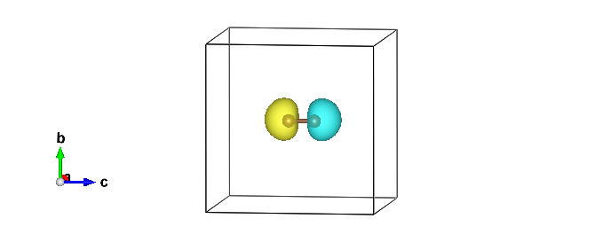

.. TurboRVB_manual documentation master file, created by
   sphinx-quickstart on Thu Jan 24 00:11:17 2019.
   You can adapt this file completely to your liking, but it should at least
   contain the root `toctree` directive.

.. _turbogeniustutorial_0202:

02Carbon_dimer
======================================================

.. contents:: Table of Contents
   :depth: 3
   
.. _turbogeniustutorial_0202_00:

00 Introduction
--------------------------------------------------------------------
   
From this tutorial, you can learn how to calculate all-electron Variational Monte Carlo (VMC) and lattice regularized diffusion Monte Carlo (LRDMC) energies of the C\ :sub:`2` dimer with various ansatz. JDFT, JSD, JsAGPs, JAGPu, and JAGP (JPf) with ``turbo-genius``. You can download all the input and output files for this tutorial from :download:`here  <./file.tar.gz>`.

C\ :sub:`2` dimer
 - E\ :sub:`bond` = 6.44 eV = 148.508 kcal/mol = 0.236 Ha `J. Chem. Theory Comput. 16, 6114-6131 (2020) <https://pubs.acs.org/doi/abs/10.1021/acs.jctc.0c00165>`_
 - d\ :sub:`C-C` = 2.3481 bohr `J. Chem. Phys. 128, 174101 (2008) <https://doi.org/10.1063/1.2908237>`_
 
.. warning::

    In this tutorial, d\ :sub:`C-C` = 2.300 bohr is used just for simplicity. So, please change it if you need a more accurat result.
 
 .. - Exact = -75.9265 Ha
 .. - Exact = -37.8450 Ha

.. _review: https://doi.org/10.1063/5.0005037

.. _turbogeniustutorial_0202_01:

01 C\ :sub:`2` dimer and C atom - JDFT ansatz
--------------------------------------------------------------------

.. _turbogeniustutorial_0202_01_01:

01-01 Preparing a trial wave function
^^^^^^^^^^^^^^^^^^^^^^^^^^^^^^^^^^^^^^^^^^^^^^^^^^^^^^^^^^^^^^^^^^^^

Download C\ :sub:`2` dimer and C atom structures, :download:`C2.xyz <./C2.xyz>`.

.. code-block:: bash
      
      # C2-dimer
      2
      comment line
      C 0.0000 0.0000 -0.60855355000000000000
      C 0.0000 0.0000 0.60855355000000000000

      # C-atom
      1
      comment line
      C 0.0000 0.0000 0.0000

.. code-block:: bash
    
    # C2 dimer
    cd 01JDFT/01C2_dimer/01trial_wavefunction/00makefort10
    turbogenius makefort10 -g -str C2.xyz -detbasis vtz -jasbasis vdz -pp BFD
    
    # C atom
    cd 01JDFT/02C_atom/01trial_wavefunction/00makefort10
    turbogenius makefort10 -g -str C.xyz -detbasis vtz -jasbasis vdz -pp BFD -neldiff 2

.. _turbogeniustutorial_0202_01_02:

01-02 Generating a JAGPs template
^^^^^^^^^^^^^^^^^^^^^^^^^^^^^^^^^^^^^^^^^^^^^

One can generate a JAGPs template using the prepared makefort10.input by typing:

.. code-block:: bash

    turbogenius makefort10 -r         # ``-r`` for running calculations
    turbogenius makefort10 -post      # ``-post`` for post-analysis or cleanup

or

.. code-block:: bash

    turbogenius makefort10 -r -post

.. _turbogeniustutorial_0202_01_03:

01-03 Generating a Pseudo potential file 
^^^^^^^^^^^^^^^^^^^^^^^^^^^^^^^^^^^^^^^^^^^^^

The pseudo potential file has been automatically generated by turbogenius.

.. code-block:: bash

    %cat pseudo.dat 
    ECP
            1   1.87000000000000                2
            1           3
    22.5516419100000        2.00000000000000        5.02991637000000     
    4.00000000000000        1.00000000000000        8.35973821000000     
    33.4389528500000        3.00000000000000        4.48361888000000     
    -19.1753732300000        2.00000000000000        3.93831258000000     
            2   1.87000000000000                2
            1           3
    22.5516419100000        2.00000000000000        5.02991637000000     
    4.00000000000000        1.00000000000000        8.35973821000000     
    33.4389528500000        3.00000000000000        4.48361888000000     
    -19.1753732300000        2.00000000000000        3.93831258000000    

.. _turbogeniustutorial_0202_01_04:

01-04 Adding molecular orbitals to the JAGPs template
^^^^^^^^^^^^^^^^^^^^^^^^^^^^^^^^^^^^^^^^^^^^^^^^^^^^^^^^^^^^^^^^
One should convert the generated JAGPs template to Jastrow Slater Determinant (JSD) one to prepare a trial wavefunction using DFT. This can be done using the ``convertfort10`` module. Generate an input file for convertfort10mol using:

.. code-block:: bash

    mv fort.10 fort.10_in
    turbogenius convertfort10mol -g

After preparing ``convertfort10mol.input``, run the calculation by typing the following commands to covert ``fort.10_in`` (JAGPs) to ``fort.10_new`` (JSD) by:

.. code-block:: bash

    turbogenius convertfort10mol -r
    turbogenius convertfort10mol -post

.. _turbogeniustutorial_0202_01_05:

01-05 Run DFT
^^^^^^^^^^^^^^^^^^^^^^^^^^^^^^^^^^^^^^^^^^^^^

As written above, the coefficients of the molecular orbitals generated by ``convertfort10mol.x`` are random. Therefore, the next step is to optimize the coefficients using a build-in DFT code, called ``prep.x``. This is done by using the ``prep`` module of Turbo-Genius.

Move to a working directory:

.. code-block:: bash

    cd ../01DFT

Next, copy the prepared ``fort.10`` and ``pseudo.dat`` to 01DFT directory:

.. code-block:: bash

    cp ../00makefort10/fort.10 ./
    cp ../00makefort10/pseudo.dat ./

To generate an input file for a DFT calculation type the following command:

.. code-block:: bash
    
    # for C2 molecule
    turbogenius prep -g -grid 0.10 0.10 0.10 -lbox 12.0 12.0 14.0
    
    # for C atom
    turbogenius prep -g -grid 0.10 0.10 0.10 -lbox 12.0 12.0 12.0
    
.. note::

   In the generated ``prep.input`` file, set ``nelocc`` to 4. The occupation of the orbitals is specified at the end of the input file (2 in this case, indicating paired electrons)
    
Launch the DFT job.

.. code-block:: bash
    
    # on a local machine (serial version)
    prep-serial.x < prep.input > out_prep
    # on a local machine (parallel version)
    mpirun -np XX prep-mpi.x < prep.input > out_prep
    # on a cluster machine (PBS)
    qsub submit.sh
    # on a cluster machine (Slurm)
    sbatch submit.sh

Check the convergence.

.. code-block:: bash

    turbogenius prep -post
    
    grep Iter out_prep 
    Iter,E,xc,corr     1       -13.1203443        -3.6300842        -0.4666827        19.4803860
    Iter,E,xc,corr     2       -11.9869924        -2.0332673        -0.3526467         1.1333519
    Iter,E,xc,corr     3       -11.2327951        -2.3881088        -0.3788108         0.7541973
    Iter,E,xc,corr     4       -20.6331707        -1.9842066        -0.4019725         9.4003755
    Iter,E,xc,corr     5       -11.3440293        -2.3325513        -0.3733283         9.2891413
    Iter,E,xc,corr     6       -11.0026202        -2.6778705        -0.4050588         0.3414091
    Iter,E,xc,corr     7       -11.0245545        -2.5463056        -0.3964621         0.0219343
    Iter,E,xc,corr     8       -10.9915229        -2.6421696        -0.4050391         0.0330315
    Iter,E,xc,corr     9       -10.9894860        -2.6702884        -0.4084529         0.0020369
    Iter,E,xc,corr    10       -10.9899084        -2.6757655        -0.4102938         0.0004223
    # Iterations =    10

.. _turbogeniustutorial_0202_01_06:

01-06 Jastrow factor optimization (WF=JDFT)
^^^^^^^^^^^^^^^^^^^^^^^^^^^^^^^^^^^^^^^^^^^^^^^^^^^^^^^^^^^^^^^^^^^^
One should refer to the :ref:`Hydrogen tutorial <turbogeniustutorial_0101_02>` for the details.
Here, only the commands are shown.

.. code-block:: bash

    cd ../../02optimization/
    cp ../01trial_wavefunction/01DFT/fort.10_new fort.10
    cp ../01trial_wavefunction/01DFT/pseudo.dat ./
    cp fort.10 fort.10_dft
    turbogenius vmcopt -g -opt_onebody -opt_twobody -opt_jas_mat -optimizer lr

Run the optimization jobs.

.. code-block:: bash

    # on a local machine (serial version)
    turborvb-serial.x < datasmin.input > out_min
    # on a local machine (parallel version)
    mpirun -np XX turborvb-mpi.x < datasmin.input > out_min
    # on a cluster machine (PBS)
    qsub submit.sh
    # on a cluster machine (Slurm)
    sbatch submit.sh
   

Check the convergence.

.. code-block:: bash

    turbogenius vmcopt -post -optwarmup 100 -plot
    # and then please follow the instructions.

.. _turbogeniustutorial_0202_01_07:

01-07 VMC (WF=JDFT)
^^^^^^^^^^^^^^^^^^^^^^^^^^^^^^^^^^^^^^^^^^^^^^^^^^^^^^^^^^^^^^^^^^^^

Please refer to the :ref:`Hydrogen tutorial <turbogeniustutorial_0101_03>` for the details.
Here, only needed commands are shown.

.. code-block:: bash

    cd ../03vmc/
    cp ../02optimization/fort.10 fort.10
    cp ../02optimization/pseudo.dat .
    turbogenius vmc -g
    vi datasvmc.input # if needed
    
    # on a local machine (serial version)
    turborvb-serial.x < datasvmc.input > out_vmc
    # on a local machine (parallel version)
    mpirun -np XX turborvb-mpi.x < datasvmc.input > out_vmc
    # on a cluster machine (PBS)
    qsub submit.sh
    # on a cluster machine (Slurm)
    sbatch submit.sh
    
    turbogenius vmc -post -bin 10 -warmup 5 

You may obtain like:

.. code-block:: bash
    
    
    # C2-dimer
    % cat pip0.d 
    number of bins read =         996
    Energy =  -11.0221801195572       2.314058967237164E-004
    Variance square =  0.225404174390588       6.661308870842383E-004
    Est. energy error bar =  2.326984685231173E-004  5.429092343987092E-006
    Est. corr. time  =   1.53214388283156       7.133083209261912E-002
    
    # C-atom
    % cat pip0.d
    number of bins read =         999
    Energy =  -5.40965078208914       1.502837476823764E-004
    Variance square =  8.609101949646993E-002  3.231616256487902E-004
    Est. energy error bar =  1.528893139652585E-004  3.472140401553639E-006
    Est. corr. time  =   1.73685872518992       7.845390460943868E-002

.. _turbogeniustutorial_0202_01_08:

01-08 LRDMC (WF=JDFT)
^^^^^^^^^^^^^^^^^^^^^^^^^^^^^^^^^^^^^^^^^^^^^^^^^^^^^^^^^^^^^^^^^^^^

One should refer to the :ref:`Hydrogen tutorial <turbogeniustutorial_0101_05>` for the details.
Here, only needed explanations and commands are shown.

Run LRDMC jobs for each ``alat``:

.. code-block:: bash
    
    cd ../04lrdmc/alat_0.XX/
    
    # for each alat
    cp ../../03vmc/fort.10 ./
    cp ../../03vmc/pseudo.dat .
    
    # C2 molecule
    turbogenius lrdmc -g -etry -11.00 -alat -0.XX
    
    # C atom
    turbogenius lrdmc -g -etry -5.00 -alat -0.XX
    
    # on a local machine (serial version)
    turborvb-serial.x < datasfn.input > out_fn
    # on a local machine (parallel version)
    mpirun -np XX turborvb-mpi.x < datasfn.input > out_fn # parallel version
    # on a cluster machine (PBS)
    qsub submit.sh
    # on a cluster machine (Slurm)
    sbatch submit.sh
    
    turbogenius lrdmc -bin 20 -corr 3 warmup 5

Extrapolation:

.. code-block:: bash

    alat_list="0.10 0.20 0.30 0.40"
    lrdmc_root_dir=`pwd`
    
    num=0
    echo -n > ${lrdmc_root_dir}/evsa.gnu
    for alat in $alat_list
    do
        cd alat_${alat}
        turbo-genius.sh -j lrdmc -post -eq 5 -reb 20 -col 5
        num=`expr ${num} + 1`
        echo -n "${alat} " >> ${lrdmc_root_dir}/evsa.gnu
        grep "Energy =" pip0_fn.d  | awk '{print $3, $4}' >> ${lrdmc_root_dir}/evsa.gnu
        cd ${lrdmc_root_dir}
    done
    
    # quartic fit (C2 dimer)
    # please replace sed with gsed on Mac
    sed "1i 2  ${num}  4  1" evsa.gnu > evsa.in
    funvsa.x < evsa.in > evsa.out

    # quadratic fit (C atom)
    # please replace sed with gsed on Mac
    sed "1i 1  ${num}  4  1" evsa.gnu > evsa.in
    funvsa.x < evsa.in > evsa.out
    
    # plot
    gnuplot 
    p "evsa.gnu" u 1:2:3 with yerr
    
It performs curve fitting for energies vs alat, which is then used for extrapolation. While running turbo-genius asks for the degree of polynomial to be used for curve fitting. The result of fitting is written to the file ``evsa.out``

For quartic fitting i.e. :math:`E(a)=E(0) + k_{1} \cdot a^2 + k_{2} \cdot a^4`, the results are like:

.. code-block:: bash
            
            # C2 dimer
            % cat evsa.out
            Reduced chi^2  =   3.24139195024559     
            Coefficient found 
            1  -11.0529822174764       1.886835280808058E-004  <- E_0
            2 -3.752828455181791E-003  3.868657694133935E-003  <- k_1
            3 -2.343738962778753E-002  1.487080872118977E-002  <- k_2

For quadratic fitting i.e. :math:`E(a)=E(0) + k_{1} \cdot a^2`, the results are like:

.. code-block:: bash
            
            # C atom
            % cat evsa.out
            Reduced chi^2  =   3.22600367069279     
            Coefficient found 
            1 -5.42188811770239        1.033538868667457E-004  <- E_0
            2 -3.493534258715859E-003  7.118635862498798E-004  <- k_1

            
Finally:

C\ :sub:`2` dimer

 - :blue:`VMC(JDFT)   = -11.02218(23) Ha`
 - :blue:`LRDMC(JDFT) = -11.05298(19) Ha`

C atom

 - :blue:`VMC(JDFT)   = -5.40965(15) Ha`
 - :blue:`LRDMC(JDFT) = -5.42189(10) Ha`

 
Binding energy

 - E\ :sub:`bond` = 0.2028(3) Ha = 5.51(8) eV (VMC-JDFT)
 
 - E\ :sub:`bond` = 5.656(3) eV (DMC-JDFT) (`J. Chem. Phys. 2008, 128, 174101 <https://doi.org/10.1063/1.2908237>`_ ).
 - E\ :sub:`bond` = 0.2092(2) Ha = 5.69(5) eV (LRDMC-JDFT)

 - E\ :sub:`bond` = 0.236 Ha = 6.44 eV (Experiment)

.. _turbogeniustutorial_0202_02:

02 C\ :sub:`2` dimer and C atom - JsAGPs ansatz
-----------------------------------------------------------------------

.. _turbogeniustutorial_0202_02_01:

02-01 Conversion of WF (WF=JsAGPs)
^^^^^^^^^^^^^^^^^^^^^^^^^^^^^^^^^^^^^^^^^^^^^^^^^^^^^^^^^^^^^^^^^^^^

The procedure is the almost same as in the Hydrogen-dimer tutorial. 
Three hybrid-orbitals (``nhyb=4``) were employed here.

Please refer to the :ref:`Hydrogen tutorial <turbogeniustutorial_0101_06>` for the details.

.. code-block:: bash
    
    # C2-dimer/copy wfs
    cd ../../../03JsAGPs/01C2_dimer/01convert_WF_JSD_to_JAGP/
    cp ../../../01JDFT/01C2_dimer/03vmc/fort.10 ./fort.10
    cp ../../../01JDFT/01C2_dimer/03vmc/pseudo.dat .
   
    # C atom/copy wfs
    cd ../../../03JsAGPs/02C_atom/01_01convert_WF_JSD_to_JAGP/
    cp ../../../01JDFT/02C_atom/03vmc/fort.10 ./fort.10
    cp ../../../01JDFT/02C_atom/03vmc/pseudo.dat .

.. code-block:: bash

    #conversion (C2-dimer)
    turbogenius convertwf -to agps -nosym -hyb 4 4 # add hybrid orbitals 4 4 for the first and the second C atoms
    
    #conversion (C atom)
    turbogenius convertwf -to agps -nosym # hybrid orbitals are added later. See below
    
.. code-block:: bash
    
    # grep Overlap out_conv
    ....
    Overlap square with no zero  0.9999....

.. code-block:: bash

    # correlated sampling
    cp fort.10_bak ./fort.10_corr
    turbogenius correlated-sampling -g
    
    # on a local machine (serial version)
    turborvb-serial.x < datasvmc.input > out_vmc
    readforward-serial.x  < datasvmc.input > out_readforward
    # on a local machine (parallel version)
    mpirun -np XX turborvb-mpi.x < datasvmc.input > out_vmc
    mpirun -np XX readforward-mpi.x < datasvmc.input > out_readforward
    # on a cluster machine (PBS)
    qsub submit.sh
    # on a cluster machine (Slurm)
    sbatch submit.sh

    # check the overlap
    %cat corrsampling.dat 
                                    Number of bins                 10
                        reference energy: E(fort.10)  -0.110045875E+02     0.252368934E-01
                    reweighted energy: E(fort.10_corr)  -0.110045875E+02     0.252368985E-01
    reweighted difference: E(fort.10)-E(fort.10_corr)   -0.148834687E-07     0.316227766E-07
            Overlap square : (fort.10,fort.10_corr)    0.999999998E+00     0.316227766E-07

The conversion procedure is a bit complicated for the C atom.
You should optimize the matrix elements before adding hybrid orbitals.

.. code-block:: bash
    
    cd ../01_02convert_WF_JSD_to_JAGP/
    cp ../01_01convert_WF_JSD_to_JAGP/fort.10 .
    cp ../01_01convert_WF_JSD_to_JAGP/pseudo.dat .
    turbogenius vmcopt -g -opt_onebody -opt_twobody -opt_jas_mat -opt_det_mat -optimizer lr
    
    # on a local machine (serial version)
    turborvb-serial.x < datasmin.input > out_min
    # on a local machine (parallel version)
    mpirun -np XX turborvb-mpi.x < datasmin.input > out_min
    # on a cluster machine (PBS)
    qsub submit.sh
    # on a cluster machine (Slurm)
    sbatch submit.sh
    
Finally, you can convert the optimized WF to the JAGP one with ``-hyb 4``.

.. code-block:: bash

    #conversion with 4 hybrid orbitals
    turbogenius convertwf -to agps -nosym -hyb 4

Please check if the largest eigenvalues are non zero that were zero before the optimization.

.. code-block:: bash
  
    % cat out_conv 
    ...
    41 0.359417387280524595E-01
    42 0.472612394607655972         <- here
    43 50.2735591956323731          <- here
    44 52.3040643927227791          <- here
    45 52.4454593457030782          <- here
    dimension =          45           4
    dimension =          45           4
    dimension =          45           4
    dimension =          45           4

Please check the energy diff. by the correlated sampling.

.. code-block:: bash

    # correlated sampling
    cp fort.10_bak ./fort.10_corr
    turbogenius correlated-sampling -g
    
    # on a local machine (serial version)
    turborvb-serial.x < datasvmc.input > out_vmc
    readforward-serial.x  < datasvmc.input > out_readforward
    # on a local machine (parallel version)
    mpirun -np XX turborvb-mpi.x < datasvmc.input > out_vmc
    mpirun -np XX readforward-mpi.x < datasvmc.input > out_readforward
    # on a cluster machine (PBS)
    qsub submit.sh
    # on a cluster machine (Slurm)
    sbatch submit.sh

.. _turbogeniustutorial_0202_02_02:

02-02 VMC-optimization (WF=JsAGPs)
^^^^^^^^^^^^^^^^^^^^^^^^^^^^^^^^^^^^^^^^^^^^^^^^^^^^^^^^^^^^^^^^^^^^

Please refer to the :ref:`Hydrogen tutorial <turbogeniustutorial_0101_08>` for the details.
Here, only the commands are shown.

.. code-block:: bash
    
    # for C2 dimer
    cd ../02optimization/
    cp ../01convert_WF_JSD_to_JAGP/fort.10 fort.10
    cp ../01convert_WF_JSD_to_JAGP/pseudo.dat pseudo.dat
    cp fort.10 fort.10_jdft
    turbogenius vmcopt -g -opt_onebody -opt_twobody -opt_jas_mat -opt_det_mat -optimizer lr
    
    # for C atom
    cd ../02optimization/
    cp ../01_02convert_WF_JSD_to_JAGP/fort.10 fort.10
    cp ../01_02convert_WF_JSD_to_JAGP/pseudo.dat pseudo.dat
    cp fort.10 fort.10_jdft
    turbogenius vmcopt -g -opt_onebody -opt_twobody -opt_jas_mat -opt_det_mat -optimizer lr
    
Run a optimization job.

.. code-block:: bash
    
    # on a local machine (serial version)
    turborvb-serial.x < datasmin.input > out_min
    # on a local machine (parallel version)
    mpirun -np XX turborvb-mpi.x < datasmin.input > out_min
    # on a cluster machine (PBS)
    qsub submit.sh
    # on a cluster machine (Slurm)
    sbatch submit.sh

Check the convergence.

.. code-block:: bash

    turbogenius vmcopt -post -optwarmup 100 -plot
    # and then please follow the instructions.

.. _turbogeniustutorial_0202_02_03:

02-03 VMC (WF=JsAGPs)
^^^^^^^^^^^^^^^^^^^^^^^^^^^^^^^^^^^^^^^^^^^^^^^^^^^^^^^^^^^^^^^^^^^^

Please refer to the :ref:`Hydrogen tutorial <turbogeniustutorial_0101_09>` for the details.
Here, only needed commands are shown.

.. code-block:: bash

    cd ../03vmc
    cp ../02optimization/fort.10 ./fort.10
    cp ../02optimization/pseudo.dat .
    turbogenius vmc -g

    # on a local machine (serial version)
    turborvb-serial.x < datasvmc.input > out_vmc
    # on a local machine (parallel version)
    mpirun -np XX turborvb-mpi.x < datasvmc.input > out_vmc
    # on a cluster machine (PBS)
    qsub submit.sh
    # on a cluster machine (Slurm)
    sbatch submit.sh
    
    turbogenius vmc -post -bin 10 -warmup 5 

You may obtain:

.. code-block:: bash
    
    # C2 dimer
    % cat pip0.d 
    number of bins read =         499
    Energy =  -11.0561023752813       2.657081737992969E-004
    Variance square =  0.167151337506581       2.487175392299656E-003
    Est. energy error bar =  2.667881948465201E-004  9.740755305129974E-006
    Est. corr. time  =   1.36165378936245       9.657211844194399E-002

    # C2 dimer
    % cat pip0.d 
    number of bins read =         499
    Energy =  -5.42023281231657       1.747843070690741E-004
    Variance square =  6.151263349430580E-002  2.812473020121101E-004
    Est. energy error bar =  1.823230486819808E-004  5.739947472392408E-006
    Est. corr. time  =   1.72750276011311       0.107600086165112     

.. _turbogeniustutorial_0202_02_04:

02-04 LRDMC (WF=JsAGPs)
^^^^^^^^^^^^^^^^^^^^^^^^^^^^^^^^^^^^^^^^^^^^^^^^^^^^^^^^^^^^^^^^^^^^

Please refer to the :ref:`Hydrogen tutorial <turbogeniustutorial_0101_10>` for the details.
Here, only the commands are shown.

.. code-block:: bash
    
    cd ../04lrdmc/alat_0.XX/
    
    # for each alat
    cp ../../03vmc/fort.10 ./
    cp ../../03vmc/pseudo.dat .
    
    # C2 molecule
    turbogenius lrdmc -g --help -etry -11.00 -alat -0.XX
    
    # C atom
    turbogenius lrdmc -g --help -etry -5.00 -alat -0.XX
    
    # on a local machine (serial version)
    turborvb-serial.x < datasfn.input > out_fn
    # on a local machine (parallel version)
    mpirun -np XX turborvb-mpi.x < datasfn.input > out_fn # parallel version
    # on a cluster machine (PBS)
    qsub submit.sh
    # on a cluster machine (Slurm)
    sbatch submit.sh
    
    turbogenius lrdmc -bin 20 -corr 3 warmup 5

Extrapolation:

.. code-block:: bash

    alat_list="0.10 0.20 0.30 0.40"
    lrdmc_root_dir=`pwd`
    
    num=0
    echo -n > ${lrdmc_root_dir}/evsa.gnu
    for alat in $alat_list
    do
        cd alat_${alat}
        turbo-genius.sh -j lrdmc -post -eq 5 -reb 20 -col 5
        num=`expr ${num} + 1`
        echo -n "${alat} " >> ${lrdmc_root_dir}/evsa.gnu
        grep "Energy =" pip0_fn.d  | awk '{print $3, $4}' >> ${lrdmc_root_dir}/evsa.gnu
        cd ${lrdmc_root_dir}
    done
    
    # quartic fit (C2 dimer)
    # please replace sed with gsed on Mac
    sed "1i 2  ${num}  4  1" evsa.gnu > evsa.in
    funvsa.x < evsa.in > evsa.out

    # quadratic fit (C atom)
    # please replace sed with gsed on Mac
    sed "1i 1  ${num}  4  1" evsa.gnu > evsa.in
    funvsa.x < evsa.in > evsa.out
    
    # plot
    gnuplot 
    p "evsa.gnu" u 1:2:3 with yerr

.. code-block:: bash
    
    # C2 dimer
    Reduced chi^2  =  0.211949768672111     
    Coefficient found 
            1  -11.0749244254452       1.269668477442219E-004
            2 -5.572540169827904E-003  8.734350696222097E-004

    # C atom
    Reduced chi^2  =   1.48922837922392     
    Coefficient found 
            1  -5.42734029684322       8.031603687503355E-005
            2 -1.750555796426137E-003  5.639930126170355E-004
            
Finally:

C\ :sub:`2` dimer

 - :blue:`VMC(JsAGPs)   = -11.05610(27) Ha`
 - :blue:`LRDMC(JsAGPs) = -11.07492(13) Ha`

C atom

 - :blue:`VMC(JsAGPs)   = -5.4202(17) Ha`
 - :blue:`LRDMC(JsAGPs) = -5.42734(8) Ha`
 
Binding energy
 
 - E\ :sub:`bond` = 0.2028(3) Ha = 5.519(8) eV (VMC-JDFT)
 - E\ :sub:`bond` = 0.2157(4)Ha = 5.870(10) eV (VMC-JsAGPs)

 - E\ :sub:`bond` = 5.656(3) eV (DMC-JDFT) (`J. Chem. Phys. 2008, 128, 174101 <https://doi.org/10.1063/1.2908237>`_ ).

 - E\ :sub:`bond` = 0.2092(2) Ha = 5.693(5) eV (LRDMC-JDFT)
 - E\ :sub:`bond` = 0.2202(2)Ha = 5.993(5)eV (LRDMC-JsAGPs)
 
 - E\ :sub:`bond` = 0.236 Ha = 6.44 eV (Experiment)

.. _turbogeniustutorial_0202_03:

03 C\ :sub:`2` dimer and C atom - JAGPu ansatz
-----------------------------------------------------------------------

.. _turbogeniustutorial_0202_03_01:

03-01 prepration of a wave function
^^^^^^^^^^^^^^^^^^^^^^^^^^^^^^^^^^^^^^^^^^^^^^^^^^^^^^^^^^^^^^^^^^^^

You can convert the JAGPs WF to the JAGPu WF by the following commands

.. code-block:: bash
    
    # C2 dimer
    cd ../../../04JAGPu/01C2_dimer/01trial_wavefunction/01DFT/
    cp ../../../../03JsAGPs/01C2_dimer/03vmc/fort.10 .
    cp ../../../../03JsAGPs/01C2_dimer/03vmc/pseudo.dat .
    turbogenius convertwf -to agpu -nosym
    
    # add molecular orbital (i.e., JAGPu -> JSD)
    turbogenius convertwf -to sd

.. _turbogeniustutorial_0202_03_02:

03-02 Generate a trial wave function using DFT with a magnetic moment (C\ :sub:`2` dimer:).
^^^^^^^^^^^^^^^^^^^^^^^^^^^^^^^^^^^^^^^^^^^^^^^^^^^^^^^^^^^^^^^^^^^^^^^^^^^^^^^^^^^^^^^^^^^^^^^^^^^
The next step is to prepare a trial wave function using the built-in DFT code.
Here you can set magnetic moments on each atom to obtain an AFM initial state.

.. code-block:: bash
    
    # both for C2 dimer and C atom
    cd ../01DFT
    cp ../00makefort10/fort.10 .
    cp ../00makefort10/pseudo.dat .
    #C2-dimer
    turbogenius prep -g -xc lsda -f 0.01 -grid 0.10 0.10 0.10 -lbox 12.0 12.0 14.0 -m u d
    #C-atom
    turbogenius prep -g -xc lsda -f 0.01 -grid 0.10 0.10 0.10 -lbox 12.0 12.0 12.0 -m u
    

Then, you can run DFT by typing:

.. code-block:: bash
    
    # on a local machine (serial version)
    prep-serial.x < prep.input > out_prep
    # on a local machine (parallel version)
    mpirun -np XX prep-mpi.x < prep.input > out_prep
    # on a cluster machine (PBS)
    qsub submit.sh
    # on a cluster machine (Slurm)
    sbatch submit.sh
    
    turbogenius prep -post

    
.. _turbogeniustutorial_0202_03_03:

03-03 Check local magnetic moments (C\ :sub:`2` dimer)
^^^^^^^^^^^^^^^^^^^^^^^^^^^^^^^^^^^^^^^^^^^^^^^^^^^^^^^^^^^^^^^^^^^^

You can check the obtained magnetic moments by using plot_orbitals.x

.. code-block:: bash

  # copy fort.10
  cd ../02check_magnetization
  cp ../01DFT/pseudo.dat .
  
  # plot spin density
  cp ../01DFT/fort.10_new fort.10
  plot_orbitals.x
  
  Number of molecular orbitals :            6
  Choose box size (x,y,z) 
  15 15 15
  15.0000000000000        15.0000000000000        15.0000000000000     
  Choose number of mesh points (x,y,z) : 
  61 61 61
  61          61          61
  Choose orbitals to tabulate (possible answers all, partial, charge, spin) : 
  spin
  spin
  Please give  the lowest molecular orbital within 1 and            8
  1
  Number of fully occupied molecular orbital/total number occupied by up and down?
  4 4
  Momentum magnetization ? (unit 2pi/cellscale) 
  0 0 0

  You obtain output_spin000000.xsf. You can depict it using xcrysden:

.. code-block:: bash
  
   xcrysden --xsf output_spin000000.xsf 
   open -a output_spin000000.xsf  # e.g., VESTA

   
Thus, one can obtain an AFM trial wavefunction.

.. _turbogeniustutorial_0202_03_04:

03-04 Convert JDFT WF to JAGPu one
^^^^^^^^^^^^^^^^^^^^^^^^^^^^^^^^^^^^^^^^^^^^^^^^^^^^^^^^^^^^^^^^^^^^
 Next step is to convert the optimized JDFT WF to a JAGPu one.
 You should check the consistency after conversion.
 
.. code-block:: bash

    # C2-dimer
    # conversion of WF (02convert_WF_JDFT_to_JAGP)
    cd ../../02convert_WF_JDFT_to_JAGP/
    cp ../01trial_wavefunction/01DFT/fort.10_new fort.10
    cp ../01trial_wavefunction/01DFT/pseudo.dat .

    #conversion (C2-dimer)
    turbogenius convertwf -to agpu -nosym -hyb 4 4 # add hybrid orbitals 4 4 for the first and the second C atoms
    
    #conversion (C atom)
    turbogenius convertwf -to agpu -nosym # hybrid orbitals are added later. See below
    
.. code-block:: bash
    
    # grep Overlap out_conv
    ....
    Overlap square with no zero  0.9999....

.. code-block:: bash

    # correlated sampling
    cp fort.10_bak ./fort.10_corr
    turbogenius correlated-sampling -g
    
    # on a local machine (serial version)
    turborvb-serial.x < datasvmc.input > out_vmc
    readforward-serial.x  < datasvmc.input > out_readforward
    # on a local machine (parallel version)
    mpirun -np XX turborvb-mpi.x < datasvmc.input > out_vmc
    mpirun -np XX readforward-mpi.x < datasvmc.input > out_readforward
    # on a cluster machine (PBS)
    qsub submit.sh
    # on a cluster machine (Slurm)
    sbatch submit.sh

    # check the overlap
    %cat corrsampling.dat 
    # Here, you may loose ~ 100mHa for the C2 dimer.

.. warning::

    You should use more hybrid orbitals in a real research project! (e.g. ~ 7).
    
The conversion procedure is again complicated for the C atom. Please do the same procedure as in the JAGPs case.

.. _turbogeniustutorial_0202_03_05:

03-05 Optimization (WF=JAGPu)
^^^^^^^^^^^^^^^^^^^^^^^^^^^^^^^^^^^^^^^^^^^^^^^^^^^^^^^^^^^^^^^^^^^^

Now that you have obtained a good trial JAGPu wavefunction, 
you can optimize its nodal surface at the VMC level.

.. code-block:: bash
    
    #C2 dimers
    cd ../03optimization/
    cp ../02convert_WF_JDFT_to_JAGP/fort.10 fort.10
    cp ../02convert_WF_JDFT_to_JAGP/pseudo.dat ./
    cp fort.10 fort.10_jdft
    turbogenius vmcopt -g -opt_onebody -opt_twobody -opt_jas_mat -opt_det_mat -optimizer lr
    
    #C atom
    cd ../03optimization/
    cp ../02_02convert_WF_JDFT_to_JAGP/fort.10 fort.10
    cp ../02_02convert_WF_JDFT_to_JAGP/pseudo.dat ./
    cp fort.10 fort.10_jdft
    turbogenius vmcopt -g -opt_onebody -opt_twobody -opt_jas_mat -opt_det_mat -optimizer lr

Run VMC-opt runs

.. code-block:: bash

    # on a local machine (serial version)
    turborvb-serial.x < datasmin.input > out_min
    # on a local machine (parallel version)
    mpirun -np XX turborvb-mpi.x < datasmin.input > out_min
    # on a cluster machine (PBS)
    qsub submit.sh
    # on a cluster machine (Slurm)
    sbatch submit.sh
    
    #average fort.10
    turbogenius vmcopt -post -optwarmup 100 -plot

.. _turbogeniustutorial_0202_03_06:

03-06 VMC and LRDMC
^^^^^^^^^^^^^^^^^^^^^^^^^^^^^^^^^^^^^^^^^^^^^^^^^^^^^^^^^

VMC and LRDMC procesures are the same as in the JsAGPs case.

.. code-block:: bash

    # VMC
    cd ../04vmc
    cp ../03optimization/fort.10 ./fort.10
    cp ../03optimization/pseudo.dat .
    turbogenius vmc -g
    
    # on a local machine (serial version)
    turborvb-serial.x < datasvmc.input > out_vmc
    # on a local machine (parallel version)
    mpirun -np XX turborvb-mpi.x < datasvmc.input > out_vmc
    # on a cluster machine (PBS)
    qsub submit.sh
    # on a cluster machine (Slurm)
    sbatch submit.sh

    turbogenius vmc -post -bin 10 -warmup 5

.. code-block:: bash

    # C2-dimer
    % cat pip0.d 
    number of bins read =         499
    Energy =  -11.0639657131521       2.451753146145206E-004
    Variance square =  0.144445612617421       1.504179616851022E-003
    Est. energy error bar =  2.382267038858785E-004  7.075164804881710E-006
    Est. corr. time  =   1.25601105010529       7.608951964475108E-002

    # C atom
    % cat pip0.d 
    number of bins read =         499
    Energy =  -5.42587679977424       1.407145615635295E-004
    Variance square =  4.092231745300601E-002  3.752942906547522E-004
    Est. energy error bar =  1.386833646006721E-004  4.181441619092614E-006
    Est. corr. time  =   1.50231356841123       8.930286017090674E-002

Heres are commands for LRDMCs.

.. code-block:: bash

    cd ../04lrdmc/alat_0.XX/
    
    # for each alat
    cp ../../03vmc/fort.10 ./
    cp ../../03vmc/pseudo.dat .
    
    # C2 molecule
    turbogenius lrdmc -g --help -etry -11.00 -alat -0.XX
    
    # C atom
    turbogenius lrdmc -g --help -etry -5.00 -alat -0.XX
    
    # on a local machine (serial version)
    turborvb-serial.x < datasfn.input > out_fn
    # on a local machine (parallel version)
    mpirun -np XX turborvb-mpi.x < datasfn.input > out_fn # parallel version
    # on a cluster machine (PBS)
    qsub submit.sh
    # on a cluster machine (Slurm)
    sbatch submit.sh
    
    turbogenius lrdmc -bin 20 -corr 3 warmup 5
    
.. code-block:: bash

    # extrapolation
    alat_list="0.10 0.20 0.30 0.40 0.50"
    lrdmc_root_dir=`pwd`
    
    num=0
    echo -n > ${lrdmc_root_dir}/evsa.gnu
    for alat in $alat_list
    do
        cd alat_${alat}
        turbo-genius.sh -j lrdmc -post -eq 5 -reb 20 -col 5
        num=`expr ${num} + 1`
        echo -n "${alat} " >> ${lrdmc_root_dir}/evsa.gnu
        grep "Energy =" pip0_fn.d  | awk '{print $3, $4}' >> ${lrdmc_root_dir}/evsa.gnu
        cd ${lrdmc_root_dir}
    done
    
    # quadratic fit
    # please replace sed with gsed on Mac
    sed "1i 2  ${num}  4  1" evsa.gnu > evsa.in
    funvsa.x < evsa.in > evsa.out

.. code-block:: bash
    
    # C2 dimer
    Reduced chi^2  =  0.229533908546215     
    Coefficient found 
            1  -11.0757437909485       1.464579638032684E-004
            2 -1.087864661257017E-002  2.922117199514128E-003
            3  6.078076478538951E-003  1.109481138283852E-002

    # C atom
    Reduced chi^2  =  3.354870888922901E-003
    Coefficient found 
            1  -5.42939660705427       7.390966338489803E-005
            2 -1.281854484441583E-003  1.529393458975311E-003
            3 -5.479765301310381E-003  5.869251318513092E-003

            
Finally:

C\ :sub:`2` dimer

 - :blue:`VMC(JAGPu)   = -11.06397(25) Ha`
 - :blue:`LRDMC(JAGPu) = -11.07574(15) Ha`

C atom

 - :blue:`VMC(JAGPu)   = -5.42588(14) Ha`
 - :blue:`LRDMC(JAGPu) = -5.42940(7)Ha`
 
Binding energy

 - E\ :sub:`bond` = 0.2028(3) Ha = 5.519(8) eV (VMC-JDFT)
 - E\ :sub:`bond` = 0.2157(4) Ha = 5.870(10) eV (VMC-JsAGPs)
 - E\ :sub:`bond` = 0.2122(4) Ha = 5.774(10) eV (VMC-JAGPu)

 - E\ :sub:`bond` = 5.656(3) eV (DMC-JDFT) (`J. Chem. Phys. 2008, 128, 174101 <https://doi.org/10.1063/1.2908237>`_ ).

 - E\ :sub:`bond` = 0.2092(2) Ha = 5.693(5) eV (LRDMC-JDFT)
 - E\ :sub:`bond` = 0.2202(2) Ha = 5.993(5) eV (LRDMC-JsAGPs)
 - E\ :sub:`bond` = 0.2169(2) Ha = 5.903(5) eV (LRDMC-JAGPu)
 
 - E\ :sub:`bond` = 0.236 Ha = 6.44 eV (Experiment)

.. _turbogeniustutorial_0202_04:

04 C\ :sub:`2` dimer and C atom - JAGP (JPf) ansatz
-----------------------------------------------------------------------

.. _turbogeniustutorial_0202_04_01:

The most important procedure in a Pfaffian calculation is to convert a JDFT or JAGPu
ansatz to JAGP(JPf) ansatz.
Since the JAGP ansatz is a special case of the JPf one,  where only :math:`G_{ud}` and :math:`G_{du}` terms are defined as described in the section review_ paper, the conversion can be realized just by direct substitution. Therefore, the main challenge is to find a reasonable initialization for the two spin-triplet sectors :math:`G_{uu}` and :math:`G_{dd}` that are not described in the JAGP and that otherwise have to be set to 0.
There are two possible approaches to convert an ansatz: 
:math:`\rm(\hspace{.18em}i\hspace{.18em})`
for polarized systems, we can build the :math:`G_{uu}` block of the matrix by using an even number of 
:math:`\{ \phi_i\}` and build an antisymmetric :math:`g_{uu}`, where the eigenvalues :math:`\lambda_k` are chosen to be large enough 
to occupy certainly  these unpaired states, as in  the standard Slater determinant used 
for our initialization.
Again, we emphasize that  this works only for polarized systems.
:math:`\rm(\hspace{.08em}ii\hspace{.08em})`
The second approach that also works in a spin-unpolarized case is to determine 
a standard broken symmetry single determinant ansatz ({\it e.g.}, by TurboRVB built-in DFT within the LSDA)  and modify it with a global  spin rotation. Indeed, in the presence of finite local magnetic moments, it is often convenient to rotate the spin moments of the WF in a direction perpendicular to  the spin quantization axis chosen for  our spin-dependent Jastrow factor, {\it i.e.}, the :math:`z` quantization axis. In this way one can obtain reasonable initializations for  :math:`G_{uu}` and :math:`G_{dd}`. TurboRVB allows every possible rotation, including an arbitrary small one close to the identity.
A particularly important case is when  a rotation of :math:`\pi/2` is applied around the :math:`y` direction. This operation maps :math:`|\uparrow \rangle \rightarrow \frac{1} {\sqrt{2}} \left( |  \uparrow \rangle + |\downarrow \rangle \right)   \mbox{ and }  |\downarrow  \rangle  \rightarrow  \frac 1 {\sqrt{2}} \left( | \uparrow  \rangle - |\downarrow \rangle \right).` One can convert from a AGP the pairing function that is obtained from a VMC optimization :math:`{g_{ud}}(\mathbf{i},\mathbf{j}) = {f_S}({{\mathbf{r}}_i},{{\mathbf{r}}_j})\frac{{\left| { \uparrow  \downarrow } \right\rangle  - \left| { \downarrow  \uparrow } \right\rangle }}{{\sqrt 2 }} + {f_T}({{\mathbf{r}}_i},{{\mathbf{r}}_j})\frac{{\left| { \uparrow  \downarrow } \right\rangle  + \left| { \downarrow  \uparrow } \right\rangle }}{{\sqrt 2 }}` to a Pf one :math:`{g_{ud}}(\mathbf{i},\mathbf{j}) \to g\left( {\mathbf{i},\mathbf{j}} \right){\text{ }} = {f_S}({{\mathbf{r}}_i},{{\mathbf{r}}_j})\frac{{\left| { \uparrow  \downarrow } \right\rangle  - \left| { \downarrow  \uparrow } \right\rangle }}{{\sqrt 2 }} + {f_T}({{\mathbf{r}}_i},{{\mathbf{r}}_j})\left( {\left| { \uparrow  \uparrow } \right\rangle  - \left| { \downarrow  \downarrow } \right\rangle } \right).` This transformation provides a meaningful initialization to the Pfaffian WF that can be  then optimized for reaching the best possible description of the ground state within this ansatz.

The strategy :math:`\rm(\hspace{.08em}ii\hspace{.08em})` is employed for the Li dimer (i.e., unpolarized case) while :math:`\rm(\hspace{.18em}i\hspace{.18em})` is employed for the Li atom (i.e., polarized case)

04-01 (spin-singlet case) C\ :sub:`2` dimer: Convert JAGPu WF to JAGP one
^^^^^^^^^^^^^^^^^^^^^^^^^^^^^^^^^^^^^^^^^^^^^^^^^^^^^^^^^^^^^^^^^^^^^^^^^^^^^^^^^^^^^^^^^^^^^^^^^^^^^^^^^^^

.. code-block:: bash

    ################
    # C-dimer
    ################
    cd ../../../05JAGP/01C2_dimer/01convert_WF_JAGPu_to_JAGP
    cp ../../../04JAGPu/01C2_dimer/04vmc/fort.10 fort.10
    cp ../../../04JAGPu/01C2_dimer/04vmc/pseudo.dat .
    
    # convert to Paffian
    turbogenius convertwf -to pf -rot 0.125 -nosym # pi/8 rotation

    # correlated sampling
    cp fort.10_bak ./fort.10_corr
    turbogenius correlated-sampling -g
    
    # on a local machine (serial version)
    turborvb-serial.x < datasvmc.input > out_vmc
    readforward-serial.x  < datasvmc.input > out_readforward
    # on a local machine (parallel version)
    mpirun -np XX turborvb-mpi.x < datasvmc.input > out_vmc
    mpirun -np XX readforward-mpi.x < datasvmc.input > out_readforward
    # on a cluster machine (PBS)
    qsub submit.sh
    # on a cluster machine (Slurm)
    sbatch submit.sh

    # check the overlap
    # Here, you may loose some energy! because you have rotated the spins.
    %cat corrsampling.dat     

.. _turborvbtutorial_0202_04_02:

04-02 (spin-triplet case) C atom: Convert JAGPu WF to JAGP one
^^^^^^^^^^^^^^^^^^^^^^^^^^^^^^^^^^^^^^^^^^^^^^^^^^^^^^^^^^^^^^^^^^^^^^^^^^^^^^^^^

You can convert spin-polarized WFs using turbogenius in the same way as in the non spin-polarized WFs.

.. code-block:: bash

    ################
    # C-dimer
    ################
    cd ../../../05JAGP/02C_atom/01convert_WF_JAGPu_to_JAGP/
    cp ../../../04JAGPu/02C_atom/02_02convert_WF_JDFT_to_JAGP/fort.10 .
    cp ../../../04JAGPu/02C_atom/02_02convert_WF_JDFT_to_JAGP/pseudo.dat .
    
    # convert to Paffian
    turbogenius convertwf -to pf -rot 0.0

    # correlated sampling
    cp fort.10_bak ./fort.10_corr
    turbogenius correlated-sampling -g
    
    # on a local machine (serial version)
    turborvb-serial.x < datasvmc.input > out_vmc
    readforward-serial.x  < datasvmc.input > out_readforward
    # on a local machine (parallel version)
    mpirun -np XX turborvb-mpi.x < datasvmc.input > out_vmc
    mpirun -np XX readforward-mpi.x < datasvmc.input > out_readforward
    # on a cluster machine (PBS)
    qsub submit.sh
    # on a cluster machine (Slurm)
    sbatch submit.sh

    # check the overlap
    %cat corrsampling.dat     

.. _turbogeniustutorial_0202_04_03:

04-03 VMC-opt, VMC and LRDMC
^^^^^^^^^^^^^^^^^^^^^^^^^^^^^^^^^^^^^^^^^^^^^^^^^^^^^^^^^^^^^^^^^^^^^^^^^^^^^^^^^^^

VMC and LRDMC procesures are the same as in the JsAGPs case.

.. code-block:: bash
    
    #C2 dimers/vmcopt
    cd ../03optimization/
    cp ../02convert_WF_JAGPu_to_JAGP/fort.10 fort.10
    cp ../02convert_WF_JAGPu_to_JAGP/pseudo.dat ./
    cp fort.10 fort.10_jdft
    turbogenius vmcopt -g -opt_onebody -opt_twobody -opt_jas_mat -opt_det_mat -optimizer lr
    
    #C atom
    cd ../03optimization/
    cp ../02_02convert_WF_JAGPu_to_JAGP/fort.10 fort.10
    cp ../02_02convert_WF_JAGPu_to_JAGP/pseudo.dat ./
    cp fort.10 fort.10_jdft
    turbogenius vmcopt -g -opt_onebody -opt_twobody -opt_jas_mat -opt_det_mat -optimizer lr

    #C atom/vmcopt
    # on a local machine (serial version)
    turborvb-serial.x < datasmin.input > out_min
    # on a local machine (parallel version)
    mpirun -np XX turborvb-mpi.x < datasmin.input > out_min
    # on a cluster machine (PBS)
    qsub submit.sh
    # on a cluster machine (Slurm)
    sbatch submit.sh
    
    #average fort.10
    turbogenius vmcopt -post -optwarmup 100 -plot
    
    # VMC
    cd ../04vmc
    cp ../03optimization/fort.10 ./fort.10
    cp ../03optimization/pseudo.dat .
    turbogenius vmc -g
    
    # on a local machine (serial version)
    turborvb-serial.x < datasvmc.input > out_vmc
    # on a local machine (parallel version)
    mpirun -np XX turborvb-mpi.x < datasvmc.input > out_vmc
    # on a cluster machine (PBS)
    qsub submit.sh
    # on a cluster machine (Slurm)
    sbatch submit.sh
    
    turbogenius vmc -post -bin 10 -warmup 5
    
    cd ../04lrdmc/alat_0.XX/

    # for each alat
    cp ../../04vmc/fort.10 ./
    cp ../../04vmc/pseudo.dat .
    
    # C2 molecule
    turbogenius lrdmc -g --help -etry -11.00 -alat -0.XX
    
    # C atom
    turbogenius lrdmc -g --help -etry -5.00 -alat -0.XX
    
    # on a local machine (serial version)
    turborvb-serial.x < datasfn.input > out_fn
    # on a local machine (parallel version)
    mpirun -np XX turborvb-mpi.x < datasfn.input > out_fn # parallel version
    # on a cluster machine (PBS)
    qsub submit.sh
    # on a cluster machine (Slurm)
    sbatch submit.sh

    turbogenius lrdmc -bin 20 -corr 3 warmup 5
    
    # extrapolation
    alat_list="0.10 0.20 0.30 0.40 0.50"
    lrdmc_root_dir=`pwd`
    
    num=0
    echo -n > ${lrdmc_root_dir}/evsa.gnu
    for alat in $alat_list
    do
        cd alat_${alat}
        turbo-genius.sh -j lrdmc -post -eq 5 -reb 20 -col 5
        num=`expr ${num} + 1`
        echo -n "${alat} " >> ${lrdmc_root_dir}/evsa.gnu
        grep "Energy =" pip0_fn.d  | awk '{print $3, $4}' >> ${lrdmc_root_dir}/evsa.gnu
        cd ${lrdmc_root_dir}
    done
    
    # quadratic fit
    # please replace sed with gsed on Mac
    sed "1i 2  ${num}  4  1" evsa.gnu > evsa.in
    funvsa.x < evsa.in > evsa.out

.. code-block:: bash
    
    # C2 dimer
    Reduced chi^2  =   1.02522438570479     
    Coefficient found 
            1  -11.0850570018256       1.273076518444894E-004
            2 -5.555205897180920E-003  2.663590439241813E-003
            3 -6.811913435438424E-003  1.030873939747665E-002

    # C atom
    Reduced chi^2  =  6.175095826610375E-002
    Coefficient found 
            1  -5.42990249903405       7.249216286985208E-005
            2 -5.519306385371122E-003  1.468246248490263E-003
            3  1.078150972592802E-002  5.587021310029283E-003

Finally:

C\ :sub:`2` dimer

 - :blue:`VMC(JAGP)   = -11.07452(24) Ha`
 - :blue:`LRDMC(JAGP) = -11.08506(12) Ha`

C atom

 - :blue:`VMC(JAGP)   = -5.42700(15) Ha`
 - :blue:`LRDMC(JAGP) = -5.42990(72) Ha`
 
Binding energy

 - E\ :sub:`bond` = 0.2028(3) Ha = 5.519(8) eV (VMC-JDFT)
 - E\ :sub:`bond` = 0.2157(4) Ha = 5.870(10) eV (VMC-JsAGPs)
 - E\ :sub:`bond` = 0.2122(4) Ha = 5.774(10) eV (VMC-JAGPu)
 - E\ :sub:`bond` = 0.2205(3) Ha = 6.000(8) eV (VMC-JAGP)

 - E\ :sub:`bond` = 5.656(3) eV (DMC-JDFT) (`J. Chem. Phys. 2008, 128, 174101 <https://doi.org/10.1063/1.2908237>`_ ).
 - E\ :sub:`bond` = 0.2092(2) Ha = 5.693(5) eV (LRDMC-JDFT)
 - E\ :sub:`bond` = 0.2202(2) Ha = 5.993(5) eV (LRDMC-JsAGPs)
 - E\ :sub:`bond` = 0.2169(2) Ha = 5.903(5) eV (LRDMC-JAGPu)
 - E\ :sub:`bond` = 0.2253(2) Ha = 6.130(5) eV (LRDMC-JAGP)

 - E\ :sub:`bond` = 6.31(1) eV (LRDMC-JAGP, an optimized cc-pVTZ, all-electron) (`J. Chem. Theory Comput. 16, 6114-6131 (2020) <https://pubs.acs.org/doi/abs/10.1021/acs.jctc.0c00165>`_).

 - E\ :sub:`bond` = 0.236 Ha = 6.44 eV (Experiment)