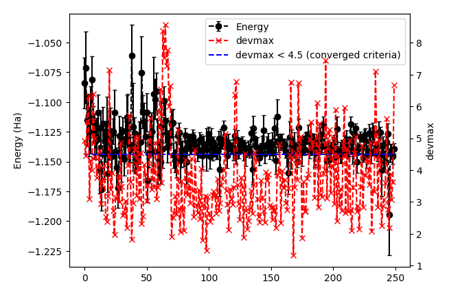
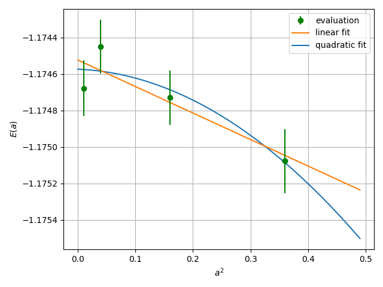

.. TurboRVB_manual documentation master file, created by
   sphinx-quickstart on Thu Jan 24 00:11:17 2019.
   You can adapt this file completely to your liking, but it should at least
   contain the root `toctree` directive.

.. _turbogeniustutorial_0101:

Hydrogen Dimer: First VMC/LRDMC Workflow
========================================

00 Introduction
----------------------------------------------------------------

In this tutorial, you will compute all-electron VMC and LRDMC energies of the hydrogen dimer (H2) using Turbo-genius. You will begin with a DFT calculation in PySCF, construct a Slater determinant from the DFT results, add a Jastrow factor, and optimize the Jastrow parameters via stochastic reconfiguration (natural-gradient) optimization. After the variational optimization, you will evaluate observables with Markov chain Monte Carlo (MCMC) and, finally, perform an LRDMC calculation using the optimized wave function. All input and output files for this tutorial can be downloaded :download:`here  <./file.tar.gz>`.

.. _review: https://doi.org/10.1063/5.0005037

.. contents:: Table of Contents
   :depth: 2

.. _turbogeniustutorial_0101_01:

01 Preparing a JDFT trial wavefunction using PySCF
----------------------------------------------------------------

First, we will generate a JDFT trial wavefunction by starting from the Hartree-Fock or DFT calcualtion using PySCF. We assume that you already have a working copy of PySCF, e.g. by ``pip install pyscf``.

The procedure is as follows:

1. Run the PySCF calculation by typing:

.. code-block:: console

    % # pyscf calculation
    % cd 01_trial_wavefunction
    % python3 pyscf_H2.py

2. Convert the generated PySCF checkpoint file to a TREXIO file by typing:

.. code-block:: console

    % # pyscf chkfile to TREXIO
    % trexio convert-from -t pyscf -i H2.chk -b hdf5 H2.hdf5
    % # trexio convert-from -t pyscf -i H2.chk -b hdf5 --overwrite H2.hdf5

3. Convert from the TREXIO file to the TurboRVB wavefunction file by typing:

.. code-block:: console

    % trexio-to-turborvb H2.hdf5 -jasbasis cc-pVDZ -jascutbasis

Then, you will have the TurboRVB wavefunction file ``fort.10`` as well as the pseudopotential file ``pseudo.dat``.

.. note::

   The basis set files will be downloaded from the basis set exchange website for the first time turbogenius is executed, and stored in the ``.turbo_genius_tmp`` directory in the user's home directory.

.. note::

   When the PySCF calculation fails:

   - Check if the basis set is available,
   - Verify the molecular geometry file exists,
   - Ensure that the sufficient memory allocation is available.

Notes on the PySCF script
^^^^^^^^^^^^^^^^^^^^^^^^^^^^^^^^
The Python code for the PySCF calculation is given as follows:

.. literalinclude:: data/pyscf_H2.py

This program performs electronic structure calculations for an H2 molecule using the PySCF (Python-based Simulations of Chemistry Framework) library.

Configuration Parameters
~~~~~~~~~~~~~~~~~~~~~~~~~~~~~~~~

- **Checkpoint File**: ``H2.chk``
- **Output File**: ``out_H2``
- **Molecular Properties**:

  - Charge: 0 (neutral molecule)
  - Spin: 0 (closed-shell system)
  - Basis Set: ``ccecp-ccpvtz`` (relativistic basis set)
  - ECP (Effective Core Potential): ``ccecp``

Calculation Method
~~~~~~~~~~~~~~~~~~~~~~~~~~~~~~~~

The program supports two calculation methods:

1. **Hartree-Fock (HF)**

   - Restricted Hartree-Fock (RHF) for closed-shell systems
   - Restricted Open-shell Hartree-Fock (ROHF) for open-shell systems

2. **Density Functional Theory (DFT)**

   - Currently configured to use DFT
   - Exchange-correlation functional: ``LDA_X,LDA_C_PZ`` (Local Density Approximation)
   - Restricted Kohn-Sham (RKS) for closed-shell systems
   - Restricted Open-shell Kohn-Sham (ROKS) for open-shell systems

Molecular Structure
~~~~~~~~~~~~~~~~~~~~~~~~~~~~~~~~

- Structure is read from ``H2_dimer.xyz`` file that contains:

  .. literalinclude:: data/H2_dimer.xyz
     :language: text

- Units: Angstroms (Å)
- Symmetry: Disabled
- Uses spherical harmonics (``cart=False``)

Program Flow
~~~~~~~~~~~~~~~~~~~~~~~~~~~~~~~~

1. Load required Python and PySCF packages
2. Configure molecular parameters
3. Build molecular structure
4. Select and execute calculation method
5. Calculate total energy
6. Save results to checkpoint file

Output
~~~~~~~~~~~~~~~~~~~~~~~~~~~~~~~~

The program outputs:

- Total HF/DFT energy
- Calculation status messages
- Checkpoint file location

Notes
~~~~~~~~~~~~~~~~~~~~~~~~~~~~~~~~

- The program serves as a template for basic electronic structure calculations
- Particularly suitable for simple molecular systems like H2
- Results are saved in a checkpoint file for potential further analysis

.. _turbogeniustutorial_0101_02:

02 Jastrow factor optimization (WF=JDFT)
----------------------------------------------------------------
In this step, Jastrow factors are optimized at the VMC level using ``vmcopt`` module of Turbo-Genius.

First, copy the trial wavefunction ``fort.10`` generated by the DFT calculation, as well as the pseudo potential file ``pseudo.dat``, to ``02_optimization`` directory:

.. code-block:: console

    % cd ../02_optimization/
    % cp ../01_trial_wavefunction/fort.10 .
    % cp ../01_trial_wavefunction/pseudo.dat .

To generate ``datasmin.input``, which is a minimal input file for a VMC-optimization:

.. code-block:: console

    % turbogenius vmcopt -g -opt_onebody -opt_twobody -opt_jas_mat -optimizer lr -nw 128 -vmcoptsteps 200 -steps 100

There are command-line variables ``-opt_XXXXX`` which can be used to specify the type of VMC optimization to be used. Currently the following options are implemented:

   * ``-opt_onebody`` (default:True): optimize the homogenius and imhomogenius one-body Jastrow part.

   * ``-opt_twobody`` (default:True): optimize the two-body Jastrow part.

   * ``-opt_det_mat`` (default:False): optimize the matrix element of the determinant part.

   * ``-opt_jas_mat`` (default:True): optimize the matrix element of the Jastrow part.

   * ``-opt_det_basis_exp`` (default:False): optimize the exponents of the determinant part.

   * ``-opt_jas_basis_exp`` (default:False): optimize the exponents of the Jastrow part.

   * ``-opt_det_basis_coeff`` (default:False): optimize the coefficients of the determinant part.

   * ``-opt_jas_basis_coeff`` (default:False): optimize the coefficients of the Jastrow part.

You can also specify an optimization algorithm via ``-optimizer`` command-line variable.

   * ``sr`` : Stochastic Reconfiguration method. See `J. Chem. Phys. 127, 014105 (2007) <https://doi.org/10.1063/1.2746035>`_ and the review_ paper.

   * ``lr`` : Linear method with natural gradients. See `Phys. Rev. B 71, 241103(R) (2005) <https://doi.org/10.1103/PhysRevB.71.241103>`_, `Phys. Rev. Lett. 98, 110201 (2007) <https://doi.org/10.1103/PhysRevLett.98.110201>`_, and review_ paper.

There are other command-line options to specify the calculation conditions, such as:

   * ``-vmcoptsteps``: The number of optimization steps.

   * ``-steps``: MCMC steps per optimization step. The actual number of sampling points is ``steps`` times ``nw`` below.

   * ``-nw``: The number of workers. When the calculation is carried out in parallel, the number of MPI processes Np must be a divisor of ``nw``. If ``nw`` is omitted, it is set equal to the number of Np.

See the command reference for the detailed description of commandline options. The uses may consult the wavefunction optimization section for parameter choices.

The input file ``datasmin.input`` should look something like:

.. literalinclude:: data/datasmin.input
   :language: fortran

Now you can launch the VMC optimization:

.. code-block:: console

    % export TURBOVMC_RUN_COMMAND="mpirun -np 16 turborvb-mpi.x"
    % turbogenius vmcopt -r

.. note::

   There are several ways to run the optimization calculation:

   1. Using TurboGenius interface

        by typing as follows to run the serial version

        .. code-block:: console

           % turbogenius vmcopt -r

        or by specifying the internal command by an environment variable as follows to run the parallel version

        .. code-block:: console

           % export TURBOVMC_RUN_COMMAND="mpirun -np XX turborvb-mpi.x"
           % turbogenius vmcopt -r

        where XX is the number of MPI processes.
        The MPI execution command (`mpirun` and the options) should be replaced according to the type of the MPI library.

   2. Using directly the TurboRVB executables

        to run the serial version:

        .. code-block:: console

           % turborvb-serial.x < datasmin.input > out_min

        or to run the parallel version:

        .. code-block:: console

           % mpirun -np XX turborvb-mpi.x < datasmin.input > out_min

   3. Using the batch job scheduler

        on a cluster machine running the PBS job scheduler:

        .. code-block:: console

           % qsub submit.sh

        on a cluster machine running the Slurm job scheduler:

        .. code-block:: console

           % sbatch submit.sh

        where ``submit.sh`` is an appropriate job script that invokes the serial or parallel version of TurboRVB executables or TurboGenius interface.

.. note::

        You can stop the optimization by writing ``0`` into ``stop.dat``.

Now, for post-processing, use:

.. code-block:: console

        % turbogenius vmcopt -post -optwarmup 80 -plot
        % # and then please follow the instructions.

.. note::

        The corresponding command in turborvb is:

        .. code-block:: console

            % readalles.x < readalles.input > out_read

It plots energy with the error bars and devmax w.r.t. optimization steps (plot_energy_and_devmax.png).
e.g.,

.. code-block:: console

    % eog plot_energy_and_devmax.png

In the plot, ``devmax`` is below the converged criteria of devmax = 4.5, hence we can say the convergence is achieved.

Post-processing performs three important functions:

1. The parameters of Jastrow were optimized over `ngen` / `nweight` ( = `vmcoptsteps` ) iterations. When ``--plot`` option is specified, the post-processing plots all the parameters with respect to iterations which is saved in all_parameters_saved. Check png files in parameters_graphs directory (e.g., eog parameters_graphs/Parameter_No*_averaged.png). Here, we show the plots of first two parameters:

   .. image:: image/parameter_No_1.png
        :width: 70%
        :align: center

   .. image:: image/parameter_No_2.png
        :width: 70%
        :align: center

2. In the second step post-processing averages optimized variational parameters. In our case, this is done over the last several thousands optimisation steps. If you wish to change the number of steps you can specify the ``-optwarmup`` option. The average values of parameters are stored in the file Average_parameters.dat.

3. Finally a dummy VMC calculation is done in ave_temp to write these averaged parameters in ``fort.10``. The final averaged WF is ``fort.10``. The original WF is renamed as ``fort.10_bak``

.. warning::

    For a real run, one should optimize variational parameters much more carefully. We recommend that one consult to an expert or a developer of TurboRVB.

.. _turbogeniustutorial_0101_03:

03 VMC (WF=JDFT)
----------------------------------------------------------------
The next step is to run a single-shot VMC calculation
This is done using the ``vmc`` module of Turbo-Genius.

First, copy ``fort.10`` and ``pseudo.dat`` from ``02_optimization`` to ``03_VMC``:

.. code-block:: console

    % cd ../03_vmc/
    % cp ../02_optimization/fort.10 .
    % cp ../02_optimization/pseudo.dat .

Now generate an input file ``datasvmc.input`` using:

.. code-block:: console

     % turbogenius vmc -g -steps 1000 -nw 128 -force

The option ``-force`` (default: False) allows us to compute VMC forces.

It should look something like the following:

.. literalinclude:: data/datasvmc.input
   :language: fortran

Run the VMC calculation:

.. code-block:: console

   % export TURBOVMC_RUN_COMMAND="mpirun -np 16 turborvb-mpi.x"
   % turbogenius vmc -r

See Note in the :ref:`optimization step <turbogeniustutorial_0101_02>` for the ways to run the calculations.

After the VMC run finishes, use post-processing to check the total energy:

.. code-block:: console

    % turbogenius vmc -post -bin 10 -warmup 5

.. note::

   This corresponds to running ``forcevmc.sh 10 5 1``
   by using the values in this example:

   .. code-block:: text

      bin length = 10
      init bin = 5
      pulay = 1 (default)

      Chosen values: bin=10, init_bin=5, pulay=1, => equil_steps=50

Postprocessing basically does reblocking using the binning technique. Here again post-processing has two modes: manual and interactive. The reblocked total energy and error are written in the file ``pip0.d``.

.. code-block:: console

    % cat pip0.d
    Energy =  -1.17284117753204       1.253988599211879E-004

The obtained forces are written in the file ``forces_vmc.dat``.

.. code-block:: console

    % cat forces_vmc.dat
    Force component 1
    Force   =  2.966615810205714E-003  1.199178968598954E-003  2.752792621302076E-005
    Der Eloc =  3.335617738742622E-002  1.231330962370900E-003
    <OH> =  0.590121966419686       7.112041263498287E-004
    <O><H> = -0.605316747208296       7.014897543031068E-004
    2*(<OH> - <O><H>) = -3.038956157722050E-002  1.214861001943852E-004

.. warning::

    Force component 1 refers to the **sum** of the forces of the first line (i.e.,  2 1 3 -2 3) in ``fort.10``. The first index is the number of force components and the second and third are the nucleus index and the direction (x:1, y:2, z:3 for a positive nucleus index whereas -x:1, -y:2, -z:3 for a negative nucleus index). Indeed, the forces in the z-direction acting on the first and second hydrogen atoms are -2.74e-4 Ha/Bohr and +2.74e-4 Ha/Bohr, respectively. *Not* -5.48e-4 Ha/Bohr and +5.48e-4 Ha/Bohr.

.. _turbogeniustutorial_0101_04:

04 LRDMC (WF=JDFT)
----------------------------------------------------------------
Lattice regularized diffusion Monte Carlo (LRDMC) is a projection technique that
can improve a trial wavefunction obtained by a DFT calculation or a VMC optimization systematically. Indeed, this method filters out the ground state wavefunction from a given trial wavefunction. See `the original Casula's paper <https://journals.aps.org/prl/abstract/10.1103/PhysRevLett.95.100201>`_, or the review_ paper in detail.

There is the so-called lattice-space error in LRDMC because the Hamiltonian is regularized by allowing electrons hopping with finite step size ``alat`` (Bohr). Therefore, one should extrapolate energies calculated by several lattice spaces (``alat``) to obtain an unbiased energy (:math:`alat \to 0`).

Please create a folder for each ``alat``, and copy an optimized ``fort.10`` and pseudopotential file from ``03_vmc`` to the current ``alat`` directory. To generate lrdmc input files for a LRDMC calc.:

.. code-block:: console

    % cd ../04_lrdmc
    % cp ../../03_vmc/fort.10 .
    % cp ../../03_vmc/pseudo.dat .

.. code-block:: console

   % turbogenius lrdmc -g -etry -1.10 -alat -0.20 -steps 10000 -nw 128

- ``-etry``: Put an obtained DFT or VMC energy. :math:`\Gamma` in Eq. 6 of the review_ paper is set 2 :math:`\times` ``etry``

- ``-alat``: The lattice space for discretizing the Hamiltonian. If you do a single grid calculation (i.e., alat2=0.0d0), please put a negative value. If you do a double-grid calculation (See `the Nakano's paper <https://doi.org/10.1103/PhysRevB.101.155106>`_), put a positive value and set ``iesrandoma=.true.``. This trick is needed for satisfying the detailed-balance condition.

.. note::

   Currently, TurboGenius automatically sets double grid calculations for all electron systems with :math:`Z > 2`, and single-grid otherwise. If you want to do something different, please change the input files manually.

``alat2``: The corser lattice space used in the double-grid calculation. If you put 0.0d0, Turbo does a single grid calculation. If you want to do a double-grid calculation for a compound include Z > 2 element, please comment out ``alat2`` because ``alat2`` is automatically set. See `the Nakano's paper <https://doi.org/10.1103/PhysRevB.101.155106>`_.

The input file ``datasfn.input`` should look something like:

.. literalinclude:: data/datasfn.input
   :language: fortran

Now run the LRDMC calculation:

.. code-block:: console

   % export TURBOVMC_RUN_COMMAND="mpirun -np 16 turborvb-mpi.x"
   % turbogenius lrdmc -r

See Note in the :ref:`optimization step <turbogeniustutorial_0101_02>` for the ways to run the calculations.

For post-processing use:

.. code-block:: console

    % turbogenius lrdmc -post -bin 20 -corr 3 -warmup 5

.. note::

    This corresponds to ``forcefn.sh 20 3 5 1``.

The total energy and error are written in the file ``pip0_fn.d``.
Thus, we get :math:`E (a=0.20 {\rm bohr})` = -1.1744(7) Ha.

.. _turbogeniustutorial_0101_05:

05 LRDMC (WF=JDFT) Extrapolation.
----------------------------------------------------------------

.. warning::

    For the hydrogen dimer, extrapolation is not needed because the energies are almost constant in the region. Try to plot evsa.gnu with gnuplot later.

If you want to extrapolate energies, collect all LRDMC energies into ``evsa.in`` in the 05_lrdmc_extrapolation directory, and perform the extrapolation.

0. Change working directory.

   .. code-block:: console

      % cd ../05_lrdmc_extrapolation

1. First, prepare the input files for all alat.

   .. code-block:: bash

    alat_list="0.10 0.20 0.40 0.60"
    lrdmc_root_dir=`pwd`
    for alat in $alat_list
    do
        cd alat_${alat}
        cp ../../03_vmc/fort.10 .
        cp ../../03_vmc/pseudo.dat .
        turbogenius lrdmc -g -etry -1.10 -alat -$alat -steps 10000 -nw 128
        cd ${lrdmc_root_dir}
    done

2. Second, run the LRDMC calculations.

   .. code-block:: bash

    export TURBOVMC_RUN_COMMAND="mpirun -np 16 turborvb-mpi.x"
    alat_list="0.10 0.20 0.40 0.60"
    lrdmc_root_dir=`pwd`
    for alat in $alat_list
    do
        cd alat_${alat}
        turbogenius lrdmc -r
        cd ${lrdmc_root_dir}
    done

3. Third, run the postprocessing.

   .. code-block:: bash

    alat_list="0.10 0.20 0.40 0.60"
    lrdmc_root_dir=`pwd`

    num=0
    echo -n > ${lrdmc_root_dir}/evsa.gnu
    for alat in $alat_list
    do
        cd alat_${alat}
        num=`expr ${num} + 1`
        echo -n "${alat} " >> ${lrdmc_root_dir}/evsa.gnu
        turbogenius lrdmc -post -bin 20 -corr 3 -warmup 5
        grep "Energy =" pip0_fn.d  | awk '{print $3, $4}' >> ${lrdmc_root_dir}/evsa.gnu
        cd ${lrdmc_root_dir}
    done

   The results can be shown, e.g. by using gnuplot:

   .. code-block:: console

    % gnuplot
    > p "evsa.gnu" u 1:2:3 with yerr

4. Finally, perform extrapolation of the obtained energies.

   .. code-block:: bash

    sed "1i 1  ${num}  4  1" evsa.gnu > evsa_lin.in   # linear fitting
    sed "1i 2  ${num}  4  1" evsa.gnu > evsa_quad.in  # quadratic fitting

    funvsa.x < evsa_lin.in > evsa_lin.out
    funvsa.x < evsa_quad.in > evsa_quad.out

It performs a curve fitting for energies vs alat. turbo-genius asks for the degree of polynomial to be used for curve fitting. The result of fitting is written to the file ``evsa.out``

For a quartic fitting i.e. :math:`E(a) = E(0) + k_{1} \cdot a^2 + k_{2} \cdot a^4`, the result is like:

.. code-block:: text

    Reduced chi^2  =   1.35815628495656
    Coefficient found
             1  -1.17457320365212       1.485265256941217E-004
             2 -1.273655937056194E-004  2.470000944108354E-003
             3 -3.607514624666779E-003  6.502831469706190E-003

where the first coefficient corresponds to :math:`E(0)`, the second to :math:`k_{1}`, and the third to :math:`k_{2}`.

For a linear fitting i.e. :math:`E(a) = E(0) + k_{1} \cdot a^2`, the result is like:

.. code-block:: text

    Reduced chi^2  =  0.843282581592029
    Coefficient found
             1  -1.17452274148461       1.148177538465624E-004
             2 -1.454427631174857E-003  6.339354112508461E-004

where the first coefficient corresponds to :math:`E(0)`, and the second to :math:`k_{1}`.

.. _turbogeniustutorial_0101_06:

06 Summary
----------------------------------------------------------------

The total energy obtained at the steps above and the reference value are summarized as follows:

- DFT (LDA) = -1.1373 Ha

- VMC (JDFT) = -1.1727(7) Ha

- LRDMC (JDFT at a=0.20 bohr) = -1.1744(7) Ha.

- LRDMC (JDFT extrapolated to a :math:`\to 0`) = -1.174(5) Ha.

- CCSD(T)=FULL/cc-pVQZ = -1.173793 Ha (Computational Chemistry Comparison and Benchmark DataBase)
