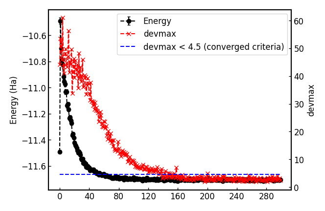
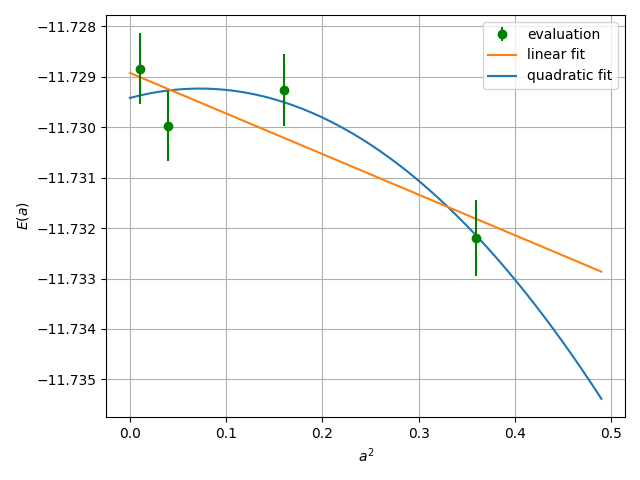

.. TurboRVB_manual documentation master file, created by
   sphinx-quickstart on Thu Jan 24 00:11:17 2019.
   You can adapt this file completely to your liking, but it should at least
   contain the root `toctree` directive.

.. _turbogeniustutorial_0201:

Ammonia: VMC/LRDMC with ECPs
============================

.. contents:: Table of Contents
   :depth: 3

.. _turbogeniustutorial_0201_00:

00 Introduction
--------------------------------------------------------------------

In this tutorial, you will learn a complete workflow for VMC and LRDMC calculations on the ammonia molecule, starting from a DFT calculation in PySCF that employs correlation-consistent effective core potentials (ccECPs). All input and output files for this tutorial can be downloaded :download:`here  <./file.tar.gz>`.

.. _review: https://doi.org/10.1063/5.0005037

.. _turbogeniustutorial_0201_01:

01 PySCF calculation and its conversion to a TREXIO file
--------------------------------------------------------------------

The first step is to run a PySCF calculation by typing:

.. code-block:: console

    % # pyscf calculation
    % cd 01_pyscf_calculation
    % python3 pyscf_NH3.py

The Python code is given as follows:

.. literalinclude:: data/pyscf_NH3.py
   :language: python

You can convert the generated PySCF checkpoint file to a TREXIO file

.. code-block:: console

    % # pyscf chkfile to TREXIO
    % trexio convert-from -t pyscf -i NH3.chk -b hdf5 NH3.hdf5

.. _turbogeniustutorial_0201_02:

02 From TREXIO file to TurboRVB WF
--------------------------------------------------------------------

Next, the TREXIO file is converted to a TurboRVB wavefunction file as follows:

.. code-block:: console

    % cd ../02_trexio_to_turborvbwf/
    % cp ../01_pyscf_calculation/NH3.hdf5 .

    % trexio-to-turborvb NH3.hdf5 -jasbasis cc-pVDZ -jascutbasis

.. note::

    If you want to specify Jastrow basis set, you can use the following python script to convert the TREXIO file.

    .. code-block:: console

        % cd ../02_trexio_to_turborvbwf/
        % cp ../01_pyscf_calculation/NH3.hdf5 .
        % vi trexio_turborvb_wf_converter.py # define your Jastrow basis
        % python trexio_turborvb_wf_converter.py

    The Python code is:

    .. literalinclude:: data/trexio_turborvb_wf_converter.py
       :language: python

.. _turbogeniustutorial_0201_03:

03 JDFT ansatz - Jastrow optimization
--------------------------------------------------------------------

The next step is to optimize the Jastrow factor at the VMC level using ``vmcopt`` module.
One should refer to the :ref:`Hydrogen tutorial <turbogeniustutorial_0101_02>` for the details.
Here, only needed commands are shown.

1. Copy the prepared wavefunction file `fort.10` and the pseudopotential file to the work directory:

   .. code-block:: console

      % cd ../03_optimization/
      % cp ../02_trexio_to_turborvbwf/fort.10 fort.10
      % cp ../02_trexio_to_turborvbwf/pseudo.dat .
      % cp fort.10 fort.10_pyscf

2. Generate an input file for VMC optimization:

   .. code-block:: console

      % turbogenius vmcopt -g -opt_onebody -opt_twobody -opt_jas_mat -optimizer lr -vmcoptsteps 300 -steps 100 -nw 128

3. Run the VMC optimization, e,g, as follows:

   .. code-block:: console

      % export TURBOVMC_RUN_COMMAND="mpirun -np 16 turborvb-mpi.x"
      % turbogenius vmcopt -r

4. Perform the postprocess by typing:

   .. code-block:: console

      % turbogenius vmcopt -post -optwarmup 80 -plot

Check `plot_energy_and_devmax.png` and the files in the `parameters_graphs` directory.

.. _turbogeniustutorial_0201_04:

04 JDFT ansatz - VMC
--------------------------------------------------------------------

The next step is to run a single-shot VMC calculation.
This is done using the ``vmc`` module of TurboGenius.
First, prepare the wavefunction and pseudopotential files:

.. code-block:: console

    % cd ../04_vmc/
    % cp ../03_optimization/fort.10 fort.10
    % cp ../03_optimization/pseudo.dat .

Next, generate an input file `datasvmc.input` using:

.. code-block:: console

    % turbogenius vmc -g -steps 1000 -nw 128

Then, run the VMC calculation, e.g., by typing:

.. code-block:: console

    % export TURBOVMC_RUN_COMMAND="mpirun -np 16 turborvb-mpi.x"
    % turbogenius vmc -r

Finally, run the postprocess:

.. code-block:: console

    % turbogenius vmc -post -bin 10 -warmup 3

Check the reblocked total energy and error in the file `pip0.d`.

.. _turbogeniustutorial_0201_05:

05 JDFT ansatz - LRDMC
--------------------------------------------------------------------

Now we proceed to the lattice regularized diffusion Monte Carlo calculation that can improve a trial wavefunction obtained by a DFT calculation or a VMC optimization.
One should refer to the :ref:`Hydrogen tutorial <turbogeniustutorial_0101_04>` for the details.

In this section, we will perform the calculation at the lattice constant `alat=0.20`.
First, copy the prepared wavefunction and the pseudopotential files:

.. code-block:: console

    % # LRDMC run
    % mkdir -p ../05_lrdmc/alat_0.20/
    % cd ../05_lrdmc/alat_0.20/
    % cp ../../04_vmc/fort.10 .
    % cp ../../04_vmc/pseudo.dat .

Next, generate an input file `datasfn.input` for the LRDMC calculation:

.. code-block:: console

    % turbogenius lrdmc -g -etry -11.70 -alat -0.20 -steps 1000 -nw 128

Then, run the calculation by typing:

.. code-block:: console

    % export TURBOVMC_RUN_COMMAND="mpirun -np 16 turborvb-mpi.x"
    % turbogenius lrdmc -r

Finally, run the postprocess:

.. code-block:: console

    % turbogenius lrdmc -post -bin 20 -corr 3 -warmup 5

We will get E at a=0.20 bohr in `pip0_fn.d`.

One then follows the above procedure for several choices of `alat`, and extrapolates the energy value at :math:`a \to 0`.
See the :ref:`Hydrogen tutorial <turbogeniustutorial_0101_05>` for the concrete steps.

.. _turbogeniustutorial_0201_06:

06 Summary
----------------------------------------------------------------

The total energy obtained at the steps above and the reference value are summarized as follows:

- DFT (LDA) = -11.4591 Ha

- VMC (JDFT) = -11.7042(4) Ha

- LRDMC (JDFT at a=0.20 bohr) = -11.7289(6) Ha.

- LRDMC (JDFT extrapolated to a :math:`\to 0`) = -11.7289(5) Ha.
