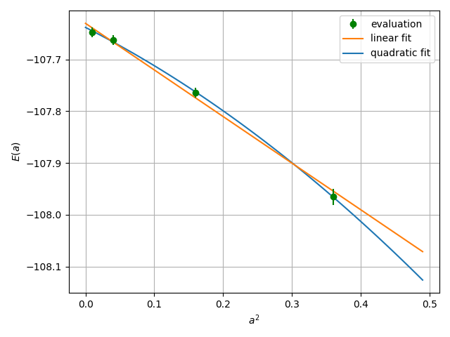

.. TurboRVB_manual documentation master file, created by
   sphinx-quickstart on Thu Jan 24 00:11:17 2019.
   You can adapt this file completely to your liking, but it should at least
   contain the root `toctree` directive.

.. _turbogeniustutorial_0401:

SiO2 Crystal: Gamma-Point VMC/LRDMC
===================================

.. _turbogeniustutorial_0401_00:

00 Introduction
--------------------------------------------------------------------

In this tutorial, you will perform a VMC/LRDMC workflow for crystalline SiO2 under PBCs, starting from a PySCF DFT calculation with ccECPs. You will use Gamma-point sampling. All input and output files for this tutorial can be downloaded :download:`here  <./file.tar.gz>`.

.. _review: https://doi.org/10.1063/5.0005037

.. contents:: Table of Contents
   :depth: 3

.. _turbogeniustutorial_0401_01:

01 PySCF calculation and its conversion to a TREXIO file
--------------------------------------------------------------------

.. .. warning::

    You can skip this step! since this is a litte heavy calculation.

The first step of this tutorial is to generate a JDFT ansatz using PySCF.
Run a PySCF calculation by typing as follows. The Python script will be presented later.

.. code-block:: console

    % cd 01_pyscf_calculation
    % python3 pyscf_SiO2.py

You can convert the generated PySCF checkpoint file to a TREXIO file

.. code-block:: console

    % # pyscf chkfile to TREXIO
    % trexio convert-from -t pyscf -i SiO2.chk -b hdf5 SiO2.hdf5

.. _turbogeniustutorial_0401_02:

02 From TREXIO file to TurboRVB WF
--------------------------------------------------------------------

Next, we convert the TREXIO file to a TurboRVB wavefunction file.
It can be done by using ``trexio-to-turborvb`` program in the TurboGenius package as follows:

.. code-block:: console

    % trexio-to-turborvb SiO2.hdf5 -jasbasis cc-pVDZ -jascutbasis

.. note::

    If you want to specify Jastrow basis set, you can use the following python script to convert the TREXIO file.

    .. code-block:: console

       % vi trexio_turborvb_wf_converter.py # define your Jastrow basis
       % python trexio_turborvb_wf_converter.py

.. _turbogeniustutorial_0401_03:

03 JDFT ansatz - Jastrow optimization
--------------------------------------------------------------------

One should refer to the :ref:`Hydrogen tutorial <turbogeniustutorial_0101_02>` for the details.
Here, only needed commands are shown.

1. Copy the wavefunction file and the pseudopotential file:

  .. code-block:: console

      % cd ../02_optimization/
      % cp ../01_pyscf_calculation/fort.10 fort.10
      % cp ../01_pyscf_calculation/pseudo.dat .
      % cp fort.10 fort.10_pyscf

2. Generate an input file `datasmin.input`:

  .. code-block:: console

      % turbogenius vmcopt -g -opt_onebody -opt_twobody -opt_jas_mat -optimizer lr -vmcoptsteps 300 -steps 1000 -nw 1024 -learn 0.30 -reg -0.01 -maxtime 86000

3. Run the optimization:

  .. code-block:: console

    % export TURBOVMC_RUN_COMMAND="mpirun -np 16 turborvb-mpi.x"
    % turbogenius vmcopt -r

  See Note in the :ref:`optimization step <turbogeniustutorial_0101_02>` for the ways to run the calculations.

4. Perform the postprocess and plot the results:

  .. code-block:: console

      % turbogenius vmcopt -post -optwarmup 80 -plot

Check `plot_energy_and_devmax.png` and the files in the `parameters_graphs` directory.

.. note::

  Optimization tips:

  - In the natural gradient method, a matrix :math:`S` is regularized as
    :math:`{\rm diag}(S') = (1 + {\rm parr}) {\rm diag}(S)`
    before calculating :math:`{S'}^{-1}`
    for a positive value of the `parr` parameter (specified by the ``-reg`` option).
    When :math:`S` is much ill-conditioned, the above regularization does not work.
    Instead, by choosing a **negative** value of the `parr` parameter,
    :math:`{\rm diag}(S') = {\rm diag}(S) + {\rm parr}` is adopted
    in which the diagonal part is directly enhanced by the `parr` parameter.
    This may stabilize the inversion.

  - By adding ``-num_opt_param`` to the turbogenius command line or specifying a parameter ``npbra`` in the ``&optimization`` section of the input parameter ``datasmin.input``, the convergence may speed up. The figure below plots the values of devmax along the optimization steps, with and without specifying ``npbra``.

    .. image:: image/optimization_devmax.png
       :width: 70%
       :align: center

.. _turbogeniustutorial_0401_04:

04 JDFT ansatz - VMC
--------------------------------------------------------------------

The next step is to run a single-shot VMC calculation. This is done using the ``vmc`` module of TurboGenius.
First, prepare the wavefunction and related files:

.. code-block:: console

    % cd ../03_vmc/
    % cp ../02_optimization/fort.10 fort.10
    % cp ../02_optimization/pseudo.dat .

Next, generate an input file `datasvmc.input` using:

.. code-block:: console

    % turbogenius vmc -g -steps 1000 -nw 128

Then, run the VMC calculation:

.. code-block:: console

    % export TURBOVMC_RUN_COMMAND="mpirun -np 16 turborvb-mpi.x"
    % turbogenius vmc -r

Finally, run the postprocess:

.. code-block:: console

    % turbogenius vmc -post -bin 10 -warmup 5

Check the reblocked total energy and error in the file `pip0.d`.

.. _turbogeniustutorial_0401_05:

05 JDFT ansatz - LRDMC
--------------------------------------------------------------------

Now we proceed to the lattice regularized diffusion Monte Carlo calculation that can improve a trial wavefunction obtained by a DFT calculation or a VMC optimization.
One should refer to the :ref:`Hydrogen tutorial <turbogeniustutorial_0101_04>` for the details.

In this section, we will perform the calculation at the lattice constant `alat=0.20`.
First, copy the prepared wavefunction and the pseudopotential files:

.. code-block:: console

    % # LRDMC run
    % cd ../04_lrdmc/
    % cp ../03_vmc/fort.10 .
    % cp ../03_vmc/pseudo.dat .

Next, generate an input file `datasfn.input` for the LRDMC calculation:

.. code-block:: console

    % turbogenius lrdmc -g -etry -108.00 -alat -0.20 -steps 1000 -nw 128

Then, run the calculation by typing:

.. code-block:: console

    % export TURBOVMC_RUN_COMMAND="mpirun -np 16 turborvb-mpi.x"
    % turbogenius lrdmc -r

Finally, run the postprocess:

.. code-block:: console

    % turbogenius lrdmc -post -bin 20 -corr 3 -warmup 5

We wil get E at a=0.20 bohr in `pip0_fn.d`.

One then follows the above procedure for several choices of `alat`, and extrapolates the energy value at :math:`a \to 0`.
See the :ref:`Hydrogen tutorial <turbogeniustutorial_0101_05>` for the concrete steps.

   Extrapolation of the energy value at :math:`a \to 0` using the linear and quadratic fits with respect to :math:`a^2`.
