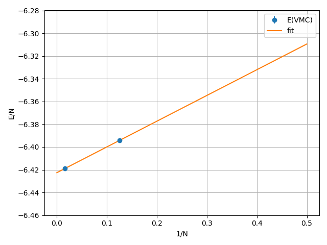
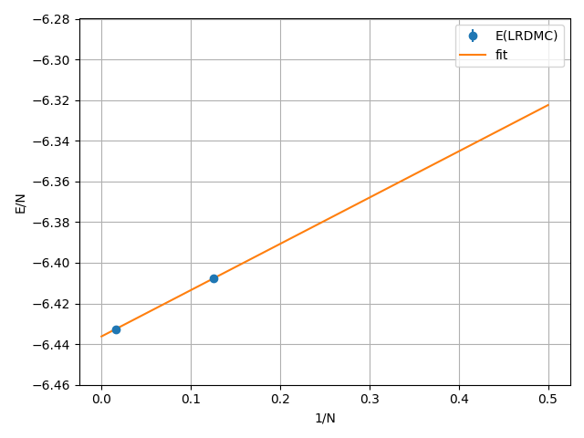

.. TurboRVB_manual documentation master file, created by
   sphinx-quickstart on Thu Jan 24 00:11:17 2019.
   You can adapt this file completely to your liking, but it should at least
   contain the root `toctree` directive.

.. _turbogeniustutorial_0801:

c-BN (conventional cell) with a Jastrow–Slater single-determinant ansatz via VMC and LRDMC using ECPs: two-body finite-size corrections
=======================================================================================================================================

.. _turbogeniustutorial_0801_00:

00 Introduction
----------------------------------------------------------------

In this tutorial, you will perform VMC/LRDMC calculations for c-BN (conventional cell) under PBCs, starting from PySCF with ccECPs. You will carry out supercell extrapolation using 1×1×1 and 2×2×2 supercells to mitigate the so-called two-body finite-size errors. All input and output files for this tutorial can be downloaded :download:`here  <./file.tar.gz>`.
   
.. _review: https://doi.org/10.1063/5.0005037

.. contents:: Table of Contents
   :depth: 3
   
    
.. _turbogeniustutorial_0801_01:

01 DFT
----------------------------------------------------------------

The first step of this tutorial is to generate a JDFT ansatz using PySCF.
A Python script will be presented later.
The procedure is as follows:

1. Run the PySCF calculation:

  .. code-block:: bash
      
      cd s_1_1_1/01_trial_wavefunction
      python3 pyscf_cBN.py
    
2. Convert the generated PySCF checkpoint file to a TREXIO file:
    
  .. code-block:: bash

      trexio convert-from -t pyscf -i cBN.chk -b hdf5 cBN.hdf5
    
3. Convert the TREXIO file to a TurboRVB wavefunction file:

  .. code-block:: bash

      trexio-to-turborvb cBN.hdf5 -jasbasis cc-pVDZ -jascutbasis
    
Then, you will have the TurboRVB wavefunction file ``fort.10`` as well as the pseudopotential file ``pseudo.dat``.

.. note::

   When the PySCF calculation fails:

   - Check if the basis set is available,
   - Ensure that the sufficient memory allocation is available.

.. _turbogeniustutorial_0801_02:

02 Jastrow optimization
----------------------------------------------------------------
The second step is to optimize the Jastrow factor at the VMC level using ``vmcopt`` module of TurboGenius.
One should refer to the :ref:`Hydrogen tutorial <turbogeniustutorial_0101_02>` for the details.
Here, only needed commands are shown.

1. Copy the wavefunction file and the pseudopotential file:

  .. code-block:: bash

    cd ../../02_optimization/
    cp ../01_trial_wavefunction/fort.10 .
    cp ../01_trial_wavefunction/pseudo.dat .
    cp fort.10 fort.10_dft

2. Generate an input file `datasmin.input`:

  .. code-block:: bash

    turbogenius vmcopt -g -opt_onebody -opt_twobody -opt_jas_mat -optimizer lr -vmcsteps 300 -steps 100 -nw 1024

3. Run the optimization:

  .. code-block:: bash

    export TURBOVMC_RUN_COMMAND="mpirun -np 16 turborvb-mpi.x"
    turbogenius vmcopt -r

  See Note in the :ref:`optimization step <turbogeniustutorial_0101_02>` for the ways to run the calculations.

4. Perform the postprocess and plot the results:

  .. code-block:: bash

    turbogenius vmcopt -post -optwarmup 20 -plot

Check `plot_energy_and_devmax.png` and the files in the `parameters_graphs` directory.

.. _turbogeniustutorial_0801_03:

03 JDFT ansatz - VMC
----------------------------------------------------------------

The next step is to run a single-shot VMC calculation. This is done using the ``vmc`` module of TurboGenius.
First, prepare the wavefunction and related files:

.. code-block:: bash

    cd ../03_vmc/
    cp ../02_optimization/fort.10 .
    cp ../02_optimization/pseudo.dat .

Next, generate an input file `datasvmc.input` using:

.. code-block:: bash

    turbogenius vmc -g -steps 1000 -nw 128

Then, run the VMC calculation:

.. code-block:: bash

    TURBOVMC_RUN_COMMAND="mpirun -np 16 turborvb-mpi.x"
    export TURBOVMC_RUN_COMMAND

    turbogenius vmc -r

Finally, run the postprocess:

.. code-block:: bash

    turbogenius vmc -post -bin 10 -warmup 5

Check the reblocked total energy and error in the file `pip0.d`.

    
.. _turbogeniustutorial_0801_04:

04 JDFT ansatz - LRDMC
--------------------------------------------------------------------

Now we proceed to the lattice regularized diffusion Monte Carlo calculation that can improve a trial wavefunction obtained by a DFT calculation or a VMC optimization.
One should refer to the :ref:`Hydrogen tutorial <turbogeniustutorial_0101_04>` for the details.

In this section, we will perform the calculation at the lattice constant `alat=0.20`.
First, copy the prepared wavefunction and the pseudopotential files:

.. code-block:: bash

    # LRDMC run
    cd ../04_lrdmc/
    cp ../03_vmc/fort.10 .
    cp ../03_vmc/pseudo.dat .

Next, generate an input file `datasfn.input` for the LRDMC calculation:

.. code-block:: bash

    turbogenius lrdmc -g -etry -51.00 -alat -0.20 -steps 1000 -nw 128

Then, run the calculation by typing:

.. code-block:: bash

    TURBOVMC_RUN_COMMAND="mpirun -np 16 turborvb-mpi.x"
    export TURBOVMC_RUN_COMMAND

    turbogenius lrdmc -r

Finally, run the postprocess:

.. code-block:: bash

    turbogenius lrdmc -post -bin 20 -corr 3 -warmup 5

We wil get E at a=0.20 bohr in `pip0_fn.d`.

One then follows the above procedure for several choices of `alat`, and extrapolates the energy value at :math:`a \to 0`.
See the :ref:`Hydrogen tutorial <turbogeniustutorial_0101_05>` for the concrete steps.

.. _turbogeniustutorial_0801_05:

05 Finite-size extrapolation
----------------------------------------------------------------

Then, we repeat the above procedure by changing the size of the supercell, from 1x1x1 to 2x2x2.
In this example, we extend the supercells in the :math:`xyz` directions.
The shape of the supercell is specified by ``nx``, ``ny``, and ``nz`` variables in ``pyscf_cBN.py``.

Try to plot the obtained energies per formula unit. v.s. 1/N, where N is the number of atoms in the simulation cell.

   The energy per atom obtained by the VMC calculation is plotted with respect to 1/N.

   The energy per atom obtained by the LRDMC calculation is plotted with respect to 1/N.
