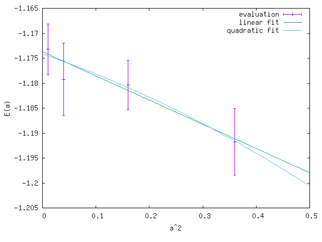

.. TurboRVB_manual documentation master file, created by
   sphinx-quickstart on Thu Jan 24 00:11:17 2019.
   You can adapt this file completely to your liking, but it should at least
   contain the root `toctree` directive.

.. _turbogeniustutorial_0101:

01Hydrogen_dimer
======================================================

00 Introduction
--------------------------------------------------------------------

From this tutorial, you can learn how to calculate all-electron Variational Monte Carlo (VMC) and lattice regularized diffusion Monte Carlo (LRDMC) energies of the H\ :sub:`2` dimer using Turbo-genius. There is also a TurboRVB tutorial, which does the same calculations but without using Turbo-Genius. For detailed information about input parameters in various input files, we recomment visiting that tutorial. You can download all the input and output files for this tutorial from :download:`here  <./file.tar.gz>`.

.. _review: https://doi.org/10.1063/5.0005037

.. contents:: Table of Contents
   :depth: 2
   
.. _turbogeniustutorial_0101_01:

01 Preparing a JDFT trial wavefunction using PySCF
--------------------------------------------------------------------

Run a PySCF calculation.

.. code-block:: bash
    
    # pyscf calculation
    cd 00pyscf_to_trexio
    python pyscf_H2.py 

The Python code is:

.. code-block:: python

    #!/usr/bin/env python
    # coding: utf-8

    # pySCF -> pyscf checkpoint file (H2 dimer)

    # load python packages
    import os, sys

    # load pyscf packages
    from pyscf import gto, scf, mp, tools

    #open boundary condition
    checkpoint_file="H2.chk"
    output="out_H2"
    charge=0
    spin=0
    basis="ccecp-ccpvtz"
    ecp='ccecp'
    #scf_method="HF"  # HF or DFT
    scf_method="DFT"  # HF or DFT
    dft_xc="LDA_X,LDA_C_PZ" # XC for DFT

    # build a molecule
    mol = gto.Mole()
    #mol.atom     = '''
    #               H    0.00000000   0.00000000  -0.360000000
    #               H    0.00000000   0.00000000   0.360000000
    #               '''
    mol.atom = 'H2_dimer.xyz'
    mol.verbose = 5
    mol.output = output
    mol.unit = 'A' # angstrom
    mol.charge = charge
    mol.spin = spin
    mol.symmetry = False

    # basis set
    mol.basis = basis

    # define ecp
    mol.ecp = ecp

    # molecular build
    mol.build(cart=False)  # cart = False => use spherical basis!!

    # calc type setting
    print(f"scf_method = {scf_method}")  # HF/DFT

    if scf_method == "HF":
        # HF calculation
        if mol.spin == 0:
            print("HF kernel = RHF")
            mf = scf.RHF(mol)
            mf.chkfile = checkpoint_file
        else:
            print("HF kernel = ROHF")
            mf = scf.ROHF(mol)
            mf.chkfile = checkpoint_file

    elif scf_method == "DFT":
        # DFT calculation
        if mol.spin == 0:
            print("DFT kernel = RKS")
            mf = scf.KS(mol).density_fit()
            mf.chkfile = checkpoint_file
        else:
            print("DFT kernel = ROKS")
            mf = scf.ROKS(mol)
            mf.chkfile = checkpoint_file
        mf.xc = dft_xc
    else:
        raise NotImplementedError

    total_energy = mf.kernel()

    # HF/DFT energy
    print(f"Total HF/DFT energy = {total_energy}")
    print("HF/DFT calculation is done.")
    print("PySCF calculation is done.")
    print(f"checkpoint file = {checkpoint_file}")

This program performs electronic structure calculations for an H2 molecule using the PySCF (Python-based Simulations of Chemistry Framework) library.

Configuration Parameters

- **Checkpoint File**: ``H2.chk``
- **Output File**: ``out_H2``
- **Molecular Properties**:
  - Charge: 0 (neutral molecule)
  - Spin: 0 (closed-shell system)
  - Basis Set: ``ccecp-ccpvtz`` (relativistic basis set)
  - ECP (Effective Core Potential): ``ccecp``

Calculation Method

The program supports two calculation methods:

1. **Hartree-Fock (HF)**
   - Restricted Hartree-Fock (RHF) for closed-shell systems
   - Restricted Open-shell Hartree-Fock (ROHF) for open-shell systems

2. **Density Functional Theory (DFT)**
   - Currently configured to use DFT
   - Exchange-correlation functional: ``LDA_X,LDA_C_PZ`` (Local Density Approximation)
   - Restricted Kohn-Sham (RKS) for closed-shell systems
   - Restricted Open-shell Kohn-Sham (ROKS) for open-shell systems

Molecular Structure

- Structure is read from ``H2_dimer.xyz`` file
- Units: Angstroms (Å)
- Symmetry: Disabled
- Uses spherical harmonics (``cart=False``)

Program Flow

1. Load required Python and PySCF packages
2. Configure molecular parameters
3. Build molecular structure
4. Select and execute calculation method
5. Calculate total energy
6. Save results to checkpoint file

Output

The program outputs:
- Total HF/DFT energy
- Calculation status messages
- Checkpoint file location

Notes

- The program serves as a template for basic electronic structure calculations
- Particularly suitable for simple molecular systems like H2
- Results are saved in a checkpoint file for potential further analysis 

    
You can convert the generated PySCF checkpoint file to a TREXIO file

.. code-block:: bash

    # pyscf chkfile to TREXIO
    trexio convert-from -t pyscf -i H2.chk -b hdf5 H2.hdf5
    
From TREXIO file to TurboRVB WF

.. code-block:: bash
    
    trexio-to-turborvb H2.hdf5 -jasbasis cc-pVDZ -jascutbasis

.. _turbogeniustutorial_0101_02:

02 Jastrow factor optimization (WF=JDFT)
--------------------------------------------------------------------
In this step, Jastrow factors are optimized at the VMC level using ``vmcopt`` module of Turbo-Genius.

Next, copy the trial wavefunction ``fort.10_new`` generated by the DFT calculation to ``02optimization`` directory and rename it to ``fort.10``:

.. code-block:: bash

    cd ../../02optimization/
    cp ../01trial_wavefunction/01DFT/fort.10_new fort.10

To generate ``datasmin.input``, which is a minimal input file for a VMC-optimization:

.. code-block:: bash

    turbogenius vmcopt -g -opt_onebody -opt_twobody -opt_jas_mat -optimizer lr -vmcoptsteps 100 -steps 10

The input file should look something like:

.. code-block:: bash

    # datasmin.input
    &simulation
        itestr4=-4
        ngen=1000
        iopt=1
        nw=40
        maxtime=3600
        disk_io='mpiio'
    /
    
    &pseudo
    /
    
    &vmc
        epscut=0.0
    /
    
    &optimization
        ncg=1
        nweight=10
        nbinr=1
        iboot=0
        tpar=0.35
        parr=0.001
        iesdonebodyoff=.false.
        iesdtwobodyoff=.false.
        twobodyoff=.false.
    /
    
    &readio
    /
    
    &parameters
        iesd=1
        iesfree=1
        iessw=0
        iesup=0
        iesm=0
    /
    
    &kpoints
    /

There is a command-line variable ``-opt_XXXXX`` which can be used to specify the type of vmc optimization to be used. Currently the following options are implemented:

   1. ``-opt_onebody`` (default:True): optimize the homogenius and imhomogenius one-body Jastrow part.

   2. ``-opt_twobody`` (default:True): optimize the two-body Jastrow part.

   3. ``-opt_det_mat`` (default:False): optimize the matrix element of the det. part.
   
   4. ``-opt_jas_mat`` (default:True): optimize the matrix element of the jas. part.

   5. ``-opt_det_basis_exp`` (default:False): optimize the exponents of the det. part.

   6. ``-opt_jas_basis_exp`` (default:False): optimize the exponents of the jas. part.
   
   7. ``-opt_det_basis_coeff`` (default:False): optimize the coefficients of the det. part.
   
   8. ``-opt_jas_basis_coeff`` (default:False): optimize the coefficients of the jas. part.
   
   9. ``-vmcoptsteps``: The number of optimization steps
   
   10. ``-steps``: MCMC steps per optimization step
   
You can also specify an optimization algorithm via ``-optimizer`` command-line variable.
   
   1. ``sr`` : Stochastic Reconfiguration method. See `J. Chem. Phys. 127, 014105 (2007) <https://doi.org/10.1063/1.2746035>`_ and the review_ paper.
   
   2. ``lr`` : Linear method with natural gradients. See `Phys. Rev. B 71, 241103(R) (2005) <https://doi.org/10.1103/PhysRevB.71.241103>`_, `Phys. Rev. Lett. 98, 110201 (2007) <https://doi.org/10.1103/PhysRevLett.98.110201>`_, and review_ paper.
   
Now you can launch the VMC optimization:

.. code-block:: bash

    # on a local machine (serial version)
    turborvb-serial.x < datasmin.input > out_min
    # on a local machine (parallel version)
    mpirun -np XX turborvb-mpi.x < datasmin.input > out_min
    # on a cluster machine (PBS)
    qsub submit.sh
    # on a cluster machine (Slurm)
    sbatch submit.sh

Now for post-processing use:

.. code-block:: bash

        turbogenius vmcopt -post -optwarmup 80 -plot
        # and then please follow the instructions.

.. note::

        The corresponding command in turborvb is:

        .. code-block:: bash
        
            readalles.x < readalles.input > out_read

It plots energy with the error bars and devmax wrt optimization steps (plot_energy_and_devmax.png).
e.g., eog plot_energy_and_devmax.png

   .. image:: vmcopt_Energy_devmax.png
       :width: 70%
       :align: center

``devmax`` is below the converged criteria of devmax = 4.5, hence we can say the convergence is achieved.

Post-processing performs three important functions:

1. The parameters of Jastrow were optimized over :math:`\frac{ngen}{nweight}` iterations. Post-processing plots all the parameters with respect to iterations which is saved in all_parameters_saved. check png files in parameters_graphs directory (e.g., eog parameters_graphs/Parameter_No*_averaged.png). Here, we show the plots of first two parameters:

   .. image:: parameter_No_1.png
        :width: 70%
        :align: center

   .. image:: parameter_No_2.png
        :width: 70%
        :align: center

2. In the second step post-processing averages optimized variational parameters. In our case, this is done over the last several thousands optimisation steps. If you wish to change the number of ``-optwarmup``. The average values of parameters are stored in the file Average_parameters.dat.

3. Finally a dummy vmc calculation is done in ave_temp to write these averaged parameters in ``fort.10``. The final averaged WF is ``fort.10``. The original WF is renamed as ``fort.10_bak``

.. warning::

    For a real run, one should optimize variational parameters much more carefully. We recommend that one consult to an expert or a developer of TurboRVB.

.. _turbogeniustutorial_0101_03:

03 VMC (WF=JDFT)
--------------------------------------------------------------------
The next step is to run a single-shot VMC calculation, This is done using the ``vmc`` module of Turbo-Genius. 

First, copy ``fort.10`` from ``02optimization`` to ``03VMC`` and rename it to ``fort.10``

.. code-block:: bash
    
    cd ../03vmc/
    cp ../02optimization/fort.10 fort.10
    
Now generate an input file ``datasvmc.input`` using:

.. code-block:: bash

     turbogenius vmc -g -steps 1000 -force

``-force`` (default:False): It allows us to compute VMC forces.

It should look something like the following:

.. code-block:: bash

    &simulation
        itestr4=2
        ngen=1000
        maxtime=3600
        iopt=1
        disk_io='mpiio'
    /
    
    &pseudo
    /
    
    &vmc
    /
    
    &readio
    /
    
    &parameters
        ieskin=1
    /
    
    &kpoints
    /

Run the VMC calculation:

.. code-block:: bash

    # on a local machine (serial version)
    turborvb-serial.x < datasvmc.input > out_vmc
    # on a local machine (parallel version)
    mpirun -np XX turborvb-mpi.x < datasvmc.input > out_vmc
    # on a cluster machine (PBS)
    qsub submit.sh
    # on a cluster machine (Slurm)
    sbatch submit.sh

After the VMC run finishes, use post-processing to check the total energy:

.. code-block:: bash

    turbogenius vmc -post -bin 10 -warmup 5

# Note: this corresponds to ``forcevmc.sh 10 5 1``

Use the following values in this example:

.. code-block:: bash

    bin length = 10
    init bin = 5
    pulay = 1 (default)
    
    Chosen values: bin=10, init_bin=5, pulay=1, => equil_steps=50

Postprocessing basically does reblocking using the binning technique. Here again post-processing has two modes: manual and interactive. The reblocked total energy and error are written in the file ``pip0.d``.

.. code-block:: bash
    
    % cat pip0.d 
    Energy =  -1.17274455570072 6.835811355104208E-004

The obtained forces are written in the file ``forces_vmc.dat``.

.. code-block:: bash
    
    % cat forces_vmc.dat
    Force component 1 
    Force   = -5.482787285095939E-004  8.061798963778890E-003
    1.399428140420830E-003
    Der Eloc = -4.043812504378014E-003  7.049753081906847E-003
    <OH> =  0.958681484345894       1.543217777712891E-002
    <O><H> = -0.956933717457959       1.515228470654634E-002
    2*(<OH> - <O><H>) =  3.495533775868420E-003  2.153459465078023E-003

.. warning::

    Force component 1 refers to the **sum** of the forces of the first line (i.e.,  2 1 3 -2 3) in ``fort.10``. The first index is the number of force components and the second and third are the nucleus index and the direction (x:1, y:2, z:3 for a positive nucleus index whereas -x:1, -y:2, -z:3 for a negative nucleus index). Indeed, the forces in the z-direction acting on the first and second hydrogen atoms are -2.74e-4 Ha/Bohr and +2.74e-4 Ha/Bohr, respectively. *Not* -5.48e-4 Ha/Bohr and +5.48e-4 Ha/Bohr.

.. _turbogeniustutorial_0101_04:

04 LRDMC (WF=JDFT)
--------------------------------------------------------------------
Lattice regularized diffusion Monte Carlo (LRDMC) is a projection technique that
can improve a trial wavefunction obtained by a DFT calculation or a VMC optimization systematically. Indeed, this method filters out the ground state wavefunction from a given trial wavefunction. See `the original Casula's paper <https://journals.aps.org/prl/abstract/10.1103/PhysRevLett.95.100201>`_, or the review_ paper in detail.

There is the so-called lattice-space error in LRDMC because the Hamiltonian is regularized by allowing electrons hopping with finite step size ``alat`` (Bohr). Therefore, one should extrapolate energies calculated by several lattice spaces (``alat``) to obtain an unbiased energy (:math:`alat \to 0`).

Please create each ``alat`` folder, and copy an optimized ``fort.10`` from ``03vmc`` to the current ``alat`` directory. To generate lrdmc input files for a LRDMC calc.:

.. code-block:: bash
    
    cd ../04lrdmc/alat_0.20
    cp ../../03vmc/fort.10 .

.. code-block:: bash

   turbogenius lrdmc -g -etry -1.10 -alat -0.20 -steps 1000

``etry`` Put an obtained DFT or VMC energy. :math:`\Gamma` in eq.6 of the review_ paper is set 2 :math:`\times` ``etry``

``alat`` The lattice space for discretizing the Hamiltonian. If you do a single grid calculation (i.e., alat2=0.0d0), please put a negative value. If you do a double-grid calculation (See `the Nakano's paper <https://doi.org/10.1103/PhysRevB.101.155106>`_), put a positive value and set ``iesrandoma=.true.``. This trick is needed for satisfying the detailed-valance condition.

The input file should look something like:

.. code-block:: bash

    #datasfn.input
    &simulation
        itestr4=-6
        ngen=1000
        iopt=1
        maxtime=1
        disk_io='mpiio'
    /
    
    &pseudo
    /
    
    &dmclrdmc
        tbra=0.1
        etry=-1.1
        Klrdmc=0.0
        alat=-0.2
        alat2=0.0
        gamma=0.0
        parcutg=1
        typereg=0
        npow=0.0
    /
    
    &readio
    /
    
    &parameters
    /
    
    &kpoints
    /

.. note::

   Currently, Turbo-genius automatically sets double grid calculations for all electron systems with :math:`Z > 2`, and single-grid otherwise. If you want to do something different, please change the input files manually.

``alat2`` The corser lattice space used in the double-grid calculation. If you put 0.0d0, Turbo does a single grid calculation. If you want to do a double-grid calculation for a compound include Z > 2 element, please comment out ``alat2`` because ``alat2`` is automatically set. See `the Nakano's paper <https://doi.org/10.1103/PhysRevB.101.155106>`_.

Now run the LRDMC calculation:

.. code-block:: bash

    # on a local machine (serial version)
    turborvb-serial.x < datasfn.input > out_fn
    # on a local machine (parallel version)
    mpirun -np XX turborvb-mpi.x < datasfn.input > out_fn # parallel version
    # on a cluster machine (PBS)
    qsub submit.sh
    # on a cluster machine (Slurm)
    sbatch submit.sh

For post-processing use:

.. code-block:: bash

    turbogenius lrdmc -post -bin 20 -corr 3 -warmup 5
    # This corresponds to forcefn.sh 20 3 5 1

Thus, we get :math:`E (a=0.20 bohr)` = -1.1744(7) Ha.

.. _turbogeniustutorial_0101_05:

05 LRDMC (WF=JDFT) Extrapolation.
--------------------------------------------------------------------

.. warning::

    For the hydrogen dimer, extrapolation is not needed because the energies are almost constant in the region. Try to plot evsa.gnu with gnuplot later.
    
If you want to extrapolate energies, please collect all LRDMC energies into ``evsa.in``, # at 04lrdmc directory.

.. code-block:: bash
    
    # Preparation of the input files for all alat.
    alat_list="0.10 0.40 0.60"
    lrdmc_root_dir=`pwd`
    for alat in $alat_list
    do
    cd ../04lrdmc/alat_0.10
    cp ../../03vmc/fort.10 .
    turbogenius lrdmc -g -etry -1.10 -alat $alat -steps 1000
    cd $lrdmc_root_dir
    done

.. code-block:: bash

    # run the jobs
    alat_list="0.10 0.40 0.60"
    lrdmc_root_dir=`pwd`
    for alat in $alat_list
    do
        # on a local machine (serial version)
        turborvb-serial.x < datasfn.input > out_fn
        # on a local machine (parallel version)
        mpirun -np XX turborvb-mpi.x < datasfn.input > out_fn # parallel version
        # on a cluster machine (PBS)
        qsub submit.sh
        # on a cluster machine (Slurm)
        sbatch submit.sh
    cd $lrdmc_root_dir
    done

.. code-block:: bash

    # Extrapolations of the obtained energies
    alat_list="0.10 0.20 0.40 0.60"
    lrdmc_root_dir=`pwd`
    
    num=0
    echo -n > ${lrdmc_root_dir}/evsa.gnu
    for alat in $alat_list
    do
        cd alat_${alat}
        num=`expr ${num} + 1`
        echo -n "${alat} " >> ${lrdmc_root_dir}/evsa.gnu
        grep "Energy =" pip0_fn.d  | awk '{print $3, $4}' >> ${lrdmc_root_dir}/evsa.gnu
        cd ${lrdmc_root_dir}
    done
    
    sed "1i 1  ${num}  4  1" evsa.gnu > evsa.in  # linear fitting
    sed "1i 2  ${num}  4  1" evsa.gnu > evsa.in  # quadratic fitting
    
    funvsa.x < evsa.in > evsa.out
    
    gnuplot
    #  p "evsa.gnu" u 1:2:3 with yerr
 
It performs a curve fitting for energies vs alat. turbo-genius asks for the degree of polynomial to be used for curve fitting. The result of fitting is written to the file ``evsa.out``

For a quartic fitting i.e. :math:`E(a)=E(0) + k_{1} \cdots a^2 + k_{2} \cdots a^4`, the result is like:

.. code-block:: bash

		    Reduced chi^2  =   8.6591216401279383E-002
		    Coefficient found 
		    1  -1.1XXXXXXXXXXXXXXXXXXXX        3.2386557773931917E-004  <- E_0
		    2   9.6921066460640640E-003   1.0580713770253138E-002  <- k_1
		    3  -4.5430694740357318E-002   6.0957893276622911E-002  <- k_2

For a quadratic fitting i.e. :math:`E(a)=E(0) + k_{1} \cdots a^2`, the result is like:

.. code-block:: bash

    Reduced chi^2  =  0.31499156876147028     
    Coefficient found 
    1  -1.1XXXXXXXXXXXXXXXXXXXX   2.3072803389120099E-004
    2   1.9281569799385230E-003   2.5923005758555885E-003

