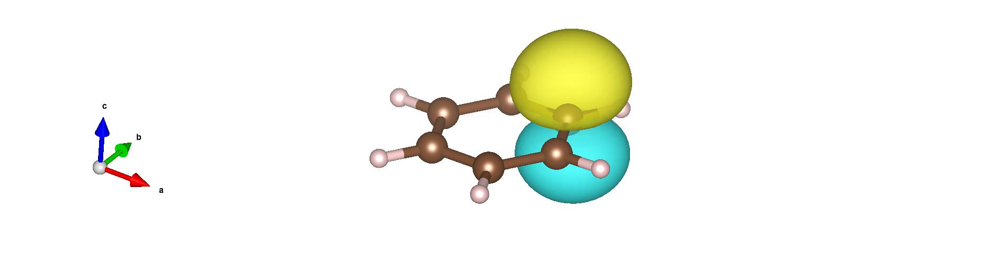

.. TurboRVB_manual documentation master file, created by
   sphinx-quickstart on Thu Jan 24 00:11:17 2019.
   You can adapt this file completely to your liking, but it should at least
   contain the root `toctree` directive.

.. _turbogeniustutorial_9805:

Benzene: Kekulé vs. Resonating Structures
===========================================================================================================================

.. contents:: Table of Contents
   :depth: 3

.. _turbogeniustutorial_9805_00:

00 Introduction
--------------------------------------------------------------------

In this tutorial, following the benzene calculation from the :ref:`previous chapter <turbogeniustutorial_1001>`, we handle a slightly more *advanced* task. Concretely, we will *schematically* estimate the energy difference between (i) the classical electronic description of benzene (the **Kekulé** structure) and (ii) the **resonating aromatic** structure (the correct delocalized picture). To do so, we first extract the carbon :math:`p_z` orbitals that form the :math:`\pi` electron cloud.

.. _turbogeniustutorial_9805_01:

01 Extracting carbon :math:`p_z` orbitals and plotting molecular orbitals
--------------------------------------------------------------------------------------------

From the obtained wavefunction file ``fort.10``, we will construct the *hybrid orbitals* for each C and H atom. For the procedure to build hybrid orbitals (GEO method), please refer to Ref. [#geo_ref]_.

Based on physical considerations, assign **four** hybrid orbitals to each carbon and **one** hybrid orbital to each hydrogen using:

.. code-block:: bash

   turbogenius convertwf -to agps -nosym -hyb 4 1 4 1 4 1 4 1 4 1 4 1

This projects the wavefunction onto an **AGP** (Antisymmetrized Geminal Power) form **based on hybrid orbitals** rather than on atomic-orbital (AO) basis functions. You can visualize the generated hybrid orbitals with:

.. code-block:: bash

   turbogenius plotorb

The obtained hybrid orbitals are visualized in **XSF** format, which can be visualized with **VESTA**. 

From the generated ``.xsf`` files, you can identify the carbon :math:`p_z` orbitals (which form the :math:`\pi` cloud) as follows:

.. table:: Identified carbon :math:`p_z` hybrid orbitals
   :widths: auto

   =====  =====  ===========
   atom   hyb    lambda index
   =====  =====  ===========
   1      2      2
   3      2      7
   5      2      12
   7      2      17
   9      2      22
   11     2      27
   =====  =====  ===========

.. note::

   In the AGP wavefunction *in the hybrid-orbital representation*, the pairing-function coefficients (the :math:`\lambda` matrix) are defined **with respect to these hybrid orbitals**. Keep in mind that, in ``fort.10``, the indices for the carbon :math:`p_z` orbitals above are **2, 7, 12, 17, 22, 27**.

.. _turbogeniustutorial_9805_02:

02 Emulating the Kekulé structure
--------------------------------------------------------------------

In the **Kekulé** picture of benzene, double and single bonds alternate around the ring. Interpreted in AGP pairing terms, this corresponds to **finite** :math:`\lambda` couplings only for **three** carbon–carbon pairs, while the others are set to **zero**. We will enforce this pattern directly in ``fort.10``.

.. code-block:: bash

   cd ../11_Kekule_vmcopt
   cp ../10_hybrid_orbitals/fort.10 .
   cp ../10_hybrid_orbitals/pseudo.dat .
   vi fort.10

1) Locate the block starting with ``# Nonzero values of  detmat``.  
   This region lists the **indices** and **values** of the pairing (:math:`\lambda`) matrix.

   To emulate the Kekulé structure, edit the pairs among the six :math:`p_z` indices
   (2, 7, 12, 17, 22, 27) as:

   - 2–7   → **keep as is** (finite)
   - 7–12  → **set to 0**
   - 12–17 → **keep as is** (finite)
   - 17–22 → **set to 0**
   - 22–27 → **keep as is** (finite)
   - 27–7  → **set to 0**

   Edit these entries in the ``detmat`` list accordingly.

2) Next, find the block starting with ``# Grouped par.  in the chosen ordered basis``.  
   Here, columns 2 and 3 are the pair indices (as above), and **column 1** is the optimization flag:
   ``1`` = optimize, ``-1`` = do not optimize (fixed).

   For the Kekulé pattern:

   - 2–7, 12–17, 22–27 → **optimize** (set flag to ``1``)
   - 7–12, 17–22, 27–7 → **fixed to 0** (ensure value is 0 and set flag to ``-1``)

   Concretely, keep only the following **three** lines with flag ``1`` and set **all other** entries’ first column to ``-1``:

   .. code-block:: text

              1           2           7
              1          12          17
              1          22          27

.. _turbogeniustutorial_9805_03:

03 Optimization (Kekulé)
----------------------------------------------------

After editing, run the wavefunction optimization in this directory (your usual VMC optimization workflow).  
Once optimized, evaluate the energy with the optimized wavefunction:

1. Generate an input file for VMC optimization:
      
   .. code-block:: bash
        cd ../11_Kekule_vmcopt
        turbogenius vmcopt -g -opt_det_mat -optimizer lr -vmcoptsteps 50 -steps 400 -nw 128 -reg -0.005

2. Run the VMC optimization, e,g, as follows:
      
   .. code-block:: bash

      TURBOVMC_RUN_COMMAND="mpirun -np 16 turborvb-mpi.x"
      export TURBOVMC_RUN_COMMAND

      turbogenius vmcopt -r

3. Perform the postprocess by typing:
      
   .. code-block:: bash

      turbogenius vmcopt -post -optwarmup 30 -plot

Check `plot_energy_and_devmax.png` and the files in the `parameters_graphs` directory.

.. _turbogeniustutorial_9805_04:

04 Energy evaluation (Kekulé)
----------------------------------------------------

Then, you can evaluate the energy.

.. code-block:: bash

   cd ../12_Kekule_vmc
   cp ../11_Kekule_vmcopt/fort.10 .
   cp ../11_Kekule_vmcopt/pseudo.dat .

Next, generate an input file `datasvmc.input` using:

.. code-block:: bash

    turbogenius vmc -g -steps 3000 -nw 128

Then, run the VMC calculation, e.g., by typing:
    
.. code-block:: bash

    TURBOVMC_RUN_COMMAND="mpirun -np 16 turborvb-mpi.x"
    export TURBOVMC_RUN_COMMAND

    turbogenius vmc -r

Finally, run the postprocess:

.. code-block:: bash

    turbogenius vmc -post -bin 20 -warmup 10

Check the reblocked total energy and error in the file `pip0.d`.

.. _turbogeniustutorial_9805_05:

05 Emulating the fully resonating aromatic structure
--------------------------------------------------------

Now set up the **resonating** (fully delocalized) :math:`\pi`-bond picture by allowing **all six** nearest-neighbor :math:`p_z` pairs to be optimized (finite):

.. code-block:: bash

   cd ../13_Resonating_vmcopt
   cp ../10_hybrid_orbitals/fort.10 .
   cp ../10_hybrid_orbitals/pseudo.dat .
   more fort.10

For the six :math:`p_z` indices (2, 7, 12, 17, 22, 27), enable optimization for **all** ring-adjacent pairs:

- 2–7, 7–12, 12–17, 17–22, 22–27, 27–2 (note: original text used 27–7; use your file’s ordering)

Thus, in the ``# Grouped par.`` block, keep these **six** lines with flag ``1`` and set all other entries’ first column to ``-1``:

.. code-block:: text

           1           2           7
           1           7          12
           1          12          17
           1          17          22
           1          22          27
           1          27           2

.. note::

   Depending on how pairs are ordered in your ``fort.10``, you may see (27, 7) instead of (27, 2).  
   Use the six **nearest-neighbor** pairs consistently around the ring, matching your index ordering.

.. _turbogeniustutorial_9805_06:

06 Optimization (Resonating)
----------------------------------------------------

Optimize this resonating AGP wavefunction, then evaluate the energy as in the Kekulé case.

1. Generate an input file for VMC optimization:
      
   .. code-block:: bash
        cd ../13_Resonating_vmcopt
        turbogenius vmcopt -g -opt_det_mat -optimizer lr -vmcoptsteps 50 -steps 400 -nw 128 -reg -0.005

2. Run the VMC optimization, e,g, as follows:
      
   .. code-block:: bash

      TURBOVMC_RUN_COMMAND="mpirun -np 16 turborvb-mpi.x"
      export TURBOVMC_RUN_COMMAND

      turbogenius vmcopt -r

3. Perform the postprocess by typing:
      
   .. code-block:: bash

      turbogenius vmcopt -post -optwarmup 30 -plot

Check `plot_energy_and_devmax.png` and the files in the `parameters_graphs` directory.

.. _turbogeniustutorial_9805_07:

07 Energy evaluation (Resonating)
----------------------------------------------------

Then, you can evaluate the energy.

.. code-block:: bash

   cd ../14_Resonating_vmc
   cp ../13_Resonating_vmcopt/fort.10 .
   cp ../13_Resonating_vmcopt/pseudo.dat .

Next, generate an input file `datasvmc.input` using:

.. code-block:: bash

    turbogenius vmc -g -steps 3000 -nw 128

Then, run the VMC calculation, e.g., by typing:
    
.. code-block:: bash

    TURBOVMC_RUN_COMMAND="mpirun -np 16 turborvb-mpi.x"
    export TURBOVMC_RUN_COMMAND

    turbogenius vmc -r

Finally, run the postprocess:

.. code-block:: bash

    turbogenius vmc -post -bin 20 -warmup 10

Check the reblocked total energy and error in the file `pip0.d`.

.. _turbogeniustutorial_9805_08:

08 Comparing energies
---------------------------------

With both **Kekulé** and **resonating** AGP wavefunctions optimized and their energies computed, compare the two total energies to obtain a schematic measure of the stabilization due to aromatic resonance in benzene.

    - Kekule: -34.6293(75) Ha
    - Resonating: -34.7682(76) Ha

.. tip::

   - Keep a clear record (e.g., a small table) of which :math:`\lambda` pairs are optimized vs. fixed for each case.
   - Verify that pairs set to zero in the Kekulé setup remain **exactly** zero during optimization (i.e., flagged ``-1``).
   - For reproducibility, retain the edited ``fort.10`` files (or diffs) in version control.

.. [#geo_ref] GEO hybrid-orbital construction reference: DOI: https://doi.org/10.1063/1.4938089
