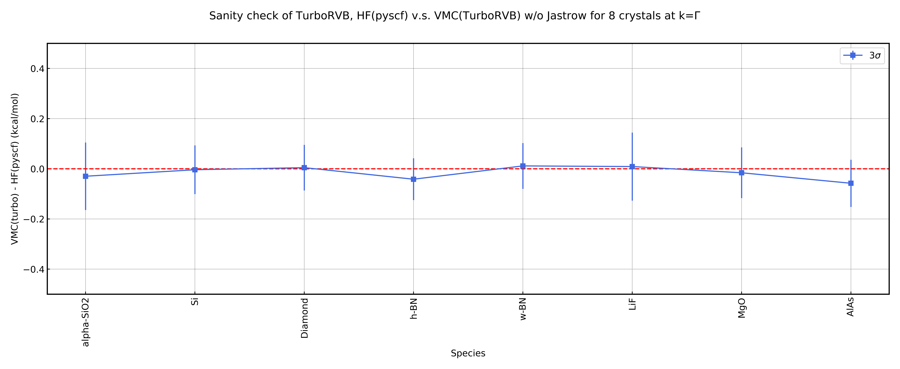

.. TurboRVB_manual documentation master file, created by
   sphinx-quickstart on Thu Jan 24 00:11:17 2019.
   You can adapt this file completely to your liking, but it should at least
   contain the root `toctree` directive.

.. _turboworkflowstutorial_03:

03_pyscf-HF_turbo-VMC_crystals_at_gamma
======================================================

From this tutorial, you can learn how to compare HF energies obtained by pySCF and VMC energies obtained by TurboRVB for 7 crystals at k=gamma using `turboworkflows`. Here is a python script to compute it. You can download the csv and geometry files for this tutorial from :download:`here  <./file.tar.gz>`.

.. code-block:: python

    #!/usr/bin/env python
    # coding: utf-8
    
    # python packages
    import os, sys
    import numpy as np
    import pandas as pd
    from ase import Atoms
    from ase.io import write, read
    import shutil
    
    # turboworkflows packages
    from turboworkflows.workflow_encapsulated import eWorkflow
    from turboworkflows.workflow_lrdmc_ext import LRDMC_ext_workflow
    from turboworkflows.workflow_vmc import VMC_workflow
    from turboworkflows.workflow_pyscf import PySCF_workflow
    from turboworkflows.workflow_trexio import TREXIO_convert_to_turboWF
    from turboworkflows.workflow_vmcopt import VMCopt_workflow
    from turboworkflows.workflow_lanchers import Launcher, Variable
    from turboworkflows.workflow_prep import DFT_workflow
    
    # read molecules and its info.
    mol_info=pd.read_csv("data_sanity_check.csv")
    mol_calc=mol_info[mol_info["Flag"]==True]
    
    # info list:
    codid_list=list(mol_calc["CODID"])
    label_list=list(mol_calc["Label"])
    pyscf_basis_list=list(mol_calc["pyscf_basis"])
    pyscf_ecp_list=list(mol_calc["pyscf_ecp"])
    charge_list=list(mol_calc["Charge"])
    neldiff_list=list(mol_calc["Neldiff"])
    
    pid=os.getpid()
    with open("turboworkflows.pid", "w") as f: f.write(str(pid)+'\n')
    
    root_dir=os.getcwd()
    result_dir=os.path.join(os.getcwd(), "results")
    os.makedirs(result_dir, exist_ok=True)
    os.chdir(result_dir)
    
    cworkflows_list=[]
    
    for codid,label,pyscf_basis,pyscf_ecp,charge,neldiff in zip(codid_list,label_list,pyscf_basis_list, pyscf_ecp_list,charge_list,neldiff_list):
    
        mol_root_dir=os.path.join(result_dir, label)
        
        shutil.copyfile(os.path.join(root_dir,"geometry", f"{codid}.cif"), os.path.join(result_dir, f"{codid}.cif"))
        
        #pyscf
        pyscf_HF_workflow = eWorkflow(
        label=f'pyscf-HF-workflow-{label}',
        dirname=os.path.join(mol_root_dir, f'pyscf-HF-workflow'),
        input_files=[f"{codid}.cif"],
        workflow=PySCF_workflow(
            ## structure file (mandatory)
            structure_file=f"{codid}.cif",
            ## job
            server_machine_name="lmpcc",
            cores=72,
            openmp=72,
            queue="XLARGE-6T",
            version="stable",
            sleep_time=3600,  # sec.
            jobpkl_name="job_manager",
            ## pyscf
            pyscf_rerun=False,
            pyscf_pkl_name="pyscf_genius",
            charge=charge,
            spin=neldiff,
            basis=pyscf_basis,
            ecp=pyscf_ecp,
            scf_method="HF",
            dft_xc="NA",
            pyscf_output="out.pyscf",
            pyscf_chkfile="pyscf.chk",
            solver_newton=False,
            twist_average=False,
            exp_to_discard=0.10,
            kpt=[0.0, 0.0, 0.0],  # scaled_kpts!! i.e., crystal coord.
            )
        )
        cworkflows_list+=[pyscf_HF_workflow]
        
        continue #to check pyscf convergence.
        
        #trexio
        trexio_HF_workflow = eWorkflow(
            label=f'trexio-HF-workflow-{label}',
            dirname=os.path.join(mol_root_dir, f'trexio-HF-workflow'),
            input_files=[Variable(label=f'pyscf-HF-workflow-{label}', vtype='file', name='trexio.hdf5')],
            workflow=TREXIO_convert_to_turboWF(
                trexio_filename="trexio.hdf5",
                twist_average=False,
                jastrow_basis_dict={},
                max_occ_conv=1.0e-4,
                trexio_rerun=False,
                trexio_pkl_name="trexio_genius"
            )
        )
        
        cworkflows_list+=[trexio_HF_workflow]
        
        #vmc
        vmc_HF_workflow = eWorkflow(
            label=f'vmc-HF-workflow-{label}',
            dirname=os.path.join(mol_root_dir, f'vmc-HF-workflow'),
            input_files=[Variable(label=f'trexio-HF-workflow-{label}', vtype='file', name='fort.10'),
                        Variable(label=f'trexio-HF-workflow-{label}', vtype='file', name='pseudo.dat')],
            workflow=VMC_workflow(
                ## job
                server_machine_name="fugaku",
                cores=4608,
                openmp=1,
                queue="small",
                version="stable",
                sleep_time=7200, # sec.
                jobpkl_name="job_manager",
                ## vmc
                vmc_max_continuation=2,
                vmc_pkl_name="vmc_genius",
                vmc_target_error_bar=5.0e-5, # Ha
                vmc_trial_steps= 150,
                vmc_bin_block = 10,
                vmc_warmupblocks = 5,
                vmc_num_walkers = -1, # default -1 -> num of MPI process.
                vmc_twist_average=False,
                vmc_kpoints=[],
                vmc_force_calc_flag=False,
                vmc_maxtime=172000,
            )
        )
    
        cworkflows_list+=[vmc_HF_workflow]
        
    launcher=Launcher(cworkflows_list=cworkflows_list, dependency_graph_draw=True)
    launcher.launch()

