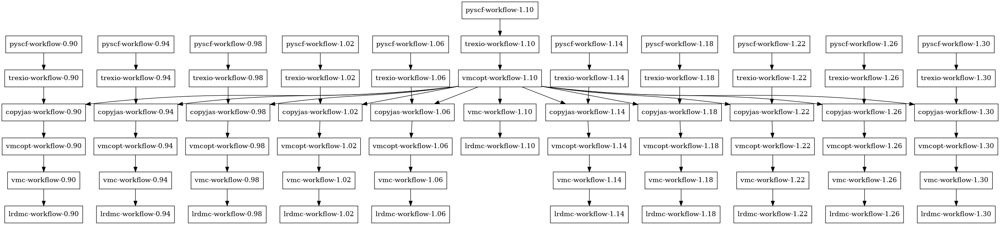
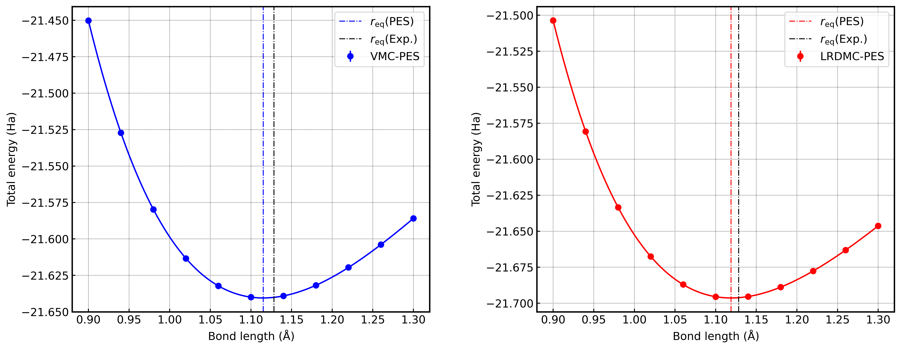

.. _turboworkflows_tutorial_co_dimer:

CO Molecule Calculation
=================================================

Overview
--------

This tutorial explains the workflow for Quantum Monte Carlo (QMC) calculations using TurboWorkflows, using ``co_dimer`` as an example.
This tutorial performs QMC calculations for CO molecule (carbon monoxide) at multiple interatomic distances to compute the energy curve.

This tutorial performs QMC calculations for CO molecule through the following steps:

1. **PySCF Calculation**: Generate initial wavefunctions using DFT calculations for multiple CO distances
2. **TREXIO Conversion**: Convert PySCF results from TREXIO format to TurboRVB format
3. **Jastrow Factor Copying**: Copy optimized Jastrow factors from the reference distance to other distances (for efficiency)
4. **VMC Optimization**: Optimize Jastrow factors
5. **VMC Calculation**: Perform VMC calculation with optimized wavefunction
6. **LRDMC Calculation**: Perform LRDMC calculation

Purpose of the Script
---------------------

The ``task.py`` script is designed to efficiently compute energy curves for CO molecule at multiple interatomic distances using QMC calculations.

Key Features:

- **Automatic Multi-Distance Calculation**: Automatically calculates at 11 points from 0.90 Å to 1.30 Å for CO distances
- **Efficient Jastrow Factor Reuse**: Reduces computation time by copying optimized Jastrow factors from the reference distance (center distance) to other distances
- **Fully Automated**: All steps from molecular structure generation to final LRDMC calculation are automated
- **Automatic Dependency Management**: TurboWorkflows' ``Launcher`` class automatically resolves dependencies between workflows and executes them in the appropriate order

Execution Steps
---------------

1. Environment Setup
~~~~~~~~~~~~~~~~~~~~

Ensure that TurboRVB, TurboGenius, TurboWorkflows, and PySCF are correctly installed.

2. Script Execution
~~~~~~~~~~~~~~~~~~

Execute ``task.py``:

.. code-block:: bash

   python task.py

The script automatically performs the following operations:

1. Creates ``results/`` directory
2. Automatically generates XYZ files for each CO distance
3. Executes a series of workflows for each distance

Program Overview
----------------

Script Structure
~~~~~~~~~~~~~~~~

``task.py`` consists of the following main parts:

1. **Distance Parameter Settings** (lines 19-21)

.. literalinclude:: task.py
   :lines: 19-21
   :language: python

- ``max_d=1.30``: Maximum CO distance (Å)
- ``min_d=0.90``: Minimum CO distance (Å)
- ``num_d=11``: Number of distance points to calculate

2. **Result Directory Preparation** (lines 26-29)

.. literalinclude:: task.py
   :lines: 26-29
   :language: python

3. **Distance List Generation** (lines 31-36)

.. literalinclude:: task.py
   :lines: 31-36
   :language: python

The reference distance (``d_ref``) is set as the median of the distance list. Jastrow factors optimized at this reference distance are reused for calculations at other distances.

4. **Jastrow Basis Function Definition** (lines 38-62)

.. literalinclude:: task.py
   :lines: 38-62
   :language: python

Jastrow basis functions are defined for C and O atoms. For each atom, S and P orbital basis functions are specified.

5. **Workflow Generation for Each Distance** (lines 64-244)

For each distance (``d``), the following workflows are generated:

a. PySCF Calculation Workflow
^^^^^^^^^^^^^^^^^^^^^^^^^^^^^

.. literalinclude:: task.py
   :lines: 64-97
   :language: python

- Generates CO molecule structure using ASE's ``Atoms`` class
- Automatically generates XYZ file (``CO_{d}.xyz``)
- Executes DFT calculation using PySCF_workflow
- Basis set: ``ccecp-ccpvqz``
- Method: DFT (LDA)

b. TREXIO Conversion Workflow
^^^^^^^^^^^^^^^^^^^^^^^^^^^^^

.. literalinclude:: task.py
   :lines: 99-114
   :language: python

- Converts PySCF calculation results (``trexio.hdf5``) to TurboRVB format (``fort.10``)
- Initializes Jastrow factors using the defined Jastrow basis functions

c. Jastrow Factor Copy Workflow (for non-reference distances)
^^^^^^^^^^^^^^^^^^^^^^^^^^^^^^^^^^^^^^^^^^^^^^^^^^^^^^^^^^^^^

.. literalinclude:: task.py
   :lines: 116-135
   :language: python

- Copies Jastrow factors optimized at the reference distance (``d_ref``) to the wavefunction at the current distance
- This eliminates the need to optimize Jastrow factors from scratch at each distance, significantly reducing computation time

d. VMC Optimization Workflow
^^^^^^^^^^^^^^^^^^^^^^^^^^^

.. literalinclude:: task.py
   :lines: 148-183
   :language: python

- Optimizes Jastrow factors
- For the reference distance, optimization starts directly from the wavefunction after TREXIO conversion
- For non-reference distances, optimization is performed on the wavefunction containing copied Jastrow factors

Key parameters:

- ``vmcopt_target_error_bar=1.0e-3``: Target error bar (Ha)
- ``vmcopt_trial_optsteps=50``: Trial optimization steps
- ``vmcopt_production_optsteps=1200``: Production optimization steps
- ``vmcopt_optimizer="lr"``: Optimization method (learning rate method)
- ``vmcopt_onebody=True, vmcopt_twobody=True``: Optimize one-body and two-body Jastrow factors

e. VMC Calculation Workflow
^^^^^^^^^^^^^^^^^^^^^^^^^^^

.. literalinclude:: task.py
   :lines: 186-212
   :language: python

- Performs VMC calculation using optimized wavefunction
- Calculates energy expectation value
- Also calculates forces (``vmc_force_calc_flag=True``)

Key parameters:

- ``vmc_target_error_bar=7.0e-5``: Target error bar (Ha)
- ``vmc_trial_steps=150``: Trial steps
- ``vmc_bin_block=10``: Bin size

f. LRDMC Calculation Workflow
^^^^^^^^^^^^^^^^^^^^^^^^^^^^^

.. literalinclude:: task.py
   :lines: 214-244
   :language: python

- Performs LRDMC calculation
- Uses VMC calculation energy as initial value (``lrdmc_trial_etry``)
- Also calculates forces (``lrdmc_force_calc_flag=True``)

Key parameters:

- ``lrdmc_target_error_bar=7.0e-5``: Target error bar (Ha)
- ``lrdmc_correcting_factor=10``: Correcting factor
- ``lrdmc_alat=-0.25``: Lattice parameter *a*
- ``lrdmc_nonlocalmoves="dla"``: Non-local move method

6. **Workflow Execution** (lines 246-247)

.. literalinclude:: task.py
   :lines: 246-247
   :language: python

All workflows are registered with the ``Launcher`` class, and the dependency graph is drawn (``dependency_graph_draw=True``) before execution.

Workflow Dependencies
~~~~~~~~~~~~~~~~~~~~

When ``task.py`` is executed, a dependency graph is automatically generated by ``dependency_graph_draw=True``.
You can visually confirm the dependencies between workflows by referring to the generated dependency graph (``graphs.png``).
In the dependency graph, each workflow is displayed as a node, and dependencies are shown with arrows.

Main dependency flow:

- For each distance (``d``), ``pyscf-workflow-{d}`` is executed first, performing PySCF calculation
- ``trexio-workflow-{d}`` depends on the output (``trexio.hdf5``) from ``pyscf-workflow-{d}``
- For non-reference distances, ``copyjas-workflow-{d}`` depends on both ``trexio-workflow-{d}`` and ``vmcopt-workflow-{d_ref}``, copying Jastrow factors optimized at the reference distance
- ``vmcopt-workflow-{d}`` depends on ``trexio-workflow-{d}`` for the reference distance, or on ``copyjas-workflow-{d}`` for other distances
- ``vmc-workflow-{d}`` depends on ``vmcopt-workflow-{d}``
- ``lrdmc-workflow-{d}`` depends on ``vmc-workflow-{d}`` and also references the energy value (``lrdmc_trial_etry``) from VMC calculation

The ``Launcher`` class automatically executes workflows in the appropriate order based on this dependency graph.

Output Directory Structure
~~~~~~~~~~~~~~~~~~~~~~~~~

After execution, results are saved in the ``results/`` directory with the following structure:

.. code-block:: text

   results/
   ├── CO_0.90.xyz
   ├── CO_0.92.xyz
   ├── ...
   ├── CO_1.30.xyz
   ├── pyscf-workflow-0.90/
   │   ├── trexio.hdf5
   │   └── ...
   ├── trexio-workflow-0.90/
   │   ├── fort.10
   │   └── pseudo.dat
   ├── copyjas-workflow-0.90/
   │   ├── fort.10
   │   └── ...
   ├── vmcopt-workflow-0.90/
   │   ├── fort.10
   │   └── ...
   ├── vmc-workflow-0.90/
   │   └── ...
   ├── lrdmc-workflow-0.90/
   │   └── ...
   └── ... (similar for other distances)

Results from each workflow are saved in independent directories.

Result Analysis
---------------

After calculations are completed, LRDMC calculation results are obtained for each distance.
These results are compiled and visualized as the Potential Energy Surface (PES) for CO molecule, saved as ``CO_PES.png``.

This plot shows the energy curve as a function of CO distance, allowing you to confirm information such as bond distance and binding energy.

Parameter Adjustment
--------------------

Distance Parameters
~~~~~~~~~~~~~~~~~~~

To change the distance range or number of points, adjust the following parameters:

.. code-block:: python

   max_d=1.30  # Maximum distance (Å)
   min_d=0.90  # Minimum distance (Å)
   num_d=11    # Number of calculation points

Calculation Accuracy Parameters
~~~~~~~~~~~~~~~~~~~~~~~~~~~~~~~

To adjust VMC optimization accuracy, modify parameters of ``vmcopt_workflow``:

- ``vmcopt_target_error_bar``: Target error bar (smaller is more accurate)
- ``vmcopt_production_optsteps``: Production optimization steps (more steps is more accurate)
- ``vmcopt_learning_rate``: Learning rate (affects optimization convergence speed)

To adjust VMC/LRDMC calculation accuracy:

- ``vmc_target_error_bar`` / ``lrdmc_target_error_bar``: Target error bar
- ``vmc_trial_steps`` / ``lrdmc_trial_steps``: Trial steps
- ``vmc_bin_block`` / ``lrdmc_bin_block``: Bin size

Job Execution Parameters
~~~~~~~~~~~~~~~~~~~~~~~~

Adjust the following parameters according to your computational environment:

- ``server_machine_name``: Server machine name (default: ``"localhost"``)
- ``queue_label``: Queue label (default: ``"default"``)
- ``sleep_time``: Job status check interval (seconds)
- ``mpi``: MPI usage flag (default: ``True``)

Jastrow Basis Functions
~~~~~~~~~~~~~~~~~~~~~~~

You can define Jastrow basis functions for C and O atoms in ``jastrow_basis_dict``. For higher accuracy calculations, you can add more basis functions.

Troubleshooting
---------------

When PySCF Calculation Fails
~~~~~~~~~~~~~~~~~~~~~~~~~~~~~

- Verify that PySCF and required packages are correctly installed
- Check that computational resources (memory, CPU) are sufficient
- Verify that the basis set (``ccecp-ccpvqz``) is available

When Workflow Fails
~~~~~~~~~~~~~~~~~~~

- Check log files for each workflow
- Verify that dependencies are correctly set (especially ``Variable`` references)
- Check computational resources (especially cluster settings)
- Check the dependency graph generated by ``dependency_graph_draw=True``

When Jastrow Factor Copying Fails
~~~~~~~~~~~~~~~~~~~~~~~~~~~~~~~~~~

- Verify that ``vmcopt-workflow`` for the reference distance (``d_ref``) has completed successfully
- Check that input files (``fort.10_new``) for ``copyjas-workflow`` are correctly referenced

When Calculation Time is Too Long
~~~~~~~~~~~~~~~~~~~~~~~~~~~~~~~~~~~

- Increase ``vmcopt_target_error_bar`` (lower accuracy)
- Reduce ``vmcopt_production_optsteps``
- Verify that Jastrow factor copying is working correctly for non-reference distances

Summary
-------

In this tutorial, we performed QMC calculations for CO molecule at multiple distances through the following steps:

1. Generated initial wavefunctions using PySCF calculations for multiple CO distances
2. Converted to TurboRVB format via TREXIO conversion
3. Copied optimized Jastrow factors from the reference distance to other distances (for efficiency)
4. Optimized Jastrow factors with VMC optimization
5. Calculated energy expectation values with VMC calculation
6. Calculated high-precision energies with LRDMC calculation

Results for each distance are saved in the ``results/`` directory and can be used for energy curve analysis. Calculation results are visualized as ``CO_PES.png``, allowing you to examine the potential energy surface of CO molecule. The ``Launcher`` class automatically manages dependencies and executes workflows in the appropriate order.

The feature of "Jastrow factor reuse at the reference distance" in this script introduces nontrivial dependency between otherwise-independent calculations at different distances.
