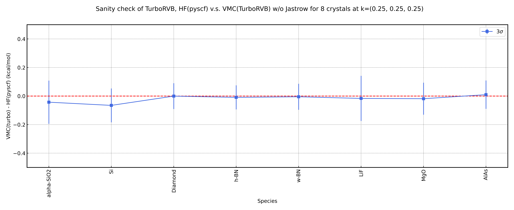

.. _turboworkflows_tutorial_crystal_at_complex:

HF-VMC Calculation for Crystals at Complex k-Point
================================================================

Overview
----------------------------------------------------------------

This tutorial explains how to perform Hartree-Fock (HF) calculations using PySCF and Variational Monte Carlo (VMC) calculations using TurboRVB for crystal structures at a complex k-point (k=[0.25, 0.25, 0.25]) using TurboWorkflows, using ``crystal_at_complex`` as an example.

This tutorial automatically executes the following workflow for multiple crystal structures listed in the CSV file (``data_sanity_check.csv``):

1. **PySCF Calculation**: Generate initial wavefunctions using HF calculations at a complex k-point (k=[0.25, 0.25, 0.25])
2. **TREXIO Conversion**: Convert PySCF results from TREXIO format to TurboRVB format
3. **VMC Calculation**: Perform VMC calculations using the converted wavefunctions

This tutorial can be used for sanity checks of TurboRVB VMC calculations. By converting HF wavefunctions to TurboRVB and performing VMC calculations, we can verify that the calculation results from both methods are consistent.
The complete set of files for this tutorial is available at :download:`file.tar.gz <./file.tar.gz>`.

Differences from tutorial for crystals *at gamma*
----------------------------------------------------------------

This tutorial (``crystal_at_complex``) differs from the ``crystal_at_gamma`` tutorial in the following ways:

1. **k-point setting**:

   - ``crystal_at_gamma``: Calculates at k=gamma point (``kpt=[0.0, 0.0, 0.0]``)
   - ``crystal_at_complex``: Calculates at a complex k-point (``kpt=[0.25, 0.25, 0.25]``)

2. **Use of JK method**:

   - ``crystal_at_gamma``: ``use_jkmethod=True`` (uses JK method)
   - ``crystal_at_complex``: ``use_jkmethod=False`` (does not use JK method)

Calculations at k-points other than gamma handle more general cases of crystal calculations. In calculations at complex k-points, the wavefunctions become complex, making the calculations more complex. On the other hand, calculations at gamma point can be performed with real wavefunctions, making them relatively simpler.

Execution Steps
----------------------------------------------------------------

1. Environment Setup
~~~~~~~~~~~~~~~~~~~~~~~~~~~~~~~~~~~~~~~~~~~~~~~~~~~~~~~~~~~~~~~~

Ensure that TurboRVB, TurboGenius, TurboWorkflows, and PySCF are correctly installed.
The following files are required:

- ``data_sanity_check.csv``: CSV file containing crystal structure information for calculations
- ``geometry/`` directory: CIF files (crystal structure files)

2. Script Execution
~~~~~~~~~~~~~~~~~~~~~~~~~~~~~~~~~~~~~~~~~~~~~~~~~~~~~~~~~~~~~~~~

Execute ``task.py``:

.. code-block:: bash

   python task.py

The script automatically performs the following operations:

1. Reads crystal structure information from ``data_sanity_check.csv``
2. Executes calculations for crystal structures with ``Flag==TRUE``
3. Creates ``results/`` directory and saves results for each crystal structure
4. Sequentially executes PySCF calculation, TREXIO conversion, and VMC calculation for each crystal structure

Program Overview
----------------------------------------------------------------

Script Structure
~~~~~~~~~~~~~~~~~~~~~~~~~~~~~~~~~~~~~~~~~~~~~~~~~~~~~~~~~~~~~~~~

``task.py`` consists of the following main parts:

1. **Crystal Structure Information Reading** (lines 22-24)

.. literalinclude:: task.py
   :lines: 22-24
   :language: python

Reads crystal structure information from the CSV file and only processes structures with ``Flag==TRUE``.

File Format of ``data_sanity_check.csv``
^^^^^^^^^^^^^^^^^^^^^^^^^^^^^^^^^^^^^^^^^^^^^^^^^^^^^^^^^^^^^^^^

``data_sanity_check.csv`` is a CSV file containing crystal structure information for calculations. It includes the following columns:

- ``Flag``: Flag indicating whether to execute the calculation (``TRUE`` or ``FALSE``). Calculations are executed only when ``TRUE``
- ``CODID``: Crystallography Open Database (COD) ID. Used as an index for CIF files. The file ``{CODID}.cif`` in the ``geometry/`` directory will be used
- ``Label``: Label (used for result directory name)
- ``pyscf_basis``: Basis set name used in PySCF (e.g., ``ccecp-ccpvqz``, ``ccecp-ccpv6z``)
- ``pyscf_ecp``: ECP (Effective Core Potential) name used in PySCF (e.g., ``ccecp``)
- ``Charge``: Crystal charge (integer)
- ``Neldiff``: Spin (number of unpaired electrons, integer)

Example CSV file:

.. code-block:: csv

   Flag,CODID,Label,pyscf_basis,pyscf_ecp,Charge,Neldiff
   TRUE,1234567,LiH,ccecp-ccpvqz,ccecp,0,0
   TRUE,2345678,LiF,ccecp-ccpvqz,ccecp,0,0

2. **Result Directory Preparation** (lines 26-32)

.. literalinclude:: task.py
   :lines: 26-32
   :language: python

Creates ``results/`` directory and changes the working directory.

3. **Workflow Generation for Each Crystal Structure** (lines 36-128)

For each crystal structure (each row in ``mol_calc``), the following workflows are generated:

a. Crystal Structure Information Retrieval and CIF File Copying (lines 36-47)
^^^^^^^^^^^^^^^^^^^^^^^^^^^^^^^^^^^^^^^^^^^^^^^^^^^^^^^^^^^^^^^^^^^^^^^^^^^^^^^^

.. literalinclude:: task.py
   :lines: 36-47
   :language: python

- Retrieves information for each crystal structure from the CSV file (CODID, label, charge, spin, etc.)
- Reads and copies the CIF file from the ``geometry/`` directory to the ``results/`` directory

b. PySCF HF Calculation Workflow (lines 49-78)
^^^^^^^^^^^^^^^^^^^^^^^^^^^^^^^^^^^^^^^^^^^^^^^^^^^^^^^^^^^^^^^^

.. literalinclude:: task.py
   :lines: 49-78
   :language: python

- Executes HF calculation using PySCF_workflow
- Calculation parameters are retrieved from the CSV file (basis set, ECP, charge, spin, etc.)
- Calculates at a complex k-point (``kpt=[0.25, 0.25, 0.25]``)
- Results are saved as ``trexio.hdf5``

Main parameters:

- ``scf_method="HF"``: Executes HF calculation
- ``charge``, ``spin``: Charge and spin retrieved from CSV file
- ``basis``, ``ecp``: Basis set and ECP retrieved from CSV file
- ``kpt=[0.25, 0.25, 0.25]``: Complex k-point (scaled k-points in crystal coordinates)
- ``twist_average=False``: No k-point averaging
- ``use_jkmethod=False``: Does not use JK method (typically not used for calculations at complex k-points)

c. TREXIO Conversion Workflow (lines 82-97)
^^^^^^^^^^^^^^^^^^^^^^^^^^^^^^^^^^^^^^^^^^^^^^^^^^^^^^^^^^^^^^^^

.. literalinclude:: task.py
   :lines: 82-97
   :language: python

- Converts PySCF calculation results (``trexio.hdf5``) to TurboRVB format (``fort.10``, ``pseudo.dat``)
- Jastrow factors are initialized as empty (no optimization) with ``jastrow_basis_dict={}``

d. VMC Calculation Workflow (lines 100-128)
^^^^^^^^^^^^^^^^^^^^^^^^^^^^^^^^^^^^^^^^^^^^^^^^^^^^^^^^^^^^^^^^

.. literalinclude:: task.py
   :lines: 100-128
   :language: python

- Performs VMC calculation using wavefunctions generated by TREXIO conversion
- Calculates energy expectation values

Main parameters:

- ``vmc_target_error_bar=5.0e-5``: Target error bar (Ha)
- ``vmc_trial_steps=150``: Number of trial steps
- ``vmc_bin_block=10``: Bin size
- ``vmc_num_walkers=-1``: Number of walkers (-1 means automatically set to the number of MPI processes)
- ``vmc_twist_average=False``: No k-point averaging

4. **Workflow Execution** (lines 130-131)

.. literalinclude:: task.py
   :lines: 130-131
   :language: python

Registers all workflows with the ``Launcher`` class, draws the dependency graph (``dependency_graph_draw=True``), and then executes them.

Workflow Dependencies
~~~~~~~~~~~~~~~~~~~~~~~~~~~~~~~~~~~~~~~~~~~~~~~~~~~~~~~~~~~~~~~~

When ``task.py`` is executed, a dependency graph is automatically generated due to ``dependency_graph_draw=True``.
By referring to the generated dependency graph (``graphs.png``), you can visually confirm the dependencies between workflows.

Main dependency flow:

- For each crystal structure, ``pyscf-HF-workflow-{label}`` is executed first, performing PySCF calculation
- ``trexio-HF-workflow-{label}`` depends on the output (``trexio.hdf5``) of ``pyscf-HF-workflow-{label}``
- ``vmc-HF-workflow-{label}`` depends on the output (``fort.10``, ``pseudo.dat``) of ``trexio-HF-workflow-{label}``

The ``Launcher`` class automatically executes workflows in the appropriate order based on this dependency graph.

Result Structure
----------------------------------------------------------------

Output Directory Structure
~~~~~~~~~~~~~~~~~~~~~~~~~~~~~~~~~~~~~~~~~~~~~~~~~~~~~~~~~~~~~~~~

After execution, results are saved in the ``results/`` directory with the following structure:

.. code-block:: text

   results/
   ├── 1234567.cif
   ├── 2345678.cif
   ├── ...
   ├── LiH/
   │   ├── pyscf-HF-workflow/
   │   │   ├── trexio.hdf5
   │   │   ├── out.pyscf
   │   │   └── ...
   │   ├── trexio-HF-workflow/
   │   │   ├── fort.10
   │   │   ├── pseudo.dat
   │   │   └── ...
   │   └── vmc-HF-workflow/
   │       ├── fort.10
   │       └── ...
   ├── LiF/
   │   └── ... (similar structure)
   └── ...

For each crystal structure, the following directories are created:

- ``{label}/pyscf-HF-workflow/``: PySCF calculation results

  - ``trexio.hdf5``: Wavefunction data in TREXIO format
  - ``out.pyscf``: PySCF calculation output file
  - ``pyscf.chk``: PySCF checkpoint file

- ``{label}/trexio-HF-workflow/``: TREXIO conversion results

  - ``fort.10``: Wavefunction file in TurboRVB format
  - ``pseudo.dat``: Pseudopotential file

- ``{label}/vmc-HF-workflow/``: VMC calculation results

  - ``fort.10``: Wavefunction file after VMC calculation
  - VMC calculation log files and output files

Checking Calculation Results
~~~~~~~~~~~~~~~~~~~~~~~~~~~~~~~~~~~~~~~~~~~~~~~~~~~~~~~~~~~~~~~~

Results from each workflow can be checked from log files and output files in the corresponding directories.

- PySCF calculation results: ``{label}/pyscf-HF-workflow/out.pyscf``
- VMC calculation results: By referring to the ``pip0.d`` file in ``{label}/vmc-HF-workflow/``, you can obtain VMC calculation results such as energy expectation values

By comparing PySCF HF energies with TurboRVB VMC energies, we can verify the validity of the calculations.
A plot summarizing the calculation results is shown below.

This plot compares PySCF HF energies with TurboRVB VMC energies for each crystal structure, confirming consistency between the two methods.

Parameter Adjustment
----------------------------------------------------------------

Job Execution Parameters
~~~~~~~~~~~~~~~~~~~~~~~~~~~~~~~~~~~~~~~~~~~~~~~~~~~~~~~~~~~~~~~~

For VMC calculation and other workflows, the following job execution parameters need to be set:

- ``queue_label``: Queue label for the job queue system. References queue settings defined in ``machine_data.yaml``. Examples: ``"i8cpu"``, ``"i8cpu-thread"``
- ``sleep_time``: Wait time between job status checks (seconds). While waiting for job completion, status is checked at this interval.
- ``mpi``: Whether to use MPI version of the binary. If ``True``, parallel computation is possible.

Calculation Accuracy Parameters
~~~~~~~~~~~~~~~~~~~~~~~~~~~~~~~~~~~~~~~~~~~~~~~~~~~~~~~~~~~~~~~~

To adjust VMC calculation accuracy, modify parameters of ``VMC_workflow``:

- ``vmc_target_error_bar``: Target error bar (smaller is more accurate)
- ``vmc_trial_steps``: Number of trial steps (more steps is more accurate)
- ``vmc_bin_block``: Bin size

PySCF Calculation Parameters
~~~~~~~~~~~~~~~~~~~~~~~~~~~~~~~~~~~~~~~~~~~~~~~~~~~~~~~~~~~~~~~~

PySCF calculation parameters:

- ``kpt=[0.25, 0.25, 0.25]``: k-point (scaled k-points in crystal coordinates). To calculate at other k-points, change this value
- ``twist_average``: Whether to perform k-point averaging
- ``exp_to_discard``: Threshold for discarding orbitals
- ``use_jkmethod=False``: Does not use JK method (typically not used for calculations at complex k-points)

Troubleshooting
----------------------------------------------------------------

When PySCF Calculation Fails
~~~~~~~~~~~~~~~~~~~~~~~~~~~~~~~~~~~~~~~~~~~~~~~~~~~~~~~~~~~~~~~~

- Verify that PySCF and required packages are correctly installed
- Check that computational resources (memory, CPU) are sufficient
- Verify that the basis set (``ccecp-ccpvqz``, etc.) is available
- Check that the CIF file format is correct
- In calculations at complex k-points, the wavefunctions become complex, making the calculations more complex. If computational resources are insufficient, try calculations at gamma point (``crystal_at_gamma``)

When Workflow Fails
~~~~~~~~~~~~~~~~~~~~~~~~~~~~~~~~~~~~~~~~~~~~~~~~~~~~~~~~~~~~~~~~

- Check log files for each workflow
- Verify that dependencies are correctly set (especially ``Variable`` references)
- Check computational resources (especially cluster settings)
- Check the dependency graph generated by ``dependency_graph_draw=True``

When TREXIO Conversion Fails
~~~~~~~~~~~~~~~~~~~~~~~~~~~~~~~~~~~~~~~~~~~~~~~~~~~~~~~~~~~~~~~~

- Verify that ``trexio.hdf5`` is correctly generated
- Check that TREXIO is correctly installed
- Try adjusting the ``max_occ_conv`` parameter (e.g., from ``1.0e-4`` to ``1.0e-3``)

When Calculation Time is Too Long
~~~~~~~~~~~~~~~~~~~~~~~~~~~~~~~~~~~~~~~~~~~~~~~~~~~~~~~~~~~~~~~~

- Increase ``vmc_target_error_bar`` (lower accuracy)
- Reduce ``vmc_trial_steps``
- Check computational resources (CPU count, memory) being used

Summary
----------------------------------------------------------------

In this tutorial, we performed HF-VMC calculations for multiple crystal structures at a complex k-point (k=[0.25, 0.25, 0.25]) through the following steps:

1. Read crystal structure information from CSV file
2. Generated HF wavefunctions using PySCF calculations for each crystal structure (complex k-point)
3. Converted to TurboRVB format via TREXIO conversion
4. Calculated energy expectation values using VMC calculations

Results for each crystal structure are saved in the ``results/`` directory and can be used to compare PySCF HF energies with TurboRVB VMC energies. The ``Launcher`` class automatically manages dependencies and executes workflows in the appropriate order.

Compared to the ``crystal_at_gamma`` tutorial, this tutorial performs calculations at complex k-points, handling more general cases of crystal calculations. While calculations at gamma point can be performed with real wavefunctions, calculations at complex k-points involve complex wavefunctions, making them more complex.

