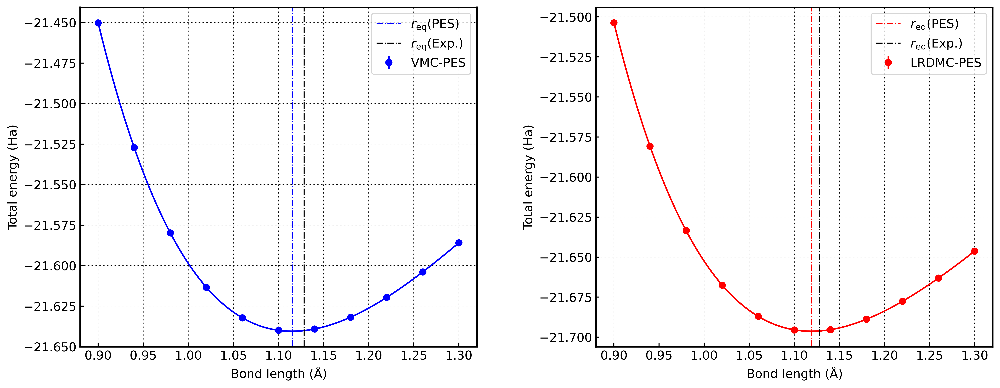

.. TurboRVB_manual documentation master file, created by
   sphinx-quickstart on Thu Jan 24 00:11:17 2019.
   You can adapt this file completely to your liking, but it should at least
   contain the root `toctree` directive.

.. _turboworkflowstutorial_01:

01_CO-dimer
======================================================

From this tutorial, you can learn how to compute the potential energy surface of the CO dimer using `turboworkflows`. 
Here is a python script to compute it.

.. code-block:: python

    #!/usr/bin/env python
    # coding: utf-8
    
    # python packages
    import os, sys
    import numpy as np
    
    # turboworkflows packages
    from turboworkflows.workflow_encapsulated import eWorkflow
    from turboworkflows.workflow_lrdmc import LRDMC_workflow
    from turboworkflows.workflow_vmc import VMC_workflow
    from turboworkflows.workflow_pyscf import PySCF_workflow
    from turboworkflows.workflow_trexio import TREXIO_convert_to_turboWF
    from turboworkflows.workflow_vmcopt import VMCopt_workflow
    from turboworkflows.workflow_collections import Jastrowcopy_workflow
    from turboworkflows.workflow_lanchers import Launcher, Variable
    
    from ase import Atoms
    max_d=1.30
    min_d=0.90
    num_d=11
    
    pid=os.getpid()
    with open("turboworkflows.pid", "w") as f: f.write(str(pid)+'\n')
    
    root_dir=os.getcwd()
    result_dir=os.path.join(os.getcwd(), "results")
    os.makedirs(result_dir, exist_ok=True)
    os.chdir(result_dir)
    
    d_list=[f'{np.round(a,2):.2f}' for a in np.linspace(min_d, max_d, num_d)]
    cworkflows_list=[]
    
    d_ref=d_list[int(len(d_list) / 2)]
    print(f"d_list={d_list}")
    print(f"d_ref={d_ref}")
    
    # jastrow basis dictionary
    jastrow_basis_dict={
        'C':
            """
            S  1
            1       1.637494  1.00000000
            S  1
            1       0.921552  1.00000000
            S  1
            1       0.409924  1.00000000
            P  1
            1       0.935757  1.00000000
            """,
        'O':
            """
            S  1
            1       1.686633  1.00000000
            S  1
            1       0.237997  1.00000000
            S  1
            1       0.125346  1.00000000
            P  1
            1       1.331816  1.00000000
            """
    }
    
    for d in d_list:
        H2_molecule = Atoms('CO', positions=[(0, 0, -float(d)/2), (0, 0, float(d)/2)])
        H2_molecule.write(f'CO_{d}.xyz')
    
        pyscf_workflow = eWorkflow(
            label=f'pyscf-workflow-{d}',
            dirname=f'pyscf-workflow-{d}',
            input_files=[f'CO_{d}.xyz'],
            workflow=PySCF_workflow(
                ## structure file (mandatory)
                structure_file=f'CO_{d}.xyz',
                ## job
                server_machine_name="kagayaki",
                cores=64,
                openmp=64,
                queue="DEFAULT",
                version="stable",
                sleep_time=10,  # sec.
                jobpkl_name="job_manager",
                ## pyscf
                pyscf_rerun=False,
                pyscf_pkl_name="pyscf_genius",
                charge=0,
                spin=0,
                basis="ccecp-ccpvqz",
                ecp="ccecp",
                scf_method="DFT",  # HF or DFT
                dft_xc="LDA_X,LDA_C_PZ",
                mp2_flag=False,
                pyscf_output="out.pyscf",
                pyscf_chkfile="pyscf.chk",
                solver_newton=False,
                twist_average=False,
                exp_to_discard=0.10,
                kpt=[0.0, 0.0, 0.0],  # scaled_kpts!! i.e., crystal coord.
                kpt_grid=[1, 1, 1]
            )
        )
    
        cworkflows_list.append(pyscf_workflow)
    
        trexio_workflow = eWorkflow(
            label=f'trexio-workflow-{d}',
            dirname=f'trexio-workflow-{d}',
            input_files=[Variable(label=f'pyscf-workflow-{d}', vtype='file', name='trexio.hdf5')],
            workflow=TREXIO_convert_to_turboWF(
                trexio_filename="trexio.hdf5",
                twist_average=False,
                jastrow_basis_dict=jastrow_basis_dict,
                max_occ_conv=0,
                mo_num_conv=-1,
                trexio_rerun=False,
                trexio_pkl_name="trexio_genius"
            )
        )
        cworkflows_list.append(trexio_workflow)
    
        if d!=d_ref:
            copyjas_workflow = eWorkflow(
                label=f'copyjas-workflow-{d}',
                dirname=f'copyjas-workflow-{d}',
                input_files=[Variable(label=f'trexio-workflow-{d}', vtype='file', name='fort.10'), Variable(label=f'vmcopt-workflow-{d_ref}', vtype='file', name='fort.10'), Variable(label=f'trexio-workflow-{d}', vtype='file', name='pseudo.dat')],
                rename_input_files=["fort.10", "fort.10_new", "pseudo.dat"],
                workflow=Jastrowcopy_workflow(
                    jastrowcopy_fort10_to="fort.10",
                    jastrowcopy_fort10_from="fort.10_new",
                )
            )
            cworkflows_list.append(copyjas_workflow)
    
            vmcopt_input_files = [Variable(label=f'copyjas-workflow-{d}', vtype='file', name='fort.10'), Variable(label=f'copyjas-workflow-{d}', vtype='file', name='pseudo.dat')]
    
        else:
            vmcopt_input_files = [Variable(label=f'trexio-workflow-{d}', vtype='file', name='fort.10'), Variable(label=f'trexio-workflow-{d}', vtype='file', name='pseudo.dat')]
    
        vmcopt_workflow = eWorkflow(
            label=f'vmcopt-workflow-{d}',
            dirname=f'vmcopt-workflow-{d}',
            input_files=vmcopt_input_files,
            workflow=VMCopt_workflow(
                ## job
                server_machine_name="kagayaki",
                cores=1536,
                openmp=1,
                queue="LARGE",
                version="stable",
                sleep_time=7200, # sec.
                jobpkl_name="job_manager",
                ## vmcopt
                vmcopt_max_continuation=2,
                vmcopt_pkl_name="vmcopt_genius",
                vmcopt_target_error_bar=1.0e-3,  # Ha
                vmcopt_trial_optsteps=50,
                vmcopt_trial_steps=50,
                vmcopt_production_optsteps=1200,
                vmcopt_optwarmupsteps_ratio=0.8,
                vmcopt_bin_block=1,
                vmcopt_warmupblocks=0,
                vmcopt_optimizer="lr",
                vmcopt_learning_rate=0.35,
                vmcopt_regularization=0.001,
                vmcopt_onebody=True,
                vmcopt_twobody=True,
                vmcopt_det_mat=False,
                vmcopt_jas_mat=True,
                vmcopt_det_basis_exp=False,
                vmcopt_jas_basis_exp=False,
                vmcopt_det_basis_coeff=False,
                vmcopt_jas_basis_coeff=False,
                vmcopt_num_walkers = -1, # default -1 -> num of MPI process.
                vmcopt_twist_average=False,
                vmcopt_kpoints=[],
                vmcopt_maxtime=172000,
            )
        )
        cworkflows_list.append(vmcopt_workflow)
    
        vmc_workflow = eWorkflow(
            label=f'vmc-workflow-{d}',
            dirname=f'vmc-workflow-{d}',
            input_files=[Variable(label=f'vmcopt-workflow-{d}', vtype='file', name='fort.10'),
                        Variable(label=f'vmcopt-workflow-{d}', vtype='file', name='pseudo.dat')],
            workflow=VMC_workflow(
                ## job
                server_machine_name="kagayaki",
                cores=1536,
                openmp=1,
                queue="LARGE",
                version="stable",
                sleep_time=3600, # sec.
                jobpkl_name="job_manager",
                ## vmc
                vmc_max_continuation=2,
                vmc_pkl_name="vmc_genius",
                vmc_target_error_bar=7.0e-5, # Ha
                vmc_trial_steps= 150,
                vmc_bin_block = 10,
                vmc_warmupblocks = 5,
                vmc_num_walkers = -1, # default -1 -> num of MPI process.
                vmc_twist_average=False,
                vmc_kpoints=[],
                vmc_force_calc_flag=True,
                vmc_maxtime=172000,
            )
        )
        cworkflows_list.append(vmc_workflow)
    
        lrdmc_workflow = eWorkflow(
            label=f'lrdmc-workflow-{d}',
            dirname=f'lrdmc-workflow-{d}',
            input_files=[Variable(label=f'vmc-workflow-{d}', vtype='file', name='fort.10'),
                        Variable(label=f'vmc-workflow-{d}', vtype='file', name='pseudo.dat')],
            workflow=LRDMC_workflow(
                ## job
                server_machine_name="kagayaki",
                cores=1536,
                openmp=1,
                queue="LARGE",
                version="stable",
                sleep_time=3600,  # sec.
                jobpkl_name="job_manager",
                ## lrdmc
                lrdmc_max_continuation=2,
                lrdmc_pkl_name="lrdmc_genius",
                lrdmc_target_error_bar=7.0e-5,  # Ha
                lrdmc_trial_steps=150,
                lrdmc_bin_block=10,
                lrdmc_warmupblocks=5,
                lrdmc_correcting_factor=10,
                lrdmc_trial_etry=Variable(label=f'vmc-workflow-{d}', vtype='value', name='energy'),
                lrdmc_alat=-0.25,
                lrdmc_nonlocalmoves="dla",  # tmove, dla, dlatm
                lrdmc_num_walkers=-1,  # default -1 -> num of MPI process.
                lrdmc_twist_average=False,
                lrdmc_kpoints=[],
                lrdmc_force_calc_flag=True,
                lrdmc_maxtime=172000,
            )
        )
    
        cworkflows_list.append(lrdmc_workflow)
    
    launcher=Launcher(cworkflows_list=cworkflows_list, dependency_graph_draw=True)
    launcher.launch()
